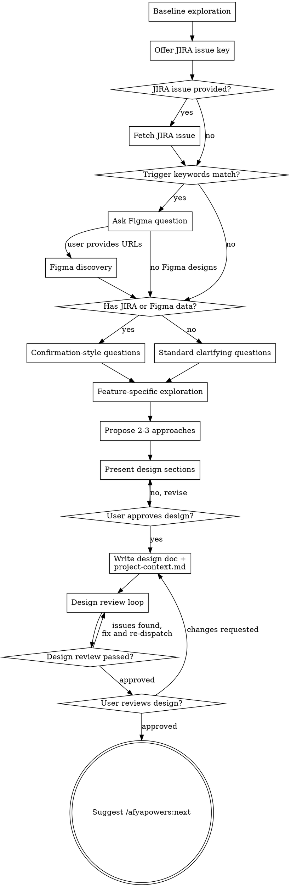

# Design Phase

Help turn ideas into fully formed technical designs through natural collaborative dialogue.

Start with a baseline exploration of the project (structure, conventions), then gather context from JIRA/Figma if applicable, ask clarifying questions, run a feature-specific exploration, and present the full design — from requirements through architecture — for user approval.

<HARD-GATE>
Do NOT invoke any implementation skill, write any code, scaffold any project, or take any implementation action until you have presented a design and the user has approved it. This applies to EVERY project regardless of perceived simplicity.
</HARD-GATE>

## Phase Gate

1. Read `.afyapowers/features/active` to get the active feature
2. Read `.afyapowers/features/<feature>/state.yaml` — confirm `current_phase` is `design`
3. If not in design phase, tell the user the current phase and stop

## Anti-Pattern: "This Is Too Simple To Need A Design"

Every project goes through this process. A todo list, a single-function utility, a config change — all of them. "Simple" projects are where unexamined assumptions cause the most wasted work. The design can be short (a few sentences for truly simple projects), but you MUST present it and get approval.

## Checklist

You MUST complete these items in order:

1. **Baseline project exploration** — run the Baseline Exploration (see below) to capture project-wide conventions (structure, build commands, commit conventions, import conventions)
2. **JIRA discovery (offer-based)** — offer the user the chance to provide a JIRA issue key; if provided, fetch and summarize the issue (see below)
3. **Figma discovery (trigger-based)** — check user request against trigger keywords (see below); if match, ask about Figma and run discovery before clarifying questions
4. **Ask clarifying questions** — if JIRA and/or Figma data is available, use confirmation-style questions (see below); otherwise, standard one-at-a-time clarifying questions
5. **Feature-specific exploration** — now that you understand what the feature is, run the Feature-Specific Exploration (see below) to capture code patterns, testing patterns, reusable examples, and framework detection relevant to this feature
6. **Propose 2-3 approaches** — with trade-offs and your recommendation
7. **Present design** — in sections scaled to their complexity, get user approval after each section
8. **Write design doc and project-context.md** — save design to `.afyapowers/features/<feature>/artifacts/design.md`; refine and save project context to `.afyapowers/features/<feature>/artifacts/project-context.md` (see Refine Project Context below)
9. **Design review loop** — dispatch @"design-reviewer (agent)"; fix issues and re-dispatch until approved (max 5 iterations, then surface to human)
10. **User reviews written spec** — ask user to review the spec file before proceeding

## Process Flow



**The terminal state is suggesting `/afyapowers:next`.** Do NOT invoke any implementation skill or advance phases. The `/afyapowers:next` command handles phase transitions.

## Baseline Exploration (Checklist Step 1)

Run **before** understanding the feature. Captures project-wide conventions that don't depend on knowing what the feature is. These populate the corresponding sections in `project-context.md` (template: `templates/project-context.md`).

### Project Structure
1. Run `find . -type f -name "*.ts" -o -name "*.tsx" -o -name "*.js" -o -name "*.jsx" -o -name "*.py" -o -name "*.go" -o -name "*.rs" | head -50` (adapt extensions to the project's language)
2. Identify the key directories and their purpose (src/, tests/, lib/, components/, etc.)
3. Note naming conventions: PascalCase, camelCase, kebab-case, snake_case for files and directories

### Build & Run Commands
1. Check `package.json` scripts, `Makefile`, `Taskfile.yml`, `Justfile`, or similar
2. Record: build command, dev server command, test command, lint command

### Import Conventions
1. Read 2-3 files from the project (pick from representative directories identified above)
2. Note: path aliases (e.g., `@/`), barrel files, relative vs absolute imports, import grouping order

### Commit Conventions
1. Run `git log --oneline -20` and identify the message pattern (conventional commits, ticket-prefixed, freeform)
2. Note which types/prefixes appear, whether scope is used, case conventions
3. Check for ticket ID in branch name: `git branch --show-current` — look for patterns like `ABC-123`
4. Check for hook tooling (existence only): `.lefthook.yml`, `lefthook.yml`, `.husky/pre-commit`, `.pre-commit-config.yaml`, `package.json` field `scripts.prepare`
5. Check for commitlint: `commitlint.config.*`, `.commitlintrc*`, `package.json` field `commitlint`
6. Build the Commit Conventions block:

**When conventions are detected:**
```
**Message format:** <detected format, e.g. "conventional commits — type(scope): description">
**Common types:** <list of types seen, e.g. feat, fix, chore, refactor, test>
**Scope:** <"commonly used" or "rarely used" or "not used">
**Ticket ID:** <extracted ID from branch name, e.g. "ABC-123 (from branch feature/ABC-123-new-login)" or "none detected">
**Examples from this repo:**
- <3-5 real examples from git log>

**Pre-commit hooks:** <tool name and what it runs, e.g. "Husky runs lint-staged (eslint + prettier) and commitlint">
**Commitlint:** <"yes — messages must follow conventional commits format" or "not detected">

**If your commit fails:**
1. Read the error output — it tells you exactly what's wrong
2. Commitlint rejection → rewrite the message to match the format above and retry
3. Lint/format failure → fix the reported issues or run the suggested fix command, re-stage changed files, retry
4. Other hook failure → read the error, apply the fix, re-stage, retry
5. After 3 failed attempts → report as DONE_WITH_CONCERNS with the full error output. Never use --no-verify
```

**When no conventions are detected:**
```
**Message format:** no enforced convention detected
**Pre-commit hooks:** none detected
**Commit freely** using clear, descriptive messages. If a commit fails unexpectedly, read the error and retry up to 3 times before reporting as DONE_WITH_CONCERNS.
```

## Feature-Specific Exploration (Checklist Step 5)

Run **after** understanding the feature (post-JIRA, post-Figma, post-clarifying questions). Now you know what the feature is and where in the codebase it will live, so you can target the exploration precisely.

### Code Patterns
1. Read 2-3 representative files **in the area where this feature's changes will happen**
2. Extract patterns for: import organization, export style, error handling, module structure
3. Include 3-5 short, representative snippets (keep each under 10 lines)

### Testing Patterns
1. Find test files in the relevant area: `find . -name "*.test.*" -o -name "*.spec.*" -o -name "test_*" | head -10`
2. Read 1-2 test files **for modules similar to what this feature will build** to identify: framework (jest, vitest, pytest, etc.), structure (describe/it, AAA), mock patterns
3. Identify the test run command from `package.json` scripts, `Makefile`, or similar

### Reusable Patterns & Examples
Identify existing code in the project that serves as a model for this feature:
1. Search for features, modules, or flows similar to what this feature needs (e.g., if building a new API endpoint, find an existing endpoint that follows the same pattern; if adding a new component, find a similar component)
2. For each relevant reference, note: file path, why it's relevant, and include a short snippet (under 15 lines) showing the pattern
3. Focus on references directly useful for this specific feature — not generic patterns (those belong in Code Patterns)
4. Common things to look for: similar CRUD operations, auth/validation flows, state management patterns, data fetching approaches, error boundary implementations, test setups for similar modules

### Framework & Component Detection (only for UI/Figma features)
If the feature involves UI work (Figma trigger keywords matched, or user describes UI components):
1. Glob for component directories: `src/components/**`, `src/ui/**`, `components/**`, `lib/components/**`, `packages/*/src/components/**`
2. Detect framework from `package.json` dependencies and config files (`next.config.*`, `nuxt.config.*`, `vite.config.*`)
3. Detect Storybook: glob for `.storybook/` and `*.stories.*`
4. Record: framework name, component directory path, Storybook presence

If the feature is not UI work, omit this section from `project-context.md` entirely.

## Refine Project Context (Checklist Step 8)

After the user approves the design and the chosen approach is locked, refine `project-context.md` before saving:

1. **Remove irrelevant patterns** — the Feature-Specific Exploration (step 5) ran before the approach was chosen. Drop any Code Patterns, Testing Patterns, or Reusable Patterns & Examples that are only relevant to approaches that were NOT chosen.
2. **Add approach-specific patterns** — if the chosen approach introduces techniques, libraries, or integrations that weren't covered in step 5, search for existing examples of those in the codebase now and add them to the relevant sections.
3. **Assemble the final artifact** — combine the Baseline Exploration (step 1) sections with the refined Feature-Specific Exploration sections and save to `.afyapowers/features/<feature>/artifacts/project-context.md` alongside the design doc.

## The Process

**Baseline exploration (checklist step 1):**

- Run the Baseline Exploration section above: project structure, build commands, import conventions, commit conventions
- This runs before any user interaction — it captures project-wide conventions that don't depend on knowing the feature

**JIRA discovery (checklist step 2) and Figma discovery (checklist step 3)** are documented in their own sections below.

**Clarifying questions (checklist step 4):**

- Before asking detailed questions, assess scope: if the request describes multiple independent subsystems (e.g., "build a platform with chat, file storage, billing, and analytics"), flag this immediately. Don't spend questions refining details of a project that needs to be decomposed first.
- If the project is too large for a single spec, help the user decompose into sub-projects: what are the independent pieces, how do they relate, what order should they be built? Then design the first sub-project through the normal flow. Each sub-project gets its own design → plan → implementation cycle.
- For appropriately-scoped projects, ask questions one at a time to refine the idea
- Prefer multiple choice questions when possible, but open-ended is fine too
- Only one question per message - if a topic needs more exploration, break it into multiple questions
- Focus on understanding: purpose, constraints, success criteria

**JIRA discovery (offer-based):**

After the Baseline Exploration (checklist step 1), offer the user:

> "Is there a JIRA issue associated with this feature? If so, share the issue key (e.g., PROJ-123)."

If the user provides a JIRA issue key:

1. **Resolve the Atlassian cloud ID:**
   - Call `mcp__claude_ai_Atlassian__getAccessibleAtlassianResources` (no parameters)
   - If exactly one site is returned, use its `id` as the `cloudId`
   - If multiple sites are returned, present them as a multiple-choice question and let the user pick

2. **Fetch the issue:**
   ```
   mcp__claude_ai_Atlassian__getJiraIssue(
     cloudId: "<resolved_cloud_id>",
     issueIdOrKey: "<user_provided_key>",
     responseContentFormat: "markdown"
   )
   ```

3. **Build the JIRA context summary** from the response:
   - **Summary:** issue summary field
   - **Issue Type:** story, bug, task, epic, etc.
   - **Description:** full description in markdown
   - **Acceptance Criteria:** extracted from description or custom fields if present
   - **Linked Issues:** dependencies, blockers, related issues
   - **Labels / Components:** for categorization context

   Present this summary to the user for confirmation before proceeding.

4. **Proceed to Figma discovery (checklist step 3)** — the JIRA summary and description text is now part of the context when evaluating Figma trigger keywords

If no JIRA issue is provided, proceed directly to Figma discovery (checklist step 3).

**If the Atlassian MCP server is unavailable:** Warn the user and **stop the JIRA discovery flow**. Do not attempt to proceed without it — the user asked for JIRA context, so a silent fallback would undermine the purpose. Suggest the user check their MCP server connection and retry.

**Figma discovery (trigger-based):**

After JIRA discovery (checklist step 2), check the user's request for these trigger keywords (case-insensitive, word-level matching):

> page, landing page, screen, view, layout, header, footer, navbar, sidebar, UI component, form, modal, dialog, card, hero, section, banner, responsive, breakpoint, mobile, desktop, dashboard, panel, widget

If any keyword matches, ask the user:

> "Does this feature have Figma designs? If so, please share the Figma URL(s)."

If a keyword matches but the request is clearly not UI work (e.g., "write unit tests for the landing page API endpoint"), use judgment — when in doubt, ask.

If no keywords match, skip Figma discovery and proceed to clarifying questions (checklist step 4) — use confirmation-style if JIRA data was gathered, standard otherwise.

If the user provides Figma URL(s):

1. **Parse each URL** to extract the file key and node ID
   - URL format: `https://figma.com/design/:fileKey/:fileName?node-id=X-Y`
   - Extract `:fileKey` (segment after `/design/`) and `X-Y` (value of `node-id` parameter)

2. **Single `get_metadata` call** on the root node
   ```
   get_metadata(fileKey=":fileKey", nodeId="X-Y")
   ```
   From the response, build the Node Map using only the first 2 depth levels of the returned tree:
   - **Depth 0:** Page
   - **Depth 1:** Screen/Section (top-level frames — names and dimensions are included in metadata)
   - **Depth 2:** Component or element (the task unit)

   Ignore any nodes deeper than depth 2. Breakpoints are inferred from top-level frame names and dimensions (e.g., "Desktop" at 1440px, "Mobile" at 375px).

   From the response, build the Node Map with two subsections:
   a. **Reusable Components:** Extract all depth-2 nodes typed COMPONENT or COMPONENT_SET. List each with its node ID and type. If none exist, write `(none — all components are external or pre-existing)`.
   b. **Screens:** List each depth-1 FRAME with its node ID, type, and dimensions. Under each frame, list its depth-2 children (excluding COMPONENT/COMPONENT_SET nodes already listed above). Collapse repeated INSTANCE nodes sharing the same `componentId` with a `×N` count.

3. **Build the `## Figma Resources` section** for the design doc:
   - File info (URL, file key)
   - Breakpoints (inferred from top-level frame names and dimensions in the metadata response)
   - Node Map (shallow structure from `get_metadata`: page → section → component/element)

   Use the template from `templates/design.md` for the section structure.

   #### Example

   `get_metadata` returns:
   ```
   Page "Landing Page"
     Frame "Hero Section" (id: 1:2, type: FRAME, 1440x800)
       ├── "Hero Title" (id: 1:3, type: TEXT)
       ├── "CTA Button" (id: 1:4, type: COMPONENT)
       ├── "Card" (id: 1:5, type: INSTANCE, componentId: 2:10)
       ├── "Card" (id: 1:6, type: INSTANCE, componentId: 2:10)
       └── "Card" (id: 1:7, type: INSTANCE, componentId: 2:10)
     Frame "Pricing Section" (id: 2:1, type: FRAME, 1440x600)
       ├── "Pricing Tier" (id: 2:10, type: COMPONENT_SET)
       ├── "Section Title" (id: 2:11, type: TEXT)
       └── "Pricing Tier" (id: 2:12, type: INSTANCE, componentId: 2:10)
   ```

   Correct Node Map output:
   ```
   #### Page: Landing Page

   **Reusable Components:**
   - CTA Button (node `1:4`, COMPONENT)
   - Pricing Tier (node `2:10`, COMPONENT_SET)

   **Screens:**
   - **Hero Section** (node `1:2`, FRAME, 1440x800)
     - Card (node `1:5`, INSTANCE, componentId: `2:10`) ×3
     - Hero Title (node `1:3`, TEXT)
   - **Pricing Section** (node `2:1`, FRAME, 1440x600)
     - Pricing Tier (node `2:12`, INSTANCE, componentId: `2:10`) ×1
     - Section Title (node `2:11`, TEXT)
   ```

   **Node Map validation (run before finalizing the Figma Resources section):**
   1. Every COMPONENT/COMPONENT_SET node from the metadata has an entry with `node \`<id>\`` and its type in **Reusable Components**
   2. No COMPONENT/COMPONENT_SET node was omitted or merged into a screen's children
   3. INSTANCE nodes with the same componentId are collapsed with ×N count under their parent screen in **Screens**
   4. Every depth-1 FRAME has its node ID and dimensions in **Screens**
   5. If no COMPONENT/COMPONENT_SET nodes exist, **Reusable Components** says `(none — all components are external or pre-existing)`

No `get_screenshot` or `get_design_context` calls during the design phase — these are deferred to implementation, where the subagent already calls them per-task. This keeps the design phase at exactly **1 MCP call** regardless of file complexity.

**If the Figma MCP server is unavailable:** Warn the user and **stop the Figma discovery flow**. Do not attempt to proceed without it — the user provided Figma URLs, so a silent fallback would undermine the purpose. Suggest the user check their MCP server connection and retry.

**If no Figma designs:** Proceed to clarifying questions (checklist step 4) — use confirmation-style if JIRA data was gathered, standard otherwise. Do not include the Figma Resources section in the design doc.

**Design tokens are NOT extracted during design phase.** They are deferred to implementation time — the implementer subagent will fetch them via `get_variable_defs` when needed.

**Clarifying questions (checklist step 4, JIRA and/or Figma-informed):**

When JIRA data and/or Figma data was gathered in previous steps, replace open-ended clarifying questions with confirmation-style:

- If JIRA data is available: present the ticket's requirements, acceptance criteria, and scope, and ask the user to confirm, correct, or extend
- If Figma data is available: present what the design shows (structure, breakpoints, component hierarchy) and ask the user to confirm or correct
- If both are available: confirm JIRA requirements first, then Figma structural details
- Then only ask about things not covered by either source: technical constraints, architecture preferences, performance requirements, edge cases

Examples:
- **Open-ended (without JIRA/Figma):** "What problem are we solving?"
- **With JIRA:** "The JIRA ticket PROJ-123 describes: '[summary]'. The acceptance criteria include [X, Y, Z]. Does this capture the full scope, or are there additions?"
- **With Figma:** "The Figma design shows a hero section, a 3-column feature grid, and a CTA footer across 3 breakpoints (mobile/tablet/desktop). Does this match what you want, or do you need changes?"
- **With JIRA + Figma:** "JIRA describes [requirements]. The Figma design shows [structure]. Do these align with what you want to build?"

When neither JIRA nor Figma data is available, use the standard approach: ask questions one at a time to understand purpose, constraints, and success criteria.

**Feature-specific exploration (checklist step 5):**

After clarifying questions, you now understand what the feature is and where it lives in the codebase. Run the Feature-Specific Exploration: code patterns in the relevant area, testing patterns for similar modules, reusable patterns & examples, and framework detection (if UI). This informs the approaches you propose next.

**Exploring approaches (checklist step 6):**

- Propose 2-3 different approaches with trade-offs
- Present options conversationally with your recommendation and reasoning
- Lead with your recommended option and explain why
- Use the Reusable Patterns & Examples from the Feature-Specific Exploration to ground your recommendations in existing project code

**Presenting the design (checklist step 7):**

- Once you believe you understand what you're building, present the full design
- Start with requirements and constraints, then move into architecture and technical details
- Scale each section to its complexity: a few sentences if straightforward, up to 200-300 words if nuanced
- Ask after each section whether it looks right so far
- Cover all sections from the design template: problem statement, requirements, constraints, chosen approach, architecture, data flow, interfaces, error handling, testing strategy, dependencies
- If JIRA discovery was performed, include the `## JIRA Context` section with issue key, summary, acceptance criteria, and linked issues
- If Figma discovery was performed, include the `## Figma Resources` section with file info, breakpoints, and node map
- Be ready to go back and clarify if something doesn't make sense

**Design for isolation and clarity:**

- Break the system into smaller units that each have one clear purpose, communicate through well-defined interfaces, and can be understood and tested independently
- For each unit, you should be able to answer: what does it do, how do you use it, and what does it depend on?
- Can someone understand what a unit does without reading its internals? Can you change the internals without breaking consumers? If not, the boundaries need work.
- Smaller, well-bounded units are also easier for you to work with - you reason better about code you can hold in context at once, and your edits are more reliable when files are focused. When a file grows large, that's often a signal that it's doing too much.

**Working in existing codebases:**

- The `project-context.md` artifact captures the current structure and patterns. Use it as reference when proposing changes. Follow the patterns documented there.
- Where existing code has problems that affect the work (e.g., a file that's grown too large, unclear boundaries, tangled responsibilities), include targeted improvements as part of the design - the way a good developer improves code they're working in.
- Don't propose unrelated refactoring. Stay focused on what serves the current goal.

## Required Sub-Skills

**REQUIRED:** Dispatch @"design-reviewer (agent)" after writing the design artifact.

- Announce: "Using design-reviewer to validate the design."
- Dispatch @"design-reviewer (agent)":
  - Provide the design document content (the file just written to `.afyapowers/features/<feature>/artifacts/design.md`)
- If issues found: fix and re-dispatch (max 5 iterations, then surface to human)
- After approval: resume the parent flow (user review gate)

## After the Design

**Documentation:**

- Write the validated design to `.afyapowers/features/<feature>/artifacts/design.md`
  - Use the template from `templates/design.md`
- Both `design.md` and `project-context.md` should be committed together

**Design Review Loop:**
After writing the design document:

1. Dispatch @"design-reviewer (agent)":
   - Provide the design document file path or content
2. If Issues Found: fix, re-dispatch, repeat until Approved
3. If loop exceeds 5 iterations, surface to human for guidance

**User Review Gate:**
After the design review loop passes, ask the user to review the written design before proceeding:

> "Design written to `.afyapowers/features/<feature>/artifacts/design.md`. Please review it and let me know if you want to make any changes."

Wait for the user's response. If they request changes, make them and re-run the design review loop. Only proceed once the user approves.

**Completion:**

- Update `state.yaml` to add `design.md` and `project-context.md` to the design phase's artifacts list
- Append `artifact_created` events to `history.yaml` (one for each artifact)
- Tell the user: "Design phase complete. Run `/afyapowers:next` to proceed to **plan**."

## Key Principles

- **One question at a time** - Don't overwhelm with multiple questions
- **Multiple choice preferred** - Easier to answer than open-ended when possible
- **YAGNI ruthlessly** - Remove unnecessary features from all designs
- **Explore alternatives** - Always propose 2-3 approaches before settling
- **Incremental validation** - Present design, get approval before moving on
- **Be flexible** - Go back and clarify when something doesn't make sense
