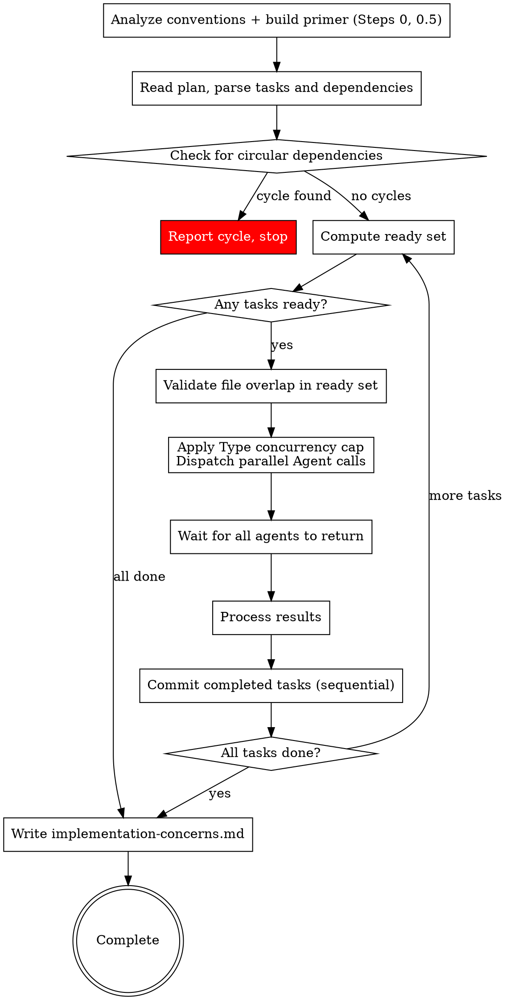

# Subagent-Driven Development

Execute plan by dispatching subagents per task. Tasks with no mutual dependencies run in parallel waves for faster execution.

**Core principle:** Fresh subagent per task + self-review + concerns collection = fast iteration with deferred quality review

## The Process



Each dispatched Agent implements the task, performs a self-review, and returns a status with any concerns. Multiple agents run concurrently. **Subagents do not commit** — they only implement, test, self-review, and report. After each wave returns, **the orchestrator (you) commits each completed task sequentially**. This is deliberate: parallel agents share one working tree and one git index, so letting them commit concurrently causes them to stage each other's in-flight files, contend on `.git/index.lock`, and trip pre-commit hooks against files they don't own. Committing sequentially from the orchestrator eliminates all of that.

## Wave Execution Algorithm

Follow these steps exactly to resolve dependencies and dispatch tasks in parallel waves.

### Step 0: Analyze Commit Conventions

Before parsing tasks, detect the project's commit conventions **once** by running the deterministic detector (plugin root is in your session context):

```bash
python3 "<plugin-root>/scripts/detect-commit-conventions.py"
```

It inspects `git log`, the branch name, hook tooling (Lefthook/Husky/pre-commit) and commitlint configs, and prints a ready `## Commit Conventions` block — message format, common types, scope usage, ticket ID (or an instruction to ask the user when history references tickets but the branch has none), real examples, hook/commitlint status, and the commit-failure rules (max 3 attempts, never `--no-verify`).

Store the printed block verbatim — **you (the orchestrator) use it when writing commit messages in Step 6.5**. Subagents do not commit, so it is never pasted into subagent prompts.

### Step 0.5: Build the Project Primer

Gather, **once**, the project facts every implementer otherwise re-discovers per task. Run ONE batched discovery command (a single Bash call combining the `ls`/`grep`/`cat` checks — never one call per fact) covering:

1. **Test setup** — runner + config path (`jest.config.*`, `vitest.config.*`, or the `package.json` field), the canonical test command (`package.json` scripts), and the test-utils/render-helper path if one exists.
2. **Design tokens / theme** — where token and theme definitions live (`tailwind.config.*`, `theme/`, `tokens/`, CSS-variable files).
3. **Canonical format + lint commands** — the exact invocations, stated once so every agent runs the identical command.
4. **Assets directory** — the existing convention (`src/assets`, `public/`, an `icons/` folder).
5. **Framework + conventions** — framework, component directory layout, path aliases (`tsconfig.json` `paths`).

Assemble a `## Project Primer` block: **at most ~20 lines, paths and commands only, no prose** — every byte is re-sent on every subagent turn. **Omit any line you could not determine** — a wrong path is worse than a missing one; implementers fall back to their own single batched discovery for omitted facts. If the design/plan artifacts already record a fact (e.g. token locations via `## Árvore de Componentes de DS`), copy it instead of re-deriving. Store the block — you paste it into every implementer dispatch in Step 5.

### Steps 1-4: Resolve the Graph (script)

The task graph — parsing, cycle detection, ready set, and file-overlap filtering — is resolved deterministically by a script. At the start of execution and again **at every wave**, run:

```bash
python3 "<plugin-root>/scripts/plan-graph.py" ".afyapowers/features/<feature>/artifacts/plan.md" --completed <comma-separated task numbers completed so far this run>
```

(Omit `--completed` on the first wave. Tasks whose checkboxes are already all `- [x]` in plan.md count as completed automatically.)

The contract it implements: a task is **ready** when its status is `pending` (or `needs-retry` — the script cannot see retries, so re-include those numbers yourself) and every task in its `**Depends on:**` / `**Depende de:**` list is `completed`; two ready tasks that share any `**Files:**` path never run in the same wave (the script keeps the lower-numbered one). **Asset files are excluded from overlap** — they are additive, dedup-checked before writing, and idempotent, so they don't need serialization; the sequential commits in Step 6.5 ensure only the last version persists.

Read the output:
- One `task=N type=... status=... deps=... files=...` line per task — this is your task table (numbers, types for Step 5 classification, file lists for Step 6.5 staging).
- `ready=<numbers>` — the wave candidates, already filtered for file overlap.
- `cycle=<N->M->...->N>` with exit code 1 — report: "Circular dependency detected — the following tasks form a cycle: [list]. Please fix the plan." Do NOT proceed until cycles are resolved.

Track task status yourself across waves (pending / in-flight / completed / needs-retry) and pass the completed numbers back via `--completed` each wave. A task you marked `needs-retry` is dispatchable again once you have addressed its blocker — treat it as ready even though the script lists it as pending.

### Step 5: Dispatch

**Type-aware concurrency:** After file overlap validation, classify each task in the ready set by its `**Type:**` line (the `type=` field in the plan-graph output):
- **MCP-capped task**: `Type` is `UI Screen` or `UI Component` — these implementers make Figma MCP calls
- **Uncapped task**: `Type` is `UI Logic`, `Backend`, or `General` — no Figma MCP calls
- **Legacy fallback**: if a task has NO `**Type:**` line, classify by the legacy heuristic — a task whose text contains a `**Figma:**` section counts as **MCP-capped**; otherwise **uncapped**

Apply concurrency caps:
- **Uncapped tasks**: dispatch all (no cap)
- **MCP-capped tasks**: budget by **estimated MCP calls**, not by task count. The Figma MCP rate-limits at **15 requests/minute**; target a wave of **≤12 calls** to leave headroom:

  | Type | Implementer | MCP calls per task | Budget cost |
  |---|---|---|---|
  | `UI Screen` | `figma-design-implementer` | 3 mandatory + occasional `get_metadata` fallback + `download_assets` | **~4** |
  | `UI Component` | `figma-component-implementer` | 3 mandatory + `download_assets` + fallbacks (self-review reuses data already in context — no extra calls) | **~4** |

  So per cycle: **3 MCP-capped tasks** of either type (≈12). Pick by task number in order; the rest stay in the ready pool for the next cycle.

> **Why budget by calls, not tasks?** Both implementers declare 3 mandatory calls, but assets and truncation fallbacks add 1-2 more per task in practice. Four tasks concurrently can exceed 15 req/min: tasks hit 429, back off 30-60s, and the wave serializes anyway — after burning the retries. Budgeting by calls (~4 each, ≤12/wave) keeps the wave under the limit.

**Figma tasks self-verify (with different mechanisms per Type).** `UI Screen` tasks (`figma-design-implementer`) run a fixed fidelity-verification step (its Step 5): after writing the code the implementer spawns a read-only `figma-token-verifier` and loops (max **2** attempts) fixing token/measure mismatches until PASS. `UI Component` tasks (`figma-component-implementer`) do **not** use `figma-token-verifier`; they self-verify via a screenshot self-review (its Step 6 — comparing against the screenshot and token data **already fetched in its Steps 1-2**; no re-fetch). Neither verification makes extra Figma calls. Consequence for you: a Figma task's `DONE` already carries a fidelity self-check, and a `DONE_WITH_CONCERNS` may carry a BLOCKING fidelity concern (e.g. "unresolved fidelity mismatch after 2 attempts", or a screenshot-mismatch concern) — handle it like any other blocking concern. This does not change wave scheduling or the commit flow.

Dispatch the combined set (all uncapped + the MCP-capped tasks that fit the ≤12-call budget) as parallel Subagent calls in a single message.

**Prompt routing:** Read the task's `**Type:**` line and select the implementer agent from this table:
- `UI Screen` → dispatch @"figma-design-implementer (agent)". Include the Figma metadata (file key, node ID, breakpoints, acceptance measures) in the agent context.
- `UI Component` → dispatch @"figma-component-implementer (agent)" (design-system-aware component implementer). Include the Figma metadata **and the full `**Design System:**` block** — see the mapping below.
- `UI Logic` / `Backend` / `General` → dispatch @"tdd-implementer (agent)" (standard TDD implementer).

**Mapping the `**Design System:**` block into the component implementer's placeholders.** This is the load-bearing part of a `UI Component` dispatch. The agent is organised entirely around its verdict, so an empty verdict changes what it builds:

| Task line | Agent placeholder |
|---|---|
| `**Veredito:**` | `[VERDICT]` (lowercase: `implementar` / `importar` / `atualizar` / `derivar`) |
| `**Base:**` | `[BASE_COMPONENT]` — name + resolved import path |
| `**Compõe de:**` | `[COMPOSE_FROM]` — the list of `{ code name, import path }` children |
| `**Variantes:**` | `[VARIANT_LIST]` — every axis the original declares |
| task name + `**Files:**` target | `[COMPONENT_NAME]`, `[OUTPUT_DIRECTORY]` |
| `**Anotações do Figma:**` / `**Estados a cobrir:**` | paste verbatim into the task text — interactive states, animation and a11y rules the implementer cannot see in the default frame |

Also pass `[NODE_TYPE]`, `[FRAMEWORK]` and `[GENERATE_STORYBOOK]` from the task/project context.

**`[FILE_KEY]` and `[NODE_ID]` on a `UI Component` task point at the ORIGINAL component, not at the instance** — and the file key may belong to a **different file** than the screen (the design-system file). Pass them exactly as the task carries them. Do not "correct" them to the screen's file key because they look inconsistent with the other tasks in the wave: that inconsistency is the point. The implementer has to read the component where it is declared, or it only ever sees the one variant that appeared on the screen.

**Leaves→root ordering is already enforced by `**Depends on:**`** — the plan derives each component task's dependencies from the DS tree's `Depende de` column, so the normal ready-set rule (a task is ready only when all its deps are `completed`) dispatches bases before derivatives and children before composites. You do not need a separate ordering pass. But do sanity-check it: a `derivar` task whose `[BASE_COMPONENT]` is not among its `**Depends on:**`, or a composite whose `[COMPOSE_FROM]` children are not all dependencies, means the plan dropped an edge. Surface that instead of dispatching — the agent would find the import unresolvable and report BLOCKING anyway, after doing the work.

**If the task has no `**Design System:**` block**, pass the placeholders empty and say so explicitly in the prompt. Do **not** invent a verdict to fill the gap. The agent has a defined procedure for a missing verdict — it checks whether the component already exists before building anything — and that check is the whole safeguard. Silently passing `implementar` defeats it and produces a duplicate of an existing design-system component, which is the worst outcome available here: permanent, invisible, and it looks like the task succeeded.

**Legacy fallback (no `**Type:**` line):** apply the pre-Type heuristic — if the task text contains a `**Figma:**` section → dispatch @"figma-design-implementer (agent)" (include Figma metadata); otherwise → dispatch @"tdd-implementer (agent)".

Each agent gets:
- Full task text (steps, file list, code/Figma metadata, and the `**Design System:**` block if present) — paste directly, don't make agent read files
- **The `## Project Primer` block from Step 0.5** — paste verbatim into every implementer dispatch. This is what stops each implementer from spending its first dozen turns re-discovering the jest config, the test-utils path, and the token files.
- **Task-relevant design spec excerpts — not the whole spec.** Paste only the sections the task actually needs: for Figma tasks, the task's screen/section context plus — from `## Árvore de Componentes de DS` — **only the rows for this task's node and its `**Depends on:**` nodes**, and — from `## Decisões de Reúso de Componentes` — only the decisions citing those nodes (these record which components exist, their import paths, and which reuses the user approved; an implementer that can't see its rows re-derives those decisions by guessing). For `UI Screen` tasks also paste the relevant Layout Contract row(s). `tdd-implementer` tasks do NOT get the DS tree — only the spec sections describing the behavior they implement. Never paste the full design.md: every byte you paste is re-sent on all of the subagent's turns
- File constraint: "You may ONLY modify these files: [list from task's Files: section]". **For Figma tasks, append:** "— plus you MAY create asset files (icons/images) under the project's assets directory as needed; list every asset file you create in your report."
- Return format: status (DONE / DONE_WITH_CONCERNS / NEEDS_CONTEXT / BLOCKED) + summary, **including the exact list of files changed**. For Figma tasks, the report must **separately list any asset files created** (the "Assets created" line) — these are usually not in the Files: section and the orchestrator needs them to stage the assets.

**Subagents do NOT commit.** They implement, test, self-review, and report. Do not paste the commit conventions block into subagent prompts — you commit each completed task yourself in Step 6.5.

### Step 6: Wait and Process Results

All Agent calls return together. For each result:
- **DONE**: mark task `completed`. (The plan checkbox flip happens automatically in the Step 6.5 commit — do not edit plan.md by hand.)
- **DONE_WITH_CONCERNS**: read concerns and sort each by the severity the implementer tagged it with (**BLOCKING** vs non-blocking **CONCERN**). Mark the task `completed` and commit its work (Step 6.5) so it isn't lost — but track BLOCKING and non-blocking concerns in **separate** lists. If a concern indicates the task is fundamentally broken, treat as `BLOCKED` instead.
  - **BLOCKING concern examples (collect as blocking, do not bury):** "I reused `DropdownPicker` as instructed but its drawer+search interaction model doesn't match the Figma chip+popover", "this component assumes a bounded-height parent the host doesn't provide", "output behaves differently from the design". These do not stop the wave, but the implement phase cannot cleanly advance until the user resolves or explicitly accepts them (enforced by the `implementing` skill).
  - **Treat as BLOCKED examples:** "I couldn't get tests to pass", "Tests fail and I can't figure out why", "Core dependency is missing and I had to stub the entire integration"
  - **Non-blocking (store-and-continue) examples:** "I'm not sure this edge case is handled correctly", "The API response format might differ in production", "This works but the approach feels fragile"
  - **A concern that defers verification is BLOCKING, never store-and-continue.** If a concern postpones checking the work to a later phase instead of checking it now — e.g. "vou validar isso na review", "will confirm later", "didn't run the tests, someone should verify before shipping" — reclassify it as **BLOCKING** regardless of how the implementer tagged it. Deferred verification is not evidence of correctness; it is the absence of evidence, and it becomes a verification requirement that only closes once the actual evidence is produced — not once someone promises to look later.
- **NEEDS_CONTEXT**: surface question to user. Mark task `needs-retry`. Continue with other tasks — do NOT pause the entire execution
- **BLOCKED**: assess blocker per standard SDD rules (more context, more capable model, break into pieces, or escalate). Mark task `needs-retry`

### Step 6.5: Commit Completed Tasks

Subagents do not commit. Once results are processed, **you** commit each task that
returned `DONE` or `DONE_WITH_CONCERNS` this wave — **one commit per task, strictly
sequentially** (never in parallel). Sequential commits are what eliminate the
index-lock races and cross-task contamination that parallel committing causes.

For each completed task, in order, run ONE call (plugin root is in your session context):

```bash
python3 "<plugin-root>/scripts/commit-task.py" \
  --files "<comma-separated paths from the task's **Files:** section (Create/Modify/Test)>" \
  --assets "<comma-separated paths from the task's 'Assets created' report line, if any>" \
  --message "<message following the ## Commit Conventions block from Step 0, subject derived from the ### Task N: heading>" \
  --task <N> --plan ".afyapowers/features/<feature>/artifacts/plan.md"
```

The script does the whole cycle deterministically: stages ONLY the listed files (never `git add .`/`-A`), verifies the staging, commits, and on success flips the task's plan.md checkboxes to `- [x]`. For Figma tasks, the reported asset files are a legitimate, expected part of the task's output — pass them via `--assets`.

Route on the output:
- `ok=true sha=...` — the task is committed and its checkboxes flipped. Move on.
- `error=unexpected_staged_file:<path>` — a file outside the task's Files list AND not a reported asset is staged (e.g. an agent edited outside its constraint). **Stop and surface it to the user** instead of committing.
- `hook_error=<output>` — a pre-commit hook or commitlint rejected the commit; the task's files are left staged. **Handle it yourself** (safe to retry now, since commits are sequential):
  - Commitlint rejection → re-run `commit-task.py` with a message rewritten to match the format.
  - Lint/format failure → fix the reported issues or run the formatter, then re-run `commit-task.py` with the same arguments (it re-stages only this task's files).
  - Other hook failure → read the error, apply the fix, re-run `commit-task.py`.
  - Max 3 attempts. After that, leave the changes staged and surface the full error to the user. **Never use `--no-verify`.**

(Repair mode: `commit-task.py --flip-only --task <N> --plan <path>` flips a task's checkboxes without committing — use it only to reconcile plan.md if a session died between a commit and its flip.)

Do **not** commit `BLOCKED` or `needs-retry` tasks — their work stays uncommitted until a later wave completes them successfully.

### Step 7: Repeat

Go back to Steps 1-4: re-run `plan-graph.py` with the updated `--completed` list. Continue until all tasks are `completed`.

If no tasks are ready and not all tasks are completed, there's a problem:
- If tasks are `needs-retry`: surface all blockers to the user
- If tasks are waiting on incomplete tasks that aren't in-flight: there may be a cycle that wasn't caught — report it

### Worked Example

```
Plan: 5 tasks. Task 1,2 have no deps. Task 3,4 depend on 1,2. Task 5 depends on 3,4.

--- Cycle 1 ---
Completed: []
Ready: [1, 2] → no file overlap → dispatch both
  → Agent(Task 1), Agent(Task 2) dispatched in parallel
  → Both return DONE (no commits — agents only implement + report)
  → Orchestrator commits sequentially: commit Task 1 files, then commit Task 2 files
Completed: [1, 2]

--- Cycle 2 ---
Ready: [3, 4] (deps [1,2] all completed) → no file overlap → dispatch both
  → Agent(Task 3), Agent(Task 4) dispatched in parallel
  → Task 3 returns DONE_WITH_CONCERNS (concern noted)
  → Task 4 returns DONE
  → Orchestrator commits sequentially: commit Task 3 files, then commit Task 4 files
Completed: [1, 2, 3, 4]
Concerns collected: [Task 3: "..."]

--- Cycle 3 ---
Ready: [5] (deps [3,4] all completed) → dispatch
  → Agent(Task 5) dispatched
  → Returns DONE
  → Orchestrator commits Task 5 files
Completed: [1, 2, 3, 4, 5] → Write implementation-concerns.md → Done
```

#### Mixed Type Example

```
Ready: [1(Backend), 2(General), 3(UI Screen), 4(UI Component), 5(UI Logic), 6(UI Component)]
→ Classify by Type: uncapped (no MCP) = [1, 2, 5], MCP-capped = [3, 4, 6]
→ Route: 1,2,5 → tdd-implementer; 3 → figma-design-implementer; 4,6 → figma-component-implementer
→ Budget the MCP wave (target ≤12 calls): 3(UI Screen)≈4 + 4(UI Component)≈6 = 10 ✓; adding 6(UI Component)≈6 → 16 ✗
→ Dispatch: [1, 2, 5] + [3, 4] = 5 parallel agents. Task 6 waits for the next cycle
→ Next cycle: 6(UI Component)≈6 dispatches alone
```

### Fallback to Sequential

If the plan has no `**Depends on:**` or `**Depende de:**` lines on any task, warn: "Plan is missing dependency declarations. Falling back to sequential execution." Then execute tasks one at a time in order, identical to pre-parallel SDD behavior.

If a plan has all tasks depending on the previous one (linear chain), the wave executor naturally dispatches one task at a time — no special case needed.

### Post-Wave Verification

After each wave's tasks are committed (Step 6.5):
1. **Review each agent's summary** — understand what changed
2. **Check for conflicts** — did any agents edit the same code despite file validation?
3. **Run the test suite** — verify all changes work together
4. **Spot check** — agents can make systematic errors, especially in parallel

## Agent Prompt Best Practices

When dispatching implementer subagents (whether sequential or parallel), craft focused prompts:

1. **Focused** — One clear task per agent. Don't combine unrelated work.
2. **Self-contained** — Paste all context the agent needs. Don't make it search or read plan files.
3. **Constrained** — Specify which files may be modified. Specify what NOT to do.
4. **Specific about output** — Define the exact return format (status + summary).

**Common mistakes:**
- Too broad: "Implement the feature" — agent gets lost
- No context: "Fix the function" — agent doesn't know which
- No constraints: agent refactors everything
- Vague output: "Fix it" — you don't know what changed

## Model Selection

Use the least powerful model that can handle each role to conserve cost and increase speed.

**Mechanical implementation tasks** (isolated functions, clear specs, 1-2 files): use a fast, cheap model.

**Integration and judgment tasks** (multi-file coordination, pattern matching, debugging): use a standard model.

**Architecture, design, and review tasks**: use the most capable available model.

## Handling Implementer Status

Implementer subagents report one of four statuses:

**DONE:** Mark task `completed` (the Step 6.5 commit flips the plan checkbox). No review dispatch.

**DONE_WITH_CONCERNS:** Read concerns and sort by severity (**BLOCKING** vs non-blocking **CONCERN**). Store them in separate lists and mark `completed`. If the concern indicates the task is fundamentally broken (e.g., "I couldn't get tests to pass", "Core dependency is missing and I had to stub the entire integration"), treat as `BLOCKED` instead. BLOCKING concerns (e.g. a component substitution that doesn't match Figma, an unconfirmed host-height assumption, behavior that differs from the design) are collected separately and gate the phase via the `implementing` skill. Examples of non-blocking concerns: "I'm not sure this edge case is handled correctly", "The API response format might differ in production", "This works but the approach feels fragile." A concern that **defers verification** to a later phase instead of performing it (e.g. "vou validar isso na review", "will check this later") is always **BLOCKING**, never non-blocking — even if the implementer filed it as a routine ressalva — because it is a verification requirement that only closes with actual evidence, not a promise to verify eventually.

**NEEDS_CONTEXT:** Provide missing context and re-dispatch.

**BLOCKED:** Assess blocker:
1. Context problem → provide more context, re-dispatch
2. Needs more reasoning → re-dispatch with more capable model
3. Task too large → break into smaller pieces
4. Plan wrong → escalate to human

**Never** ignore an escalation or force retry without changes.

## Prompt Templates

- @"tdd-implementer (agent)" - Dispatch standard implementer subagent (TDD workflow) — for `UI Logic` / `Backend` / `General`
- @"figma-design-implementer (agent)" - Dispatch Figma design implementer subagent (visual fidelity workflow) — for `UI Screen`
- @"figma-component-implementer (agent)" - Dispatch Figma component implementer subagent (design-system-aware component workflow) — for `UI Component`

## Red Flags

**Never:**
- Start implementation on main/master branch without explicit user consent
- Dispatch implementation subagents that modify the same files in parallel (file overlap = sequential)
- Let subagents commit — committing is the orchestrator's job, done sequentially after the wave (Step 6.5)
- Commit by hand with raw `git add`/`git commit` — always go through `scripts/commit-task.py`, which stages only the task's specific files and verifies the staging
- Make subagent read plan file (provide full text instead)
- Skip scene-setting context
- Ignore subagent questions
- Silently discard DONE_WITH_CONCERNS notes — always collect and persist them

**If subagent asks questions:**
- Answer clearly and completely
- Provide additional context if needed
- Don't rush them into implementation

**If subagent fails task:**
- Dispatch fix subagent with specific instructions
- Don't try to fix manually (context pollution)

## Integration

**Invoked by:**
- **implementing** (REQUIRED SUB-SKILL) — implementing loads the plan and design, then invokes SDD to execute all tasks

**Subagent prompts:**
- @"tdd-implementer (agent)" — TDD rules are embedded directly in this prompt (used for `UI Logic` / `Backend` / `General` tasks, and legacy non-Figma tasks)
- @"figma-design-implementer (agent)" — Figma implement-design workflow (used for `UI Screen` tasks, and legacy tasks with a `**Figma:**` section)
- @"figma-component-implementer (agent)" — design-system-aware component workflow (used for `UI Component` tasks)

**Context:** When invoked by implementing, the plan and design are already in the conversation context. Use them directly. If the plan is not in context (e.g., invoked standalone), read it from `.afyapowers/features/<feature>/artifacts/plan.md`.

## Concerns Collection

After all tasks complete, if any `DONE_WITH_CONCERNS` notes were collected during execution, write them to `.afyapowers/features/<feature>/artifacts/implementation-concerns.md`, split into two severity sections:

```markdown
# Implementation Concerns

Collected during implementation phase.

## Impedimentos
<!-- Output diverges from the design/Figma in look or behavior. Must be resolved or explicitly
     accepted by the user before the phase advances. Omit this section if there are none. -->

### Task N: [task name verbatim from plan heading]
- [blocking concern text from implementer report]

## Ressalvas
<!-- Doubts, fragility, edge cases, token drift, a11y additions. Priority areas for the review
     phase. Omit this section if there are none. -->

### Task M: [task name verbatim from plan heading]
- [concern text from implementer report]
```

Always keep blocking concerns under `## Impedimentos` and the rest under `## Ressalvas`, each grouped by task. Omit a section entirely if it has no entries.

If the implementation phase is re-run (e.g., after fixing a blocked task), overwrite `implementation-concerns.md` with fresh data from the current run — do not append to stale concerns from a previous run. **Exception:** before overwriting, read the existing file and collect every blocking-concern line already marked `[ACCEPTED BY USER: <reason>]`. When writing the fresh blocking concerns, for each concern line in the fresh run: if its text (ignoring the marker) exactly matches an accepted carry-forward line, emit the accepted version (with the marker) instead of the unmarked fresh line — do not emit both. After processing all fresh concerns this way, append any remaining accepted lines whose text did not appear in the fresh run. This guarantees a user's recorded acceptance survives re-runs without producing unmarked duplicates that would force a spurious Alterações Solicitadas verdict. If no concerns were collected and no accepted markers exist to preserve, do not create the file.
