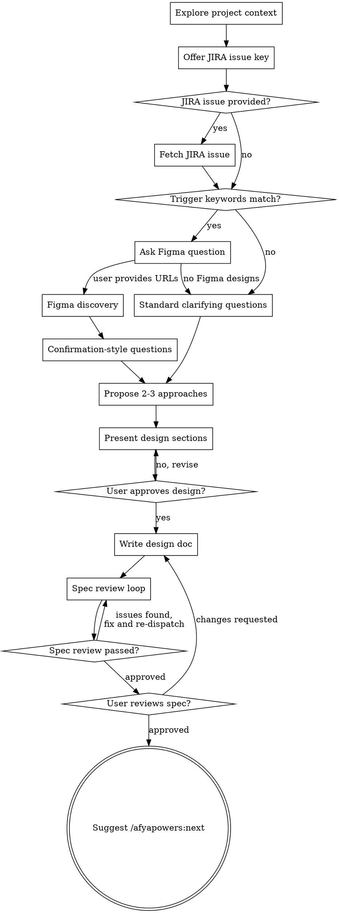

# Design Phase

Help turn ideas into fully formed technical designs through natural collaborative dialogue.

Start by understanding the current project context, then ask questions one at a time to refine the idea. Once you understand what you're building, present the full design — from requirements through architecture — and get user approval.

<HARD-GATE>
Do NOT invoke any implementation skill, write any code, scaffold any project, or take any implementation action until you have presented a design and the user has approved it. This applies to EVERY project regardless of perceived simplicity.
</HARD-GATE>

## Phase Gate

1. Read `.afyapowers/features/active` to get the active feature
2. Read `.afyapowers/features/<feature>/state.yaml` — confirm `current_phase` is `design`
3. If not in design phase, tell the user the current phase and stop

## Anti-Pattern: "This Is Too Simple To Need A Design"

Every project goes through this process. A todo list, a single-function utility, a config change — all of them. "Simple" projects are where unexamined assumptions cause the most wasted work. The design can be short (a few sentences for truly simple projects), but you MUST present it and get approval.

## Checklist

You MUST complete these items in order:

1. **Explore project context** — check files, docs, recent commits
2. **JIRA discovery (offer-based)** — offer the user the chance to provide a JIRA issue key; if provided, fetch and summarize the issue (see below)
3. **Figma discovery (trigger-based)** — check user request against trigger keywords (see below); if match, ask about Figma and run discovery before clarifying questions
4. **Ask clarifying questions** — if JIRA and/or Figma data is available, use confirmation-style questions (see below); otherwise, standard one-at-a-time clarifying questions
5. **Propose 2-3 approaches** — with trade-offs and your recommendation
6. **Present design** — in sections scaled to their complexity, get user approval after each section
7. **Write design doc** — save to `.afyapowers/features/<feature>/artifacts/design.md`
8. **Spec review loop** — dispatch spec-document-reviewer subagent; fix issues and re-dispatch until approved (max 5 iterations, then surface to human)
9. **User reviews written spec** — ask user to review the spec file before proceeding

## Process Flow



**The terminal state is suggesting `/afyapowers:next`.** Do NOT invoke any implementation skill or advance phases. The `/afyapowers:next` command handles phase transitions.

## The Process

**Understanding the idea:**

- Check out the current project state first (files, docs, recent commits)
- Before asking detailed questions, assess scope: if the request describes multiple independent subsystems (e.g., "build a platform with chat, file storage, billing, and analytics"), flag this immediately. Don't spend questions refining details of a project that needs to be decomposed first.
- If the project is too large for a single spec, help the user decompose into sub-projects: what are the independent pieces, how do they relate, what order should they be built? Then design the first sub-project through the normal flow. Each sub-project gets its own design → plan → implementation cycle.
- For appropriately-scoped projects, ask questions one at a time to refine the idea
- Prefer multiple choice questions when possible, but open-ended is fine too
- Only one question per message - if a topic needs more exploration, break it into multiple questions
- Focus on understanding: purpose, constraints, success criteria

**JIRA discovery (offer-based):**

After exploring project context, offer the user:

> "Is there a JIRA issue associated with this feature? If so, share the issue key (e.g., PROJ-123)."

If the user provides a JIRA issue key:

1. **Resolve the Atlassian cloud ID:**
   - Call `mcp__claude_ai_Atlassian__getAccessibleAtlassianResources` (no parameters)
   - If exactly one site is returned, use its `id` as the `cloudId`
   - If multiple sites are returned, present them as a multiple-choice question and let the user pick

2. **Fetch the issue:**
   ```
   mcp__claude_ai_Atlassian__getJiraIssue(
     cloudId: "<resolved_cloud_id>",
     issueIdOrKey: "<user_provided_key>",
     responseContentFormat: "markdown"
   )
   ```

3. **Build the JIRA context summary** from the response:
   - **Summary:** issue summary field
   - **Issue Type:** story, bug, task, epic, etc.
   - **Description:** full description in markdown
   - **Acceptance Criteria:** extracted from description or custom fields if present
   - **Linked Issues:** dependencies, blockers, related issues
   - **Labels / Components:** for categorization context

   Present this summary to the user for confirmation before proceeding.

4. **Proceed to Figma discovery** (the JIRA summary and description text is now part of the context when evaluating Figma trigger keywords)

If no JIRA issue is provided, proceed directly to Figma discovery.

**If the Atlassian MCP server is unavailable:** Warn the user and **stop the JIRA discovery flow**. Do not attempt to proceed without it — the user asked for JIRA context, so a silent fallback would undermine the purpose. Suggest the user check their MCP server connection and retry.

**Figma discovery (trigger-based):**

After exploring project context, check the user's request for these trigger keywords (case-insensitive, word-level matching):

> page, landing page, screen, view, layout, header, footer, navbar, sidebar, UI component, form, modal, dialog, card, hero, section, banner, responsive, breakpoint, mobile, desktop, dashboard, panel, widget

If any keyword matches, ask the user:

> "Does this feature have Figma designs? If so, please share the Figma URL(s)."

If a keyword matches but the request is clearly not UI work (e.g., "write unit tests for the landing page API endpoint"), use judgment — when in doubt, ask.

If no keywords match, skip Figma discovery and proceed to clarifying questions.

If the user provides Figma URL(s):

1. **Parse each URL** to extract the file key and node ID
   - URL format: `https://figma.com/design/:fileKey/:fileName?node-id=X-Y`
   - Extract `:fileKey` (segment after `/design/`) and `X-Y` (value of `node-id` parameter)

2. **Single `get_metadata` call** on the root node
   ```
   get_metadata(fileKey=":fileKey", nodeId="X-Y")
   ```
   From the response, build the Node Map using only the first 2 depth levels of the returned tree:
   - **Depth 0:** Page
   - **Depth 1:** Screen/Section (top-level frames — names and dimensions are included in metadata)
   - **Depth 2:** Component or element (the task unit)

   Ignore any nodes deeper than depth 2. Breakpoints are inferred from top-level frame names and dimensions (e.g., "Desktop" at 1440px, "Mobile" at 375px).

   From the response, build the Node Map with two subsections:
   a. **Reusable Components:** Extract all depth-2 nodes typed COMPONENT or COMPONENT_SET. List each with its node ID and type. If none exist, write `(none — all components are external or pre-existing)`.
   b. **Screens:** List each depth-1 FRAME with its node ID, type, and dimensions. Under each frame, list its depth-2 children (excluding COMPONENT/COMPONENT_SET nodes already listed above). Collapse repeated INSTANCE nodes sharing the same `componentId` with a `×N` count.

3. **Build the `## Figma Resources` section** for the design doc:
   - File info (URL, file key)
   - Breakpoints (inferred from top-level frame names and dimensions in the metadata response)
   - Node Map (shallow structure from `get_metadata`: page → section → component/element)

   Use the template from `templates/design.md` for the section structure.

   #### Example

   `get_metadata` returns:
   ```
   Page "Landing Page"
     Frame "Hero Section" (id: 1:2, type: FRAME, 1440x800)
       ├── "Hero Title" (id: 1:3, type: TEXT)
       ├── "CTA Button" (id: 1:4, type: COMPONENT)
       ├── "Card" (id: 1:5, type: INSTANCE, componentId: 2:10)
       ├── "Card" (id: 1:6, type: INSTANCE, componentId: 2:10)
       └── "Card" (id: 1:7, type: INSTANCE, componentId: 2:10)
     Frame "Pricing Section" (id: 2:1, type: FRAME, 1440x600)
       ├── "Pricing Tier" (id: 2:10, type: COMPONENT_SET)
       ├── "Section Title" (id: 2:11, type: TEXT)
       └── "Pricing Tier" (id: 2:12, type: INSTANCE, componentId: 2:10)
   ```

   Correct Node Map output:
   ```
   #### Page: Landing Page

   **Reusable Components:**
   - CTA Button (node `1:4`, COMPONENT)
   - Pricing Tier (node `2:10`, COMPONENT_SET)

   **Screens:**
   - **Hero Section** (node `1:2`, FRAME, 1440x800)
     - Card (node `1:5`, INSTANCE, componentId: `2:10`) ×3
     - Hero Title (node `1:3`, TEXT)
   - **Pricing Section** (node `2:1`, FRAME, 1440x600)
     - Pricing Tier (node `2:12`, INSTANCE, componentId: `2:10`) ×1
     - Section Title (node `2:11`, TEXT)
   ```

   **Node Map validation (run before finalizing the Figma Resources section):**
   1. Every COMPONENT/COMPONENT_SET node from the metadata has an entry with `node \`<id>\`` and its type in **Reusable Components**
   2. No COMPONENT/COMPONENT_SET node was omitted or merged into a screen's children
   3. INSTANCE nodes with the same componentId are collapsed with ×N count under their parent screen in **Screens**
   4. Every depth-1 FRAME has its node ID and dimensions in **Screens**
   5. If no COMPONENT/COMPONENT_SET nodes exist, **Reusable Components** says `(none — all components are external or pre-existing)`

No `get_screenshot` or `get_design_context` calls during the design phase — these are deferred to implementation, where the subagent already calls them per-task. This keeps the design phase at exactly **1 MCP call** regardless of file complexity.

**If the Figma MCP server is unavailable:** Warn the user and **stop the Figma discovery flow**. Do not attempt to proceed without it — the user provided Figma URLs, so a silent fallback would undermine the purpose. Suggest the user check their MCP server connection and retry.

**If no Figma designs:** Proceed normally. Do not include the Figma Resources section in the design doc.

**Design tokens are NOT extracted during design phase.** They are deferred to implementation time — the implementer subagent will fetch them via `get_variable_defs` when needed.

**Clarifying questions (JIRA and/or Figma-informed):**

When JIRA data and/or Figma data was gathered in previous steps, replace open-ended clarifying questions with confirmation-style:

- If JIRA data is available: present the ticket's requirements, acceptance criteria, and scope, and ask the user to confirm, correct, or extend
- If Figma data is available: present what the design shows (structure, breakpoints, component hierarchy) and ask the user to confirm or correct
- If both are available: confirm JIRA requirements first, then Figma structural details
- Then only ask about things not covered by either source: technical constraints, architecture preferences, performance requirements, edge cases

Examples:
- **Open-ended (without JIRA/Figma):** "What problem are we solving?"
- **With JIRA:** "The JIRA ticket PROJ-123 describes: '[summary]'. The acceptance criteria include [X, Y, Z]. Does this capture the full scope, or are there additions?"
- **With Figma:** "The Figma design shows a hero section, a 3-column feature grid, and a CTA footer across 3 breakpoints (mobile/tablet/desktop). Does this match what you want, or do you need changes?"
- **With JIRA + Figma:** "JIRA describes [requirements]. The Figma design shows [structure]. Do these align with what you want to build?"

When neither JIRA nor Figma data is available, use the standard approach: ask questions one at a time to understand purpose, constraints, and success criteria.

**Exploring approaches:**

- Propose 2-3 different approaches with trade-offs
- Present options conversationally with your recommendation and reasoning
- Lead with your recommended option and explain why

**Presenting the design:**

- Once you believe you understand what you're building, present the full design
- Start with requirements and constraints, then move into architecture and technical details
- Scale each section to its complexity: a few sentences if straightforward, up to 200-300 words if nuanced
- Ask after each section whether it looks right so far
- Cover all sections from the design template: problem statement, requirements, constraints, chosen approach, architecture, data flow, interfaces, error handling, testing strategy, dependencies
- If JIRA discovery was performed, include the `## JIRA Context` section with issue key, summary, acceptance criteria, and linked issues
- If Figma discovery was performed, include the `## Figma Resources` section with file info, breakpoints, and node map
- Be ready to go back and clarify if something doesn't make sense

**Design for isolation and clarity:**

- Break the system into smaller units that each have one clear purpose, communicate through well-defined interfaces, and can be understood and tested independently
- For each unit, you should be able to answer: what does it do, how do you use it, and what does it depend on?
- Can someone understand what a unit does without reading its internals? Can you change the internals without breaking consumers? If not, the boundaries need work.
- Smaller, well-bounded units are also easier for you to work with - you reason better about code you can hold in context at once, and your edits are more reliable when files are focused. When a file grows large, that's often a signal that it's doing too much.

**Working in existing codebases:**

- Explore the current structure before proposing changes. Follow existing patterns.
- Where existing code has problems that affect the work (e.g., a file that's grown too large, unclear boundaries, tangled responsibilities), include targeted improvements as part of the design - the way a good developer improves code they're working in.
- Don't propose unrelated refactoring. Stay focused on what serves the current goal.

## Required Sub-Skills

**REQUIRED:** Dispatch spec-document-reviewer subagent after writing the design artifact.

- Announce: "Using spec-document-reviewer to validate the design."
- Dispatch subagent using `skills/design/spec-document-reviewer-prompt.md`
- If issues found: fix and re-dispatch (max 5 iterations, then surface to human)
- After approval: resume the parent flow (user review gate)

## After the Design

**Documentation:**

- Write the validated design to `.afyapowers/features/<feature>/artifacts/design.md`
  - Use the template from `templates/design.md`
- Commit the design document to git

**Spec Review Loop:**
After writing the spec document:

1. Dispatch spec-document-reviewer subagent (see `skills/design/spec-document-reviewer-prompt.md`)
2. If Issues Found: fix, re-dispatch, repeat until Approved
3. If loop exceeds 5 iterations, surface to human for guidance

**User Review Gate:**
After the spec review loop passes, ask the user to review the written spec before proceeding:

> "Design written to `.afyapowers/features/<feature>/artifacts/design.md`. Please review it and let me know if you want to make any changes."

Wait for the user's response. If they request changes, make them and re-run the spec review loop. Only proceed once the user approves.

**Completion:**

- Update `state.yaml` to add `design.md` to the design phase's artifacts list
- Append `artifact_created` event to `history.yaml`
- Tell the user: "Design phase complete. Run `/afyapowers:next` to proceed to **plan**."

## Key Principles

- **One question at a time** - Don't overwhelm with multiple questions
- **Multiple choice preferred** - Easier to answer than open-ended when possible
- **YAGNI ruthlessly** - Remove unnecessary features from all designs
- **Explore alternatives** - Always propose 2-3 approaches before settling
- **Incremental validation** - Present design, get approval before moving on
- **Be flexible** - Go back and clarify when something doesn't make sense
