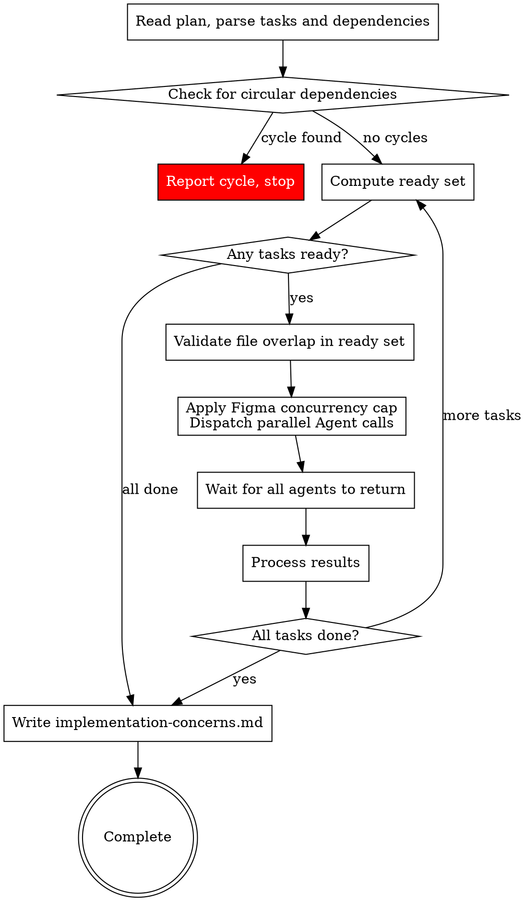

# Subagent-Driven Development

Execute plan by dispatching subagents per task. Tasks with no mutual dependencies run in parallel waves for faster execution.

**Core principle:** Fresh subagent per task + self-review + concerns collection = fast iteration with deferred quality review

## The Process



Each dispatched Agent implements the task, performs a self-review, and returns a status with any concerns. Multiple agents run concurrently.

## Wave Execution Algorithm

Follow these steps exactly to resolve dependencies and dispatch tasks in parallel waves.

### Step 1: Parse Tasks

Read the plan and extract all tasks. For each task, record:
- Task number (from `### Task N:` heading)
- Dependencies (from `**Depends on:**` line — parse as list of task numbers, or empty if `none`)
- File list (from `**Files:**` section — all file paths mentioned)
- Status: pending, in-flight, completed, or needs-retry

Example:
```
Task 1: deps=[]      files=[src/a.py, tests/test_a.py]     status=pending
Task 2: deps=[]      files=[src/b.py, tests/test_b.py]     status=pending
Task 3: deps=[1,2]   files=[src/c.py, tests/test_c.py]     status=pending
Task 4: deps=[1,2]   files=[src/d.py, tests/test_d.py]     status=pending
Task 5: deps=[3,4]   files=[src/e.py, tests/test_e.py]     status=pending
```

### Step 2: Check for Cycles

Before executing anything, verify no circular dependencies exist. If task A depends on B and B depends on A (directly or transitively), report: "Circular dependency detected — the following tasks form a cycle: [list]. Please fix the plan." Do NOT proceed until cycles are resolved.

### Step 3: Compute Ready Set

A task is **ready** if:
- Status is `pending` or `needs-retry`
- All tasks in its `deps` list have status `completed`

```
Completed: [1, 2]
Ready: [3, 4]    (deps [1,2] all completed)
Waiting: [5]     (dep 3 not completed)
```

### Step 4: Validate File Overlap

Check every pair of tasks in the ready set. If two tasks share any file path in their file lists, remove one from the ready set (move it back to waiting). It will be picked up in the next cycle.

### Step 5: Dispatch

**Figma-aware concurrency:** After file overlap validation, classify each task in the ready set:
- **Figma task**: task text contains a `**Figma:**` section
- **Non-Figma task**: no `**Figma:**` section

Apply concurrency caps:
- **Non-Figma tasks**: dispatch all (no cap)
- **Figma tasks**: dispatch up to **4** per cycle. If more than 4 Figma tasks are ready, pick the first 4 by task number; the rest stay in the ready pool for the next cycle

> **Why 4?** The Figma MCP rate-limits at 15 requests/minute. Each Figma task makes 3 mandatory MCP calls, so 4 concurrent tasks = 12 calls — safely under the limit.

Dispatch the combined set (all non-Figma + up to 4 Figma) as parallel Subagent calls in a single message.

**Prompt routing:** Select the correct implementer prompt based on the task type:
- If the task text contains a `**Figma:**` section → use `skills/implementing/implement-figma-design.md` prompt template. Include the Figma metadata (file key, node ID, breakpoints) in the agent context.
- If the task does NOT contain a `**Figma:**` section → use `skills/implementing/implementer-prompt.md` prompt template (standard TDD implementer).

Each agent gets:
- Full task text (steps, file list, code/Figma metadata) — paste directly, don't make agent read files
- Design spec content for context
- File constraint: "You may ONLY modify these files: [list from task's Files: section]"
- Return format: status (DONE / DONE_WITH_CONCERNS / NEEDS_CONTEXT / BLOCKED) + summary

### Step 6: Wait and Process Results

All Agent calls return together. For each result:
- **DONE**: mark task `completed`, update plan checkbox to `- [x]`
- **DONE_WITH_CONCERNS**: read concerns. Store in concerns list and mark `completed`. If the concern indicates the task is fundamentally broken, treat as `BLOCKED` instead.
  - **Treat as BLOCKED examples:** "I couldn't get tests to pass", "Tests fail and I can't figure out why", "Core dependency is missing and I had to stub the entire integration"
  - **Store-and-continue examples:** "I'm not sure this edge case is handled correctly", "The API response format might differ in production", "This works but the approach feels fragile"
- **NEEDS_CONTEXT**: surface question to user. Mark task `needs-retry`. Continue with other tasks — do NOT pause the entire execution
- **BLOCKED**: assess blocker per standard SDD rules (more context, more capable model, break into pieces, or escalate). Mark task `needs-retry`

### Step 7: Repeat

Go back to Step 3. Recompute the ready set from scratch based on current task statuses. Continue until all tasks are `completed`.

If no tasks are ready and not all tasks are completed, there's a problem:
- If tasks are `needs-retry`: surface all blockers to the user
- If tasks are waiting on incomplete tasks that aren't in-flight: there may be a cycle that wasn't caught — report it

### Worked Example

```
Plan: 5 tasks. Task 1,2 have no deps. Task 3,4 depend on 1,2. Task 5 depends on 3,4.

--- Cycle 1 ---
Completed: []
Ready: [1, 2] → no file overlap → dispatch both
  → Agent(Task 1), Agent(Task 2) dispatched in parallel
  → Both return DONE
Completed: [1, 2]

--- Cycle 2 ---
Ready: [3, 4] (deps [1,2] all completed) → no file overlap → dispatch both
  → Agent(Task 3), Agent(Task 4) dispatched in parallel
  → Task 3 returns DONE_WITH_CONCERNS (concern noted)
  → Task 4 returns DONE
Completed: [1, 2, 3, 4]
Concerns collected: [Task 3: "..."]

--- Cycle 3 ---
Ready: [5] (deps [3,4] all completed) → dispatch
  → Agent(Task 5) dispatched
  → Returns DONE
Completed: [1, 2, 3, 4, 5] → Write implementation-concerns.md → Done
```

#### Mixed Figma / Non-Figma Example

```
Ready: [1(std), 2(std), 3(figma), 4(figma), 5(std), 6(figma)]
→ Classify: non-Figma = [1, 2, 5], Figma = [3, 4, 6]
→ Apply caps: all non-Figma + first 4 Figma
→ Dispatch: [1, 2, 5] + [3, 4, 6] = 6 parallel agents (all 3 Figma tasks fit under the cap of 4)
```

### Fallback to Sequential

If the plan has no `**Depends on:**` lines on any task, warn: "Plan is missing dependency declarations. Falling back to sequential execution." Then execute tasks one at a time in order, identical to pre-parallel SDD behavior.

If a plan has all tasks depending on the previous one (linear chain), the wave executor naturally dispatches one task at a time — no special case needed.

### Post-Wave Verification

After each wave completes:
1. **Review each agent's summary** — understand what changed
2. **Check for conflicts** — did any agents edit the same code despite file validation?
3. **Run the test suite** — verify all changes work together
4. **Spot check** — agents can make systematic errors, especially in parallel

## Agent Prompt Best Practices

When dispatching implementer subagents (whether sequential or parallel), craft focused prompts:

1. **Focused** — One clear task per agent. Don't combine unrelated work.
2. **Self-contained** — Paste all context the agent needs. Don't make it search or read plan files.
3. **Constrained** — Specify which files may be modified. Specify what NOT to do.
4. **Specific about output** — Define the exact return format (status + summary).

**Common mistakes:**
- Too broad: "Implement the feature" — agent gets lost
- No context: "Fix the function" — agent doesn't know which
- No constraints: agent refactors everything
- Vague output: "Fix it" — you don't know what changed

## Model Selection

Use the least powerful model that can handle each role to conserve cost and increase speed.

**Mechanical implementation tasks** (isolated functions, clear specs, 1-2 files): use a fast, cheap model.

**Integration and judgment tasks** (multi-file coordination, pattern matching, debugging): use a standard model.

**Architecture, design, and review tasks**: use the most capable available model.

## Handling Implementer Status

Implementer subagents report one of four statuses:

**DONE:** Mark task `completed`, update plan checkbox. No review dispatch.

**DONE_WITH_CONCERNS:** Read concerns. Store in concerns list and mark `completed`. If the concern indicates the task is fundamentally broken (e.g., "I couldn't get tests to pass", "Core dependency is missing and I had to stub the entire integration"), treat as `BLOCKED` instead. Examples of store-and-continue concerns: "I'm not sure this edge case is handled correctly", "The API response format might differ in production", "This works but the approach feels fragile."

**NEEDS_CONTEXT:** Provide missing context and re-dispatch.

**BLOCKED:** Assess blocker:
1. Context problem → provide more context, re-dispatch
2. Needs more reasoning → re-dispatch with more capable model
3. Task too large → break into smaller pieces
4. Plan wrong → escalate to human

**Never** ignore an escalation or force retry without changes.

## Prompt Templates

- `skills/implementing/implementer-prompt.md` - Dispatch standard implementer subagent (TDD workflow)
- `skills/implementing/implement-figma-design.md` - Dispatch Figma design implementer subagent (visual fidelity workflow)

## Red Flags

**Never:**
- Start implementation on main/master branch without explicit user consent
- Dispatch implementation subagents that modify the same files in parallel (file overlap = sequential)
- Make subagent read plan file (provide full text instead)
- Skip scene-setting context
- Ignore subagent questions
- Silently discard DONE_WITH_CONCERNS notes — always collect and persist them

**If subagent asks questions:**
- Answer clearly and completely
- Provide additional context if needed
- Don't rush them into implementation

**If subagent fails task:**
- Dispatch fix subagent with specific instructions
- Don't try to fix manually (context pollution)

## Integration

**Invoked by:**
- **implementing** (REQUIRED SUB-SKILL) — implementing loads the plan and design, then invokes SDD to execute all tasks

**Subagent prompts:**
- `skills/implementing/implementer-prompt.md` — TDD rules are embedded directly in this prompt (used for standard tasks)
- `skills/implementing/implement-figma-design.md` — Figma implement-design workflow (used for tasks with `**Figma:**` section)

**Context:** When invoked by implementing, the plan and design are already in the conversation context. Use them directly. If the plan is not in context (e.g., invoked standalone), read it from `.afyapowers/features/<feature>/artifacts/plan.md`.

## Concerns Collection

After all tasks complete, if any `DONE_WITH_CONCERNS` notes were collected during execution, write them to `.afyapowers/features/<feature>/artifacts/implementation-concerns.md`:

```markdown
# Implementation Concerns

Collected during implementation phase. Priority areas for the review phase.

## Task N: [task name verbatim from plan heading]
- [concern text from implementer report]

## Task M: [task name verbatim from plan heading]
- [concern text from implementer report]
```

If the implementation phase is re-run (e.g., after fixing a blocked task), overwrite `implementation-concerns.md` with fresh data from the current run — do not append to stale concerns from a previous run. If no concerns were collected, do not create the file.
