# Design Phase

Help turn ideas into fully formed technical designs through natural collaborative dialogue.

Start by gathering the **requirements** — JIRA, Figma, and clarifying questions — *before* looking at any existing code. Only once the requirement is locked do you explore the codebase. Then present the full design — from requirements through architecture — and get user approval.

<HARD-GATE>
Do NOT invoke any implementation skill, write any code, scaffold any project, or take any implementation action until you have presented a design and the user has approved it. This applies to EVERY project regardless of perceived simplicity.
</HARD-GATE>

<REQUIREMENTS-BEFORE-CODE>
Do NOT read project files, docs, or git history before requirements are gathered (JIRA + Figma + clarifying questions). Exploring existing code first anchors the design on what already exists and biases it toward reusing whatever you happen to find — the exact failure mode where a design reuses a component that doesn't match the actual requirement. Gather the requirement first; explore the codebase only afterward, and evaluate any reuse candidate **against** the requirement, never as the starting point. You may rely on what the user's request, JIRA, and Figma tell you to frame questions — but no codebase reads until the dedicated exploration step.
</REQUIREMENTS-BEFORE-CODE>

<REQUIREMENTS-GATE>
Requirements are inputs to be challenged, not facts to transcribe. JIRA tickets, Figma annotations, and acceptance criteria are incomplete by default — they describe the happy path and omit states, rules, and edge cases. You MUST interrogate them (Requirements Interrogation step) until contradictions are resolved, edge cases are mapped, business rules are confirmed by the user, and risky assumptions are surfaced. Do NOT write the design doc while any **BLOCKING** interrogation item is unresolved — the user must answer or explicitly defer each one first. Confirming what the inputs already say is not enough; you must actively probe for what they leave out.
</REQUIREMENTS-GATE>

## Phase Gate

1. Read `.afyapowers/features/active` to get the active feature
2. Read `.afyapowers/features/<feature>/state.yaml` — confirm `current_phase` is `design`
3. If not in design phase, tell the user the current phase and stop

## Anti-Pattern: "This Is Too Simple To Need A Design"

Every project goes through this process. A todo list, a single-function utility, a config change — all of them. "Simple" projects are where unexamined assumptions cause the most wasted work. The design can be short (a few sentences for truly simple projects), but you MUST present it and get approval.

## Checklist

You MUST complete these items in order. **Requirements first (1-6), code exploration only after (7).**

1. **JIRA discovery (offer-based)** — offer the user the chance to provide a JIRA issue key; if provided, fetch the issue (the fetch is what validates the key), summarize it, and record the key in `.afyapowers/current-jira-ticket`; if the user has no ticket, record the literal `none` in that same file (see below)
2. **Figma discovery (trigger-based)** — check user request against trigger keywords (see below); if match, ask about Figma and collect the URL(s)
3. **Revisão de handoff do Figma (REQUIRED quando há URLs)** — dispatch @"figma-handoff-reviewer (agent)"; it discovers the file's own design libraries via `get_libraries`, writes `figma-handoff-review.md` into the feature's artifacts and returns only a status block. On `BLOQUEADO` (Figma MCP down) or `SEM_BIBLIOTECAS` (file has no library enabled) the phase stops with no artifact. On `OK` the status block carries blocking/suggestion counts and a `Recomendação`, and the phase STOPS until the user reviews the report and decides whether to continue or talk to the Product Designer — both options always offered, the recommended one first (see HARD-GATE-HANDOFF)
4. **Ler os designs do Figma** — invoke `afyapowers-dev:reading-figma-designs` to produce `## Recursos do Figma` and `## Contrato de Layout` (only after the user chose to continue)
5. **Ask clarifying questions** — confirm **and challenge** the inputs (see below); in batches of up to 4 independent questions (see BATCHED-QUESTIONS)
6. **Interrogate requirements (REQUIRED)** — dispatch @"requirements-interrogator (agent)" **once** on the gathered inputs, then drive a question loop with the user, resuming the same agent with only the new answers each round (max 3 rounds), until every BLOCKING contradiction / gap / edge case / ambiguity / risky assumption is resolved or explicitly deferred (see REQUIREMENTS-GATE)
7. **Análise de Design System (só quando há Figma)** — invoke `afyapowers-dev:analyzing-design-system` on the `### Componentes` entries. **HARD GATE:** every component instance whose original is not declared in the file you read requires a direct node link from the user. Check JIRA and the initial request first, then ask for **all** pending components in one open-question message (validating each answer on arrival, re-asking only failures); the phase stops until all are resolved. Then confirm **every** node's verdict with the user — in compact batches of up to 4 nodes per prompt, one explicit answer per node — and record the completed `### Componentes` entries + `## Árvore de Componentes de DS`. Skip entirely when there is no Figma (see below)
8. **Explore the codebase** — ONLY now, with the requirement locked. Read files, docs, recent commits. Identify reuse candidates and evaluate each against the requirement/Figma — never let existing code become the starting point (see REQUIREMENTS-BEFORE-CODE). Apply the **Component Reuse Gate**: ask the user before adopting **any** candidate, without exception
9. **Propose 2-3 approaches** — with trade-offs and your recommendation
10. **Present design** — in sections scaled to their complexity, get user approval after each section
11. **Confirm the Layout Contract (when Figma is present)** — if Figma discovery ran, confirm `## Contrato de Layout` (derived by `reading-figma-designs` from `get_metadata`) is present and complete in the design doc; if there is no Figma reference, omit the section (see below)
12. **Write design doc** — save to `.afyapowers/features/<feature>/artifacts/design.md` (only once no BLOCKING interrogation item remains open)
13. **Design review loop** — dispatch @"design-reviewer (agent)"; fix issues and follow up on the same instance with only the corrections until approved (max 3 iterations, then surface to human)
14. **User reviews written spec** — ask user to review the spec file before proceeding

**Why the DS analysis comes after the interrogation (item 7, not item 5):** it reads the codebase to
decide what already exists. Requirements must be locked first, or the requirement gets anchored on
whatever the code happens to contain — the same reason as REQUIREMENTS-BEFORE-CODE. A missing DS
component is a code-inventory fact; it must never block requirements gathering.

## Process Flow

```dot
digraph design {
    "Offer JIRA issue key" [shape=box];
    "JIRA issue provided?" [shape=diamond];
    "Fetch JIRA issue" [shape=box];
    "Gravar .afyapowers/current-jira-ticket" [shape=box];
    "Trigger keywords match?" [shape=diamond];
    "Ask Figma question" [shape=box];
    "Revisar handoff (agent)" [shape=box];
    "Relatório gravado — recomendação no bloco de status" [shape=box];
    "Escolha do usuário (opção recomendada primeiro)" [shape=diamond];
    "PARAR: contatar o Product Designer" [shape=doublecircle];
    "Ler designs (reading-figma-designs)" [shape=box];
    "Confirm + challenge questions" [shape=box];
    "Standard clarifying questions" [shape=box];
    "Interrogate requirements (agent + user loop)" [shape=box];
    "BLOCKING items resolved?" [shape=diamond];
    "Figma present?" [shape=diamond];
    "Detectar componentes NÃO RESOLVIDOS" [shape=box];
    "Toda instância tem origem validada?" [shape=diamond];
    "PARAR: pedir link de UM componente (pergunta aberta)" [shape=box];
    "Analisar Design System (sub-skill)" [shape=box];
    "Confirmar cada nó da árvore (1 pergunta por nó)" [shape=box];
    "Explore codebase (requirement locked)" [shape=box];
    "Propose 2-3 approaches" [shape=box];
    "Present design sections" [shape=box];
    "User approves design?" [shape=diamond];
    "Write design doc" [shape=box];
    "Design review loop" [shape=box];
    "Design review passed?" [shape=diamond];
    "User reviews design?" [shape=diamond];
    "Suggest /afyapowers-dev:next" [shape=doublecircle];

    "Offer JIRA issue key" -> "JIRA issue provided?";
    "JIRA issue provided?" -> "Fetch JIRA issue" [label="yes"];
    "JIRA issue provided?" -> "Gravar .afyapowers/current-jira-ticket" [label="no (grava none)"];
    "Fetch JIRA issue" -> "Gravar .afyapowers/current-jira-ticket" [label="chave válida (grava a chave)"];
    "Fetch JIRA issue" -> "Offer JIRA issue key" [label="chave inválida — pedir de novo"];
    "Gravar .afyapowers/current-jira-ticket" -> "Trigger keywords match?";
    "Trigger keywords match?" -> "Ask Figma question" [label="yes"];
    "Trigger keywords match?" -> "Standard clarifying questions" [label="no"];
    "Ask Figma question" -> "Revisar handoff (agent)" [label="user provides URLs"];
    "Ask Figma question" -> "Standard clarifying questions" [label="no Figma designs"];
    "Revisar handoff (agent)" -> "Relatório gravado — recomendação no bloco de status";
    "Relatório gravado — recomendação no bloco de status" -> "Escolha do usuário (opção recomendada primeiro)";
    "Escolha do usuário (opção recomendada primeiro)" -> "PARAR: contatar o Product Designer" [label="falar com o PD"];
    "Escolha do usuário (opção recomendada primeiro)" -> "Ler designs (reading-figma-designs)" [label="prosseguir com o design"];
    "Ler designs (reading-figma-designs)" -> "Confirm + challenge questions";
    "Confirm + challenge questions" -> "Interrogate requirements (agent + user loop)";
    "Standard clarifying questions" -> "Interrogate requirements (agent + user loop)";
    "Interrogate requirements (agent + user loop)" -> "BLOCKING items resolved?";
    "BLOCKING items resolved?" -> "Interrogate requirements (agent + user loop)" [label="no — ask user,\nresume o mesmo agente (máx. 3 rodadas)"];
    "BLOCKING items resolved?" -> "Figma present?" [label="yes / deferred"];
    "Figma present?" -> "Detectar componentes NÃO RESOLVIDOS" [label="yes"];
    "Figma present?" -> "Explore codebase (requirement locked)" [label="no — skip DS analysis"];
    "Detectar componentes NÃO RESOLVIDOS" -> "Toda instância tem origem validada?";
    "Toda instância tem origem validada?" -> "PARAR: pedir link de UM componente (pergunta aberta)" [label="no"];
    "PARAR: pedir link de UM componente (pergunta aberta)" -> "Toda instância tem origem validada?" [label="valida na hora; falhou → re-pergunta o mesmo componente"];
    "Toda instância tem origem validada?" -> "Analisar Design System (sub-skill)" [label="yes"];
    "Analisar Design System (sub-skill)" -> "Confirmar cada nó da árvore (1 pergunta por nó)";
    "Confirmar cada nó da árvore (1 pergunta por nó)" -> "Explore codebase (requirement locked)";
    "Explore codebase (requirement locked)" -> "Propose 2-3 approaches";
    "Propose 2-3 approaches" -> "Present design sections";
    "Present design sections" -> "User approves design?";
    "User approves design?" -> "Present design sections" [label="no, revise"];
    "User approves design?" -> "Write design doc" [label="yes"];
    "Write design doc" -> "Design review loop";
    "Design review loop" -> "Design review passed?";
    "Design review passed?" -> "Design review loop" [label="issues found,\nfix e follow-up no mesmo agente"];
    "Design review passed?" -> "User reviews design?" [label="approved"];
    "User reviews design?" -> "Write design doc" [label="changes requested"];
    "User reviews design?" -> "Suggest /afyapowers-dev:next" [label="approved"];
}
```



**The terminal state is suggesting `/afyapowers-dev:next`.** Do NOT invoke any implementation skill or advance phases. The `/afyapowers-dev:next` command handles phase transitions.

## The Process

**How to ask questions:**

<BATCHED-QUESTIONS>
Ask in batches of up to 4. Group mutually independent questions (one answer does not change
another) into a single `AskUserQuestion` call — up to 4 questions, each with its own options and
its own explicit answer. Chained questions (one answer determines the next) stay sequential.
Batching groups the questions; it never converts a decision into an assumption, filters the list,
or creates a "confirm all" shortcut. Never re-ask what was already answered.
</BATCHED-QUESTIONS>

**Understanding the idea:**

- Do NOT read project files, docs, or git history yet (see REQUIREMENTS-BEFORE-CODE). Work from the user's request, JIRA, and Figma until the dedicated codebase-exploration step.
- Before asking detailed questions, assess scope from the request/JIRA: if it describes multiple independent subsystems (e.g., "build a platform with chat, file storage, billing, and analytics"), flag this immediately. Don't spend questions refining details of a project that needs to be decomposed first.
- If the project is too large for a single spec, help the user decompose into sub-projects: what are the independent pieces, how do they relate, what order should they be built? Then design the first sub-project through the normal flow. Each sub-project gets its own design → plan → implementation cycle.
- For appropriately-scoped projects, ask questions in batches of up to 4 independent questions to refine the idea (see BATCHED-QUESTIONS)
- Prefer multiple choice questions when possible, but open-ended is fine too
- Batch only independent questions — if answers chain (one determines the next), split into sequential messages
- Focus on understanding: purpose, constraints, success criteria

**JIRA discovery (offer-based):**

This is the FIRST step — before any codebase exploration. Offer the user:

> "Is there a JIRA issue associated with this feature? If so, share the issue key (e.g., PROJ-123)."

If the user provides a JIRA issue key:

1. **Resolve the Atlassian cloud ID:**
   - Call `mcp__claude_ai_Atlassian__getAccessibleAtlassianResources` (no parameters)
   - If exactly one site is returned, use its `id` as the `cloudId`
   - If multiple sites are returned, present them as a multiple-choice question and let the user pick

2. **Fetch the issue:**
   ```
   mcp__claude_ai_Atlassian__getJiraIssue(
     cloudId: "<resolved_cloud_id>",
     issueIdOrKey: "<user_provided_key>",
     responseContentFormat: "markdown"
   )
   ```

3. **Build the JIRA context summary** from the response:
   - **Summary:** issue summary field
   - **Issue Type:** story, bug, task, epic, etc.
   - **Description:** full description in markdown
   - **Acceptance Criteria:** extracted from description or custom fields if present
   - **Linked Issues:** dependencies, blockers, related issues
   - **Labels / Components:** for categorization context

   Present this summary to the user for confirmation before proceeding.

4. **Record the ticket pointer (REQUIRED):** the successful fetch is what proves the key is valid. Only then, write it to `.afyapowers/current-jira-ticket` — uppercase, single line, no trailing newline, overwriting whatever was there (the file holds exactly one value):

   ```bash
   mkdir -p .afyapowers && printf '%s' 'PROJ-123' > .afyapowers/current-jira-ticket
   ```

   **If the fetch fails because the key does not exist or is not readable:** do NOT write the file. Tell the user the key was not found and ask for the correct one — or whether they would rather work without a ticket (then follow the `none` path below) — and retry.

5. **Proceed to Figma discovery** (the JIRA summary and description text is now part of the context when evaluating Figma trigger keywords)

If no JIRA issue is provided — the user has no ticket, or does not want to tie this work to one — record that too, so nobody is asked again:

```bash
mkdir -p .afyapowers && printf '%s' 'none' > .afyapowers/current-jira-ticket
```

Then proceed directly to Figma discovery.

**Why this file matters:** `.afyapowers/current-jira-ticket` is the project's ticket pointer. The `jira-context` hook of the afyapowers-core plugin reads it on every prompt (and re-asks the user whenever it is missing or holds garbage), and its telemetry attaches the key to the work done in this session. The design phase is where the ticket is established, so the pointer MUST end this step either holding a validated key or the literal `none` — never left unset, and never set to an unverified key. The file is gitignored; it is a local pointer, not a project artifact.

**If the Atlassian MCP server is unavailable:** Warn the user and **stop the JIRA discovery flow**. Do not attempt to proceed without it — the user asked for JIRA context, so a silent fallback would undermine the purpose. Do NOT write `.afyapowers/current-jira-ticket` in this case: the key was never validated, and writing `none` would wrongly record "no ticket". Suggest the user check their MCP server connection and retry.

**Figma discovery (trigger-based):**

After JIRA discovery (and still before any codebase exploration), check the user's request for these trigger keywords (case-insensitive, word-level matching):

> page, landing page, screen, view, layout, header, footer, navbar, sidebar, UI component, form, modal, dialog, card, hero, section, banner, responsive, breakpoint, mobile, desktop, dashboard, panel, widget

If any keyword matches, ask the user:

> "Does this feature have Figma designs? If so, please share the Figma URL(s)."

If a keyword matches but the request is clearly not UI work (e.g., "write unit tests for the landing page API endpoint"), use judgment — when in doubt, ask.

If no keywords match, skip Figma discovery and proceed to clarifying questions.

If the user provides Figma URL(s), the **handoff review runs first** (next section). Only once the user
has chosen to continue do you read the designs.

**Revisão de handoff do Figma (REQUIRED quando há URLs do Figma):**

Before anything reads the *content* of the file, audit its *quality as a handoff*. A file with frames
missing Auto Layout, spacing and colors off-token, or no dev annotations produces a design doc that
looks complete and an implementation that cannot be faithful — and by then the cost of fixing it in
Figma has already been paid twice.

1. Announce: "Usando o figma-handoff-reviewer para auditar o handoff."
2. Dispatch @"figma-handoff-reviewer (agent)", passing:
   - `[FIGMA_URLS]` — **every** Figma URL you already have (initial request + JIRA)
   - `[ARTIFACT_PATH]` — `.afyapowers/features/<feature>/artifacts/figma-handoff-review.md`
   - `[PAGE_ID]` — only if the user pointed at a specific page
   The agent writes the report itself and returns **only** a status block (artifact path, coverage,
   status, blocking/suggestion counts, recommendation, MCP calls spent, warnings). The report never
   enters this thread.
3. Route on the status. Two of the three outcomes stop the phase, and in both cases **no artifact was
   written** — there is no report for the user to review, so neither the recording below nor the gate
   applies:
   - **`Status: BLOQUEADO`** (Figma MCP unavailable, `get_libraries` failed, or the write failed) —
     warn the user that the Figma MCP server is not available, ask them to check the connection and
     retry, and **stop the Figma flow**. Do not fall back silently: the user provided Figma URLs, so
     proceeding without the audit would undermine the purpose.
   - **`Status: SEM_BIBLIOTECAS`** — the handoff file has no design library enabled, so the token
     audit has no criterion to run against. Tell the user exactly that, and that it needs the Product
     Designer to fix before development. **Stop the design phase** — same outcome as the "falar com o
     PD" branch below, and do NOT invoke `afyapowers-dev:reading-figma-designs`.
   - **`Status: OK`** — continue, and read three more lines from the block: `Bloqueantes`,
     `Sugestões` and `Recomendação` (`FALAR_COM_PD` or `PROSSEGUIR`). They drive the gate below.

   Relaying a `Motivo` here does **not** violate `<HARD-GATE-HANDOFF>`. That rule governs the
   *report's findings*, which never enter this thread. A precondition that stopped the audit from
   running is a fact stated in the status block, not an assessment of what the audit found.
4. On `Status: OK`, record the artifact immediately: add `figma-handoff-review.md` to the design
   phase's artifacts list in `state.yaml` and append an `artifact_created` event to `history.yaml`.
   Do this before the gate — a phase paused at the gate must still leave a trace.

<HARD-GATE-HANDOFF>
**The design phase STOPS once the handoff review is written, until the user decides.**

Present the artifact path, the coverage and the two counts, transcribed from the status block, then
the sentence that matches `Recomendação`:

> "Revisão de handoff gravada em `.afyapowers/features/<feature>/artifacts/figma-handoff-review.md`
> (cobertura: <arquivos/páginas do bloco de status>).
> Bloqueantes: <linha Bloqueantes do bloco> · Sugestões: <linha Sugestões do bloco>."

- `Recomendação: FALAR_COM_PD` → "Como há itens bloqueantes, o recomendado é falar com o Product
  Designer antes de seguir. Revise o relatório e me diga como prefere seguir."
- `Recomendação: PROSSEGUIR` → "Nenhum item bloqueante: os ajustes encontrados são sugestões e não
  impedem o desenvolvimento. Revise o relatório e me diga como prefere seguir."

Then ask a choice question with the **two options always present**, the recommended one first:

- `FALAR_COM_PD` → 1) **Falar com o Product Designer responsável (recomendado)** · 2) **Prosseguir com
  o design mesmo assim**
- `PROSSEGUIR` → 1) **Prosseguir com o design (recomendado)** · 2) **Falar com o Product Designer
  responsável**

**Relay the block; do not interpret it.** The counts and the recommendation are yours to state because
they came back as facts — a fixed severity table applied to counters, decided before you saw them. Past
that line, nothing: you have NOT read the report. Do not guess which findings are behind the numbers,
do not name screens or layers, do not estimate how long the fixes take, do not soften or dramatize the
recommendation, and do not suggest the user can skip reading the artifact because you already told them
the counts. The report's content lives in the artifact, not in your context — any assessment you add
would be a guess dressed as analysis, and the user would reasonably read it as informed.

The recommendation orients the decision; it does not make it. Both options stay available, and choosing
against the recommendation is a legitimate answer — accept it without arguing and without repeating the
recommendation.
</HARD-GATE-HANDOFF>

**If the user chooses to continue:** proceed to reading the designs (below). Do not re-litigate the
choice, even when the recommendation was `FALAR_COM_PD`.

**If the user chooses to talk to the Product Designer:** do NOT invoke `afyapowers-dev:reading-figma-designs`.
The feature stays in the design phase. Tell them:

> "Fase design pausada. O relatório lista o que precisa de ajuste — os itens bloqueantes estão
> marcados como `Bloqueante`. Quando o Product Designer ajustar o arquivo, rode `/afyapowers-dev:design`
> novamente — a revisão de handoff roda de novo e sobrescreve o relatório."

Then stop. Do not continue to clarifying questions, do not start the design, do not advance the phase.

**Ler os designs do Figma (after the gate clears):**

Invoke `afyapowers-dev:reading-figma-designs`. It parses each URL,
inventories the screens and components via a single `get_metadata` call, and extracts **all** Dev Mode data
annotations via a read-only `use_figma` call. It returns the complete `## Recursos do Figma` section
— `### Arquivos`, `### Breakpoints`, `### Telas`, `### Componentes` and `### Anotações de Design` — ready to drop into
the design doc (template: `templates/design.md`).

Annotations carry semantic intent: business rules, responsive rules, interactive-state behavior,
animations, accessibility rules, content rules, development-specific instructions, spacing, and
more. Treat them as real requirements — business rules flow into the design's requirements, and
the rest into the relevant design sections. Carry them into the clarifying questions below so the
user can confirm them before the design is written.

No `get_screenshot` calls during the design phase — screenshots are deferred to implementation, where
the subagent already calls them per-task. `get_design_context` is called during the design phase in
exactly one place: the DS analysis (checklist item 7) calls it **at most once per distinct DS original,
and only when needed** — an original that already exists in code with the required variants covered is
resolved from the code inventory alone, with no `get_design_context` call (see the sub-skill's Step 5).
It is never called to implement anything.

**If no Figma designs:** Proceed normally. Do not include the Figma Resources section in the design doc.

**Design tokens are NOT extracted during design phase.** They are deferred to implementation time — the implementer subagent will fetch them via `get_variable_defs` when needed.

**Análise de Design System (only when Figma is present):**

This step runs ONLY when Figma discovery produced the Telas/Componentes inventory — skip it entirely for backend/API/CLI/lib features and for UI work with no Figma. It runs **after** the requirements interrogation closes (checklist item 7) and **before** the codebase exploration.

Invoke `afyapowers-dev:analyzing-design-system`. Pass it:

- the `### Componentes` entries `afyapowers-dev:reading-figma-designs` produced — which already separate the locally-declared ones from those marked `NÃO RESOLVIDO`;
- the `get_metadata` response already in hand, so it does not re-fetch it;
- **every Figma URL you already have** — from the JIRA issue and from the user's initial request. These are candidate origin files; the sub-skill still validates each one, but handing them over saves the user an exchange;
- **anything you already read from disk** that bears on the existence check — the feature's `state.yaml`/artifacts, `package.json`, the local component directory listing, the DS package in use. The sub-skill runs in your turn and must not re-read what is already in context;
- caller mode `design`.

It resolves every instance **to its original component in the file that declares it**, checks the real codebase, recommends a verdict per node (`Implementar` | `Importar` | `Atualizar` | `Derivar`), and **confirms every one of them with the user — in compact batches of up to 4 nodes per prompt, each node with its own explicit answer**. It returns the confirmed tree (with the origin fileKey + original node id per node), the validated origin map, the warnings, the skip set, and the import path of every `Importar` node.

**Write the confirmed verdicts to `## Árvore de Componentes de DS`** and complete each component's `C#` entry under `### Componentes` (origin, coordinates, type, validation, declared variants) in `design.md` — the sub-skill persists each row as it is confirmed, so an interrupted session resumes instead of restarting. Omit both sections entirely when the layout uses no component instances.

<HARD-GATE-ORIGENS>
**The design phase STOPS while any component instance has no validated origin file.**

An `INSTANCE` whose `COMPONENT`/`COMPONENT_SET` is not declared in the file you read means the original lives somewhere else — another page of the same file, or another file such as the design system. You cannot analyze or implement that component from its instance: an instance shows only the one variant that screen used, so building from it yields a permanently poorer duplicate of the real component.

So, for **every** unresolved instance, the user must supply the **direct link to the component node**. **Check the JIRA issue and the initial request first** — the design-system links are often already there.

**You do the asking, all pending components in one message.** Do not wait for the user to volunteer links. The moment pending components are detected, **interrupt the phase** and ask, openly, for every pending component's link in a single numbered list — an open question, not a multiple-choice prompt: the answers are URLs the user has to fetch from Figma. Say in the same message that they may skip any component or tell you they cannot find it, and what skipping costs. Validate each answer on arrival (matching links to components by validation, never by order), then re-ask **only** the ones that failed or are still missing.

Tell them how to get it: right-click the component in Figma → **"Copy link to selection"**. The sub-skill owns this loop — see its Step 2.

**Only a direct node link is accepted.** A URL without `node-id` is rejected **before any MCP call** — no `get_metadata`, no page listing, no search. A file-level link does not say *which* component it means, so resolving it would mean matching by name, and names collide (`Card` vs `Card / Legacy`, two `Card`s in different sections). Guessing which original a component maps to is the exact error this gate exists to stop. It also happens to be two clicks of work for the user versus a call per page for us.

Then **validate** each accepted link: the node must be reachable, it must be a `COMPONENT` or `COMPONENT_SET`, and its name must correspond to the component you asked about. A link pointing at a frame, or at another *instance* inside the design-system file, does not count. If it resolves to a different component than the one requested, say which — do not quietly refile it. Say what failed and ask again.

Do not proceed on a partial set, do not defer a component "for later", and never fall back to reading the instance. If the user genuinely cannot produce a link, the analysis stops and reports what is blocked — that is the correct outcome, not a component built from an instance.
</HARD-GATE-ORIGENS>

**Once every origin is validated, a missing component is not a blocker — it is a task:**

- `Implementar` / `Derivar` → the plan phase generates a `UI Component` task, pointing at the **original** in its own file. The component gets built **inside** this feature, with plan review, code review and commits, like any other work.
- `Atualizar` → also a task, but the additive change to a shared component was **approved by the user during this phase**, in the confirmation loop. That approval is what authorizes it; do not let an `Atualizar` reach the plan without it.
- `Importar` → no task. The import path travels into the plan so the consuming screen imports it.

Beyond the origin gate, stop and ask only where the analysis genuinely cannot resolve something: two originals sharing a name, or a tree large enough to need prioritization first.

**Code Connect not configured:** if `get_code_connect_map` indicates Code Connect isn't set up for the file (rather than returning an empty/negative mapping for a specific component), do NOT treat this as "everything is missing." Tell the user Code Connect isn't configured, and fall back to the codebase search alone for the existence check — flagging every affected node as **reduced confidence** so the confirmation loop presents it as uncertain. Do not report an existence verdict as settled when the authoritative source was unavailable.

**No DS components in the layout:** if the layout uses no DS library instances, omit the `## Árvore de Componentes de DS` section and continue normally.

**Component Reuse Gate (always — Figma or not):**

**NEVER adopt an existing codebase or design-system (DS) component into the design without the user's explicit approval.** There is no exception. Reuse is not a default and it is not a conclusion you are allowed to reach on your own — it is a decision that belongs to the user, every single time.

Judge each candidate on three axes and **report** what you found:

- **Name** — does the component's name correspond to what the requirement/Figma calls for? A name mismatch (e.g. `DropdownPicker` for a Figma "Specialty Chip") is a real difference, not a detail.
- **Layout / visuals** — are colors, shape, sizing and states identical to what the requirement/Figma shows?
- **Behavior / interaction model** — is runtime behavior identical: popover vs drawer, inline vs modal, anchored vs full-screen, search vs no-search? This is the axis most often missed — a DS component can look adjustable and behave fundamentally differently.

<NO-SILENT-REUSE>
A match on all three axes is your **recommendation**, never your authorization. Whether the three axes match is itself your judgement, and it is precisely the judgement the user needs to check — so it cannot be the thing that lets you skip asking them.

Present every candidate: name it, state the verdict per axis, name every difference you found, and say what you recommend. Then adopt it **only on explicit approval**. One question per candidate — batched up to 4 candidates per prompt (e.g. via `AskUserQuestion`), each with its own explicit answer.

Example: "Figma shows an inline chip + anchored popover; the DS `DropdownPicker` renders a bottom drawer with a search field — reuse it anyway, or build a custom chip to match Figma?"

And for the case that used to pass silently: "Figma shows a Submit Button; `PrimaryButton` (DS) matches on name, visuals and interaction model as far as I can tell. Reuse it?"
</NO-SILENT-REUSE>

Record every candidate in the `## Decisões de Reúso de Componentes` section of the design doc (template: `templates/design.md`), with **both** your recommendation and the user's decision, so any divergence between the two is visible in the artifact. *"If it's different, it's wrong"* unless the user has explicitly accepted the divergence.

**Division of labour with the DS analysis:** for Figma DS components, `## Árvore de Componentes de DS` is the authority — that is where the verdict and its confirmation live, and each of those nodes was already individually confirmed. This gate covers everything else: any non-DS component from the codebase you are considering adopting. Do not record the same component in both sections; if the two ever disagree about a DS component, the tree wins.

**Clarifying questions — confirm AND challenge (JIRA and/or Figma-informed):**

When JIRA and/or Figma data was gathered, do NOT just play it back for confirmation. Confirmation establishes a baseline; your real job is to **challenge** the inputs. Inputs are incomplete by default — they describe the happy path and omit states, rules, and edge cases.

- **Confirm the baseline:** present the ticket's requirements/AC/scope and what the design shows (structure, breakpoints, hierarchy, annotations) and ask the user to confirm, correct, or extend. Surface annotations explicitly — they encode business rules, behavior, animations, accessibility, dev instructions the user must validate.
- **Then challenge every input.** For each requirement, acceptance criterion, and annotation, actively probe: Does it conflict with another source? What states does it not mention (empty, loading, error, zero/one/many, unauthorized)? What business rule is implied but unstated? What term is vague? What is it quietly assuming (API shape, data presence, layout host)? Confirming "yes that's what it says" is not enough — find what it leaves out.
- Ask about things no source covers: technical constraints, architecture preferences, performance, security/permissions.
- Batches of up to 4 independent questions (see BATCHED-QUESTIONS). Prefer multiple choice when possible.

Examples (challenge, not just confirm):
- **With JIRA:** "PROJ-123 says '[summary]'. The AC cover [X, Y] but say nothing about what happens when the list is empty or the request fails — what should those show?"
- **With Figma:** "The Figma annotation says 'disabled until valid', but no validation rules are given. What exactly makes the form valid?"
- **Contradiction:** "JIRA says results are paginated; the Figma annotation describes infinite scroll. Which is correct?"

When neither JIRA nor Figma is available, ask questions — in batches of up to 4 independent ones — to understand purpose, constraints, and success criteria — and still probe for edge cases, states, and assumptions.

**Requirements Interrogation (REQUIRED):**

After the baseline confirm+challenge pass, run a dedicated adversarial analysis before writing anything. This is a hard gate (see REQUIREMENTS-GATE) — the design doc may not be written while any BLOCKING item is open.

1. **Dispatch @"requirements-interrogator (agent)".** Announce: "Usando o requirements-interrogator para estressar os requisitos." Paste the raw inputs only (NO codebase — exploration comes later): the user's request, the JIRA context, the Figma Telas + Componentes inventory + verbatim annotations, and the user answers gathered so far. It returns findings across five lenses (contradictions, gaps/business rules, edge cases, ambiguities, risky assumptions), each tagged BLOCKING or non-blocking, plus a `BLOCKING items: N` count.
2. **Drive the loop with the user.** Ask **every** finding — BLOCKING and non-blocking alike — in batches of up to 4 findings per `AskUserQuestion` call, grouping related findings (same lens or same screen/component) into a single question when they share one decision. Record an explicit answer for every finding. Do not filter the list by what you judge cheap or obvious: deciding an item is not worth asking is itself a decision about the requirement, and it is not yours to make. A non-blocking item the user waves off costs one exchange; a non-blocking item you drop silently costs a wrong assumption baked into the design.
3. **Retome o interrogator (resume) para pegar lacunas de segunda ordem.** Send **only the new answers** back to the *same* interrogator instance — the raw inputs and its previous findings are already in its context (see `<RESUME-INTERROGATOR>` below). It reports only findings the new answers expose plus anything still unresolved. Repeat until it returns `BLOCKING items: 0` (loop-until-dry, **max 3 rounds counting the first dispatch**). Round 3 is scoped to BLOCKING items; whatever it lists under `### Não-bloqueante remanescente` goes straight to `## Questões em Aberto` as deferred, without another round of questions. If round 3 still has BLOCKING items open, surface all remaining items to the user and ask them to resolve or explicitly defer each one before proceeding — do not keep looping.
4. **Resolve or defer.** Every BLOCKING item must end resolved (user answered) or explicitly deferred (user chose to). Only then proceed. Reflect confirmed business rules into Requirements, and record the outcomes in the design doc's `## Casos de Borda & Estados`, `## Premissas & Riscos`, and `## Questões em Aberto` sections (Status: resolved / deferred).

<RESUME-INTERROGATOR>
- **Claude Code:** send the new answers to the same agent with `SendMessage` (its name/id came back with the dispatch; `ListAgents` finds it again, and if `SendMessage` is not loaded yet, load it before falling back to a re-dispatch). Message content is the new answers and nothing else — never re-paste the request, JIRA, the Figma inventory, the annotations, the previous answers, or its own previous findings.
- **Other IDEs, or if the instance is no longer reachable:** re-dispatch with the new answers plus a one-paragraph recap of the findings still open — never the full raw inputs again.
</RESUME-INTERROGATOR>

**Explore the codebase (only after the requirement is locked):**

Now — and only now — read the project: files, docs, recent commits, existing patterns and components. Doing this *after* requirements keeps the requirement, not the existing code, as the anchor (see REQUIREMENTS-BEFORE-CODE).

- Explore the current structure and conventions so the design fits the project.
- Identify reuse candidates (existing components, utilities, patterns) — but treat each as a *candidate measured against the requirement*, not as the thing the design must bend toward. A candidate that doesn't match the requirement/Figma is not a fit; prefer building to the requirement over retrofitting a near-match.
- Run the **Component Reuse Gate** above on every candidate you would reuse: ask the user before adopting **any** of them — batched up to 4 candidates per prompt as NO-SILENT-REUSE specifies, one explicit answer per candidate, no exceptions. Never settle on a reuse the user hasn't approved — and never conclude that a candidate is close enough that asking would be a formality.
- Where existing code has problems that affect the work (a file grown too large, tangled responsibilities), note targeted improvements — but don't propose unrelated refactoring.

**Exploring approaches:**

- Propose 2-3 different approaches with trade-offs
- Present options conversationally with your recommendation and reasoning
- Lead with your recommended option and explain why

**Presenting the design:**

- Once you believe you understand what you're building, present the full design
- Start with requirements and constraints, then move into architecture and technical details
- Scale each section to its complexity: a few sentences if straightforward, up to 200-300 words if nuanced
- Ask after each section whether it looks right so far
- Cover all sections from the design template: problem statement, requirements, constraints, chosen approach, architecture, data flow, interfaces, error handling, testing strategy, dependencies, and the interrogation outputs — `## Casos de Borda & Estados`, `## Premissas & Riscos`, and `## Questões em Aberto` (with Status)
- If JIRA discovery was performed, include the `## Contexto do JIRA` section with issue key, summary, acceptance criteria, and linked issues
- If Figma discovery was performed, include the `## Recursos do Figma` section with file info, breakpoints, node map, and the `### Anotações de Design` list. Reflect the annotations in the relevant design sections too — business rules in Requirements, the rest wherever they fit (Constraints, Architecture, Error Handling, Testing Strategy) — not just the annotations list.
- If the design reuses any existing non-DS codebase component, include the `## Decisões de Reúso de Componentes` section recording each candidate, its name/layout/behavior parity per axis, **your recommendation**, and **the user's decision** (per the Component Reuse Gate above). Every row must carry a decision the user actually made.
- If Figma discovery ran and the layout uses DS components, include the `## Árvore de Componentes de DS` section with the confirmed tree returned by `afyapowers-dev:analyzing-design-system` — every node's verdict, its dependencies, its confirmed code name, and the import path for `Importar` nodes. This is what the plan phase reads to derive `UI Component` tasks.
- If Figma discovery was performed, confirm `## Contrato de Layout` is present and complete (see below); if there is no Figma reference, omit the section
- Be ready to go back and clarify if something doesn't make sense

**Layout Contract (when Figma is present):**

`## Contrato de Layout` is populated by the `reading-figma-designs` skill during Figma discovery (measurements derived from `get_metadata` — container max-width, side margins, gaps, column count, min/max per piece, per breakpoint). It serves as the fidelity guide for the implementer: concrete acceptance measures to hit, per breakpoint.

The design phase's job here is only to GUARANTEE that `## Contrato de Layout` is present and complete in the design doc whenever Figma discovery ran — the design-reviewer must reject the design if it is missing or incomplete in that case. If there is no Figma reference (backend/API/CLI/lib features with no UI, or UI work with no Figma), omit the section entirely (same rule as `## Recursos do Figma`).

**Design for isolation and clarity:**

- Break the system into smaller units that each have one clear purpose, communicate through well-defined interfaces, and can be understood and tested independently
- For each unit, you should be able to answer: what does it do, how do you use it, and what does it depend on?
- Can someone understand what a unit does without reading its internals? Can you change the internals without breaking consumers? If not, the boundaries need work.
- Smaller, well-bounded units are also easier for you to work with - you reason better about code you can hold in context at once, and your edits are more reliable when files are focused. When a file grows large, that's often a signal that it's doing too much.

**Working in existing codebases:**

- Explore the current structure before proposing changes. Follow existing patterns.
- Where existing code has problems that affect the work (e.g., a file that's grown too large, unclear boundaries, tangled responsibilities), include targeted improvements as part of the design - the way a good developer improves code they're working in.
- Don't propose unrelated refactoring. Stay focused on what serves the current goal.

## Required Sub-Skills

**REQUIRED when the user provides Figma URL(s):** Dispatch @"figma-handoff-reviewer (agent)" **before**
invoking `afyapowers-dev:reading-figma-designs` — it is the first thing that happens once URLs are in hand.

- Announce: "Usando o figma-handoff-reviewer para auditar o handoff."
- Pass every Figma URL you have (initial request + JIRA) and `[ARTIFACT_PATH]` = `.afyapowers/features/<feature>/artifacts/figma-handoff-review.md`.
- It writes the report itself and returns only a status block — the report does not enter this thread.
- Two statuses stop the phase before any gate, with no artifact written: `BLOQUEADO` (Figma MCP unavailable / `get_libraries` failed — tell the user to check the connection and retry) and `SEM_BIBLIOTECAS` (the handoff file has no design library enabled — this needs the Product Designer).
- On `OK`: record `figma-handoff-review.md` in `state.yaml` / `history.yaml`, then apply `<HARD-GATE-HANDOFF>`: present the artifact path plus the `Bloqueantes` / `Sugestões` counts and the `Recomendação`, all transcribed from the status block, ask the user to review the report, and offer both options with the recommended one first — **relaying the block, never opining on a report you did not read**.
- Only after the user chooses to continue do you invoke `afyapowers-dev:reading-figma-designs`.

**REQUIRED:** Dispatch @"requirements-interrogator (agent)" during the Requirements Interrogation step (before exploring the codebase or writing the design) and loop until `BLOCKING items: 0`. See the Requirements Interrogation section above.

**REQUIRED when Figma discovery produced the Telas/Componentes inventory:** Invoke `afyapowers-dev:analyzing-design-system` after the interrogation closes and before exploring the codebase.

- Announce: "Usando o analyzing-design-system para resolver os componentes de DS."
- Pass it the `### Componentes` entries, the `get_metadata` response already in hand, every Figma URL you already have (JIRA + initial request), anything you already read from disk, and caller mode `design`.
- It confirms every node with the user (in compact batches, one explicit answer per node) and persists each batch as it goes. Do not confirm nodes yourself in parallel with it, and do not accept a tree with unconfirmed rows.
- It runs **in this turn** — it is not a subagent and it dispatches none. If you see it delegating a codebase sweep or waiting on a background job, that is the bug this ordering exists to avoid.
- Record the returned tree in `## Árvore de Componentes de DS`, then resume the parent flow (codebase exploration).

**REQUIRED:** Dispatch @"design-reviewer (agent)" after writing the design artifact.

- Announce: "Usando o design-reviewer para validar o design."
- Dispatch @"design-reviewer (agent)":
  - Provide the design document content (the file just written to `.afyapowers/features/<feature>/artifacts/design.md`)
- If issues found: fix, then send the corrections as a follow-up to the **same** instance (`<RESUME-REVIEW>`) — max 3 iterations counting the first dispatch, then surface the open items to the user
- After approval: resume the parent flow (user review gate)

<RESUME-REVIEW>
Iterations 2+ never re-send the artifact.

- **Claude Code:** send a follow-up to the **same** reviewer instance with `SendMessage` (its name/id came back with the dispatch; `ListAgents` finds it again, and if `SendMessage` is not loaded yet, load it before falling back to a re-dispatch), containing only what changed: "Corrigi: <lista dos issues>. Re-verifique apenas esses itens e os que você deixou em aberto; não re-audite o que já aprovou."
- **Other IDEs, or if the instance is no longer reachable:** re-dispatch with the corrections plus a one-paragraph recap of the previous findings — never the full document again.
</RESUME-REVIEW>

## After the Design

**Documentation:**

- Write the validated design to `.afyapowers/features/<feature>/artifacts/design.md`
  - Use the template from `templates/design.md`
- Commit the design document to git

**Design Review Loop:**
After writing the design document:

1. Dispatch @"design-reviewer (agent)":
   - Provide the design document file path or content
2. If Issues Found: fix, then follow up on the same instance (`<RESUME-REVIEW>`), repeat until Approved
3. If the loop reaches 3 iterations, surface the open items to the user for guidance

**User Review Gate:**
After the design review loop passes, ask the user to review the written design before proceeding:

> "Design written to `.afyapowers/features/<feature>/artifacts/design.md`. Please review it and let me know if you want to make any changes."

Wait for the user's response. If they request changes, make them and re-run the design review loop. Only proceed once the user approves.

**Completion:**

- Update `state.yaml` to add `design.md` to the design phase's artifacts list (when Figma discovery ran, `figma-handoff-review.md` is already there — it was recorded at the handoff gate)
- Append `artifact_created` event to `history.yaml`
- Tell the user: "Fase design concluída. Rode `/afyapowers-dev:next` para avançar para **plan**."

## Key Principles

- **Batch independent questions (up to 4)** - One `AskUserQuestion` call per batch; chained questions stay sequential; every question still gets its own explicit answer
- **Multiple choice preferred** - Easier to answer than open-ended when possible
- **YAGNI ruthlessly** - Remove unnecessary features from all designs
- **Assume nothing — confirm everything** - Every substantive decision in this phase belongs to the user: which component gets adopted, every DS verdict, every derive-vs-update cut, every proposed name, every interrogation finding. You analyze and recommend; they decide. There is no confidence level, match quality, or "obvious case" that converts a decision into an assumption
- **Never reuse a component without asking** - No exceptions, not even a perfect match on name + layout + behavior. Whether it matches is your judgement, and that judgement is exactly what the user needs to check — so it can never be the reason you skipped asking them
- **Explore alternatives** - Always propose 2-3 approaches before settling
- **Incremental validation** - Present design, get approval before moving on
- **Be flexible** - Go back and clarify when something doesn't make sense
