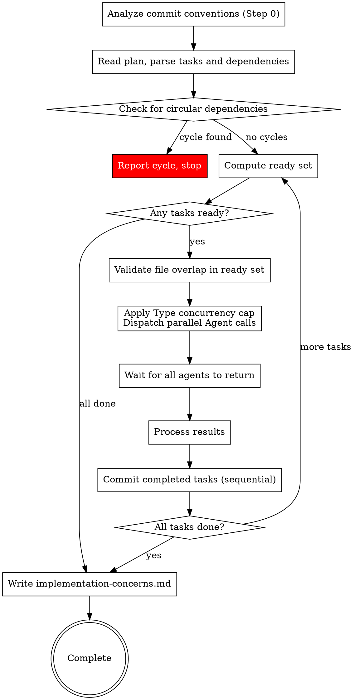

# Subagent-Driven Development

Execute plan by dispatching subagents per task. Tasks with no mutual dependencies run in parallel waves for faster execution.

**Core principle:** Fresh subagent per task + self-review + concerns collection = fast iteration with deferred quality review

## The Process



Each dispatched Agent implements the task, performs a self-review, and returns a status with any concerns. Multiple agents run concurrently. **Subagents do not commit** — they only implement, test, self-review, and report. After each wave returns, **the orchestrator (you) commits each completed task sequentially**. This is deliberate: parallel agents share one working tree and one git index, so letting them commit concurrently causes them to stage each other's in-flight files, contend on `.git/index.lock`, and trip pre-commit hooks against files they don't own. Committing sequentially from the orchestrator eliminates all of that.

## Wave Execution Algorithm

Follow these steps exactly to resolve dependencies and dispatch tasks in parallel waves.

### Step 0: Analyze Commit Conventions

Before parsing tasks, analyze the project's commit conventions **once**. The result is a text block **you (the orchestrator) use when committing completed tasks in Step 6.5**. Subagents do not commit, so this block is your own reference — it is not pasted into subagent prompts.

**Run this analysis:**

1. **Detect commit message pattern** — run `git log --oneline -20` and identify the pattern:
   - Conventional Commits: `type(scope): description` or `type: description` (look for prefixes like feat, fix, chore, refactor, test, docs, style, ci, build, perf)
   - Ticket-prefixed: `[PROJ-123] description` or `PROJ-123: description`
   - Other patterns: any consistent prefix or structure
   - Freeform: no discernible pattern
   - Note which types/prefixes appear most often, whether scope is used, and whether messages are lowercase or capitalized
   - **Check if commit messages include a Jira/ticket ID** (e.g., `feat(ABC-123): ...` or `[ABC-123] fix: ...`). If they do, extract the ticket ID from the current branch name — run `git branch --show-current` and look for a pattern like `ABC-123` (uppercase letters, dash, digits). Include the extracted ticket ID in the conventions block so subagents can use it in their commit messages

2. **Detect commit hook tooling** — check for these files (existence only, don't parse deeply):
   - `.lefthook.yml` or `lefthook.yml` — Lefthook
   - `.husky/pre-commit` — Husky
   - `.pre-commit-config.yaml` — pre-commit framework
   - `package.json` field `scripts.prepare` containing `husky` or `lefthook`

3. **Detect commitlint** — check for:
   - `commitlint.config.js`, `.cjs`, `.mjs`, `.ts`
   - `.commitlintrc`, `.commitlintrc.json`, `.commitlintrc.yml`, `.commitlintrc.js`
   - `package.json` field `commitlint`
   - If found, note it — subagents need to match the format strictly

4. **Build the Commit Conventions block** — assemble a `## Commit Conventions` text block:

When conventions are detected:
```markdown
## Commit Conventions

**Message format:** <detected format, e.g. "conventional commits — type(scope): description">
**Common types:** <list of types seen in git log, e.g. feat, fix, chore, refactor, test>
**Scope:** <"commonly used" or "rarely used" or "not used">
**Ticket ID:** <extracted ID from branch name if the convention requires it, e.g. "ABC-123 (from branch feature/ABC-123-new-login)" or "none detected">
**Examples from this repo:**
- <3-5 real examples from git log>

**Pre-commit hooks:** <tool name and what it runs, e.g. "Husky runs lint-staged (eslint + prettier) and commitlint">
**Commitlint:** <"yes — messages must follow conventional commits format" or "not detected">

**If a commit fails:**
1. Read the error output — it tells you exactly what's wrong
2. Commitlint rejection → rewrite the message to match the format above and retry
3. Lint/format failure → fix the reported issues or run the suggested fix command, re-stage **only the same task's files** (`git add -- <files>`), retry
4. Other hook failure → read the error, apply the fix, re-stage the same task's files, retry
5. After 3 failed attempts → leave the changes staged and surface the full error to the user. Never use `--no-verify`
```

When no conventions are detected:
```markdown
## Commit Conventions

**Message format:** no enforced convention detected
**Pre-commit hooks:** none detected
**Commit freely** using clear, descriptive messages. If a commit fails unexpectedly, read the error and retry up to 3 times before surfacing the error to the user.
```

Store this block — you will use it when committing completed tasks in Step 6.5.

### Step 1: Parse Tasks

Read the plan and extract all tasks. For each task, record:
- Task number (from `### Task N:` or `### Tarefa N:` heading)
- Dependencies (from `**Depends on:**` or `**Depende de:**` line — parse as list of task numbers, or empty if `none` / `nenhuma`)
- File list (from `**Files:**` section — all file paths mentioned)
- Status: pending, in-flight, completed, or needs-retry

Example:
```
Task 1: deps=[]      files=[src/a.py, tests/test_a.py]     status=pending
Task 2: deps=[]      files=[src/b.py, tests/test_b.py]     status=pending
Task 3: deps=[1,2]   files=[src/c.py, tests/test_c.py]     status=pending
Task 4: deps=[1,2]   files=[src/d.py, tests/test_d.py]     status=pending
Task 5: deps=[3,4]   files=[src/e.py, tests/test_e.py]     status=pending
```

### Step 2: Check for Cycles

Before executing anything, verify no circular dependencies exist. If task A depends on B and B depends on A (directly or transitively), report: "Circular dependency detected — the following tasks form a cycle: [list]. Please fix the plan." Do NOT proceed until cycles are resolved.

### Step 3: Compute Ready Set

A task is **ready** if:
- Status is `pending` or `needs-retry`
- All tasks in its `deps` list have status `completed`

```
Completed: [1, 2]
Ready: [3, 4]    (deps [1,2] all completed)
Waiting: [5]     (dep 3 not completed)
```

### Step 4: Validate File Overlap

Check every pair of tasks in the ready set. If two tasks share any file path in their file lists, remove one from the ready set (move it back to waiting). It will be picked up in the next cycle.

Overlap validation covers `**Files:**` (source) paths only. **Asset files are excluded** — they are additive, dedup-checked before writing, and idempotent, so they don't need serialization. If two parallel Figma tasks download the same icon, they produce functionally identical files (same node → same export + same fixes). Exports may not be byte-identical across calls (e.g., non-deterministic SVG attribute ordering), but the sequential commits in Step 6.5 ensure only the last version persists — no data corruption. No locking needed.

### Step 5: Dispatch

**Type-aware concurrency:** After file overlap validation, classify each task in the ready set by its `**Type:**` line:
- **MCP-capped task**: `Type` is `UI Screen` or `UI Component` — these implementers make Figma MCP calls
- **Uncapped task**: `Type` is `UI Logic`, `Backend`, or `General` — no Figma MCP calls
- **Legacy fallback**: if a task has NO `**Type:**` line, classify by the legacy heuristic — a task whose text contains a `**Figma:**` section counts as **MCP-capped**; otherwise **uncapped**

Apply concurrency caps:
- **Uncapped tasks**: dispatch all (no cap)
- **MCP-capped tasks**: dispatch up to **4** per cycle. If more than 4 MCP-capped tasks are ready, pick the first 4 by task number; the rest stay in the ready pool for the next cycle

> **Why 4?** The Figma MCP rate-limits at 15 requests/minute. Each MCP-capped task makes ~3 mandatory MCP calls, so 4 concurrent tasks = 12 calls — safely under the limit.

**Figma tasks self-verify (with different mechanisms per Type).** `UI Screen` tasks (`figma-design-implementer`) run a fixed fidelity-verification step (its Step 5): after writing the code the implementer spawns a read-only `figma-token-verifier` and loops (max 5 attempts) fixing token/measure mismatches until PASS. `UI Component` tasks (`figma-component-implementer`) do **not** use `figma-token-verifier`; they self-verify via a screenshot self-review (its Step 6 — the agent re-reads `get_screenshot`/`get_variable_defs` and compares against its output). Either way the verification reads-only and makes no *extra* uncapped Figma calls beyond the implementer's own budget. Consequence for you: a Figma task's `DONE` already carries a fidelity self-check, and a `DONE_WITH_CONCERNS` may carry a BLOCKING fidelity concern (e.g. `figma-design-implementer`'s "unresolved fidelity mismatch after 5 attempts", or a `figma-component-implementer` screenshot-mismatch concern) — handle it like any other blocking concern. This does not change wave scheduling or the commit flow.

Dispatch the combined set (all uncapped + up to 4 MCP-capped) as parallel Subagent calls in a single message.

**Prompt routing:** Read the task's `**Type:**` line and select the implementer agent from this table:
- `UI Screen` → dispatch @"figma-design-implementer (agent)". Include the Figma metadata (file key, node ID, breakpoints) in the agent context.
- `UI Component` → dispatch @"figma-component-implementer (agent)" (design-system-aware component implementer). Include the Figma metadata (file key, node ID, breakpoints) in the agent context.
- `UI Logic` / `Backend` / `General` → dispatch @"tdd-implementer (agent)" (standard TDD implementer).

**Legacy fallback (no `**Type:**` line):** apply the pre-Type heuristic — if the task text contains a `**Figma:**` section → dispatch @"figma-design-implementer (agent)" (include Figma metadata); otherwise → dispatch @"tdd-implementer (agent)".

Each agent gets:
- Full task text (steps, file list, code/Figma metadata) — paste directly, don't make agent read files
- Design spec content for context
- File constraint: "You may ONLY modify these files: [list from task's Files: section]". **For Figma tasks, append:** "— plus you MAY create asset files (icons/images) under the project's assets directory as needed; list every asset file you create in your report."
- Return format: status (DONE / DONE_WITH_CONCERNS / NEEDS_CONTEXT / BLOCKED) + summary, **including the exact list of files changed**. For Figma tasks, the report must **separately list any asset files created** (the "Assets created" line) — these are usually not in the Files: section and the orchestrator needs them to stage the assets.

**Subagents do NOT commit.** They implement, test, self-review, and report. Do not paste the commit conventions block into subagent prompts — you commit each completed task yourself in Step 6.5.

### Step 6: Wait and Process Results

All Agent calls return together. For each result:
- **DONE**: mark task `completed`, update plan checkbox to `- [x]`
- **DONE_WITH_CONCERNS**: read concerns and sort each by the severity the implementer tagged it with (**BLOCKING** vs non-blocking **CONCERN**). Mark the task `completed` and commit its work (Step 6.5) so it isn't lost — but track BLOCKING and non-blocking concerns in **separate** lists. If a concern indicates the task is fundamentally broken, treat as `BLOCKED` instead.
  - **BLOCKING concern examples (collect as blocking, do not bury):** "I reused `DropdownPicker` as instructed but its drawer+search interaction model doesn't match the Figma chip+popover", "this component assumes a bounded-height parent the host doesn't provide", "output behaves differently from the design". These do not stop the wave, but the implement phase cannot cleanly advance until the user resolves or explicitly accepts them (enforced by the `implementing` skill).
  - **Treat as BLOCKED examples:** "I couldn't get tests to pass", "Tests fail and I can't figure out why", "Core dependency is missing and I had to stub the entire integration"
  - **Non-blocking (store-and-continue) examples:** "I'm not sure this edge case is handled correctly", "The API response format might differ in production", "This works but the approach feels fragile"
  - **A concern that defers verification is BLOCKING, never store-and-continue.** If a concern postpones checking the work to a later phase instead of checking it now — e.g. "vou validar isso na review", "will confirm later", "didn't run the tests, someone should verify before shipping" — reclassify it as **BLOCKING** regardless of how the implementer tagged it. Deferred verification is not evidence of correctness; it is the absence of evidence, and it becomes a verification requirement that only closes once the actual evidence is produced — not once someone promises to look later.
- **NEEDS_CONTEXT**: surface question to user. Mark task `needs-retry`. Continue with other tasks — do NOT pause the entire execution
- **BLOCKED**: assess blocker per standard SDD rules (more context, more capable model, break into pieces, or escalate). Mark task `needs-retry`

### Step 6.5: Commit Completed Tasks

Subagents do not commit. Once results are processed, **you** commit each task that
returned `DONE` or `DONE_WITH_CONCERNS` this wave — **one commit per task, strictly
sequentially** (never in parallel). Sequential commits are what eliminate the
index-lock races and cross-task contamination that parallel committing causes.

For each completed task, in order:

1. **Stage only that task's files** — `git add -- <files from the task's **Files:** section (Create/Modify/Test)> <asset files from the task's "Assets created" report line>`. Never `git add .` or `git add -A`; that would sweep in other tasks' changes. For Figma tasks, the reported asset files are a legitimate, expected part of the task's output — stage them alongside the source files.
2. **Verify staging** — run `git diff --cached --name-only` and confirm only this task's files are staged. The task's Files: entries **and** its reported "Assets created" paths are expected. If any *other* file appears (outside the Files list AND not a reported asset — e.g. an agent edited outside its constraint), stop and surface it to the user instead of committing.
3. **Commit** — write a message following the `## Commit Conventions` block from Step 0, with the subject derived from the task name (`### Task N:` heading).
4. **Handle hook failures** (safe to retry now, since commits are sequential):
   - Commitlint rejection → rewrite the message to match the format, retry.
   - Lint/format failure → fix the reported issues or run the formatter, re-stage **only this task's files** (`git add -- <files>`), retry.
   - Other hook failure → read the error, apply the fix, re-stage this task's files, retry.
   - Max 3 attempts. After that, leave the changes staged and surface the full error to the user. **Never use `--no-verify`.**

Do **not** commit `BLOCKED` or `needs-retry` tasks — their work stays uncommitted until a later wave completes them successfully.

### Step 7: Repeat

Go back to Step 3. Recompute the ready set from scratch based on current task statuses. Continue until all tasks are `completed`.

If no tasks are ready and not all tasks are completed, there's a problem:
- If tasks are `needs-retry`: surface all blockers to the user
- If tasks are waiting on incomplete tasks that aren't in-flight: there may be a cycle that wasn't caught — report it

### Worked Example

```
Plan: 5 tasks. Task 1,2 have no deps. Task 3,4 depend on 1,2. Task 5 depends on 3,4.

--- Cycle 1 ---
Completed: []
Ready: [1, 2] → no file overlap → dispatch both
  → Agent(Task 1), Agent(Task 2) dispatched in parallel
  → Both return DONE (no commits — agents only implement + report)
  → Orchestrator commits sequentially: commit Task 1 files, then commit Task 2 files
Completed: [1, 2]

--- Cycle 2 ---
Ready: [3, 4] (deps [1,2] all completed) → no file overlap → dispatch both
  → Agent(Task 3), Agent(Task 4) dispatched in parallel
  → Task 3 returns DONE_WITH_CONCERNS (concern noted)
  → Task 4 returns DONE
  → Orchestrator commits sequentially: commit Task 3 files, then commit Task 4 files
Completed: [1, 2, 3, 4]
Concerns collected: [Task 3: "..."]

--- Cycle 3 ---
Ready: [5] (deps [3,4] all completed) → dispatch
  → Agent(Task 5) dispatched
  → Returns DONE
  → Orchestrator commits Task 5 files
Completed: [1, 2, 3, 4, 5] → Write implementation-concerns.md → Done
```

#### Mixed Type Example

```
Ready: [1(Backend), 2(General), 3(UI Screen), 4(UI Component), 5(UI Logic), 6(UI Component)]
→ Classify by Type: uncapped (no MCP) = [1, 2, 5], MCP-capped = [3, 4, 6]
→ Route: 1,2,5 → tdd-implementer; 3 → figma-design-implementer; 4,6 → figma-component-implementer
→ Apply caps: all uncapped + first 4 MCP-capped
→ Dispatch: [1, 2, 5] + [3, 4, 6] = 6 parallel agents (all 3 MCP-capped tasks fit under the cap of 4)
```

### Fallback to Sequential

If the plan has no `**Depends on:**` or `**Depende de:**` lines on any task, warn: "Plan is missing dependency declarations. Falling back to sequential execution." Then execute tasks one at a time in order, identical to pre-parallel SDD behavior.

If a plan has all tasks depending on the previous one (linear chain), the wave executor naturally dispatches one task at a time — no special case needed.

### Post-Wave Verification

After each wave's tasks are committed (Step 6.5):
1. **Review each agent's summary** — understand what changed
2. **Check for conflicts** — did any agents edit the same code despite file validation?
3. **Run the test suite** — verify all changes work together
4. **Spot check** — agents can make systematic errors, especially in parallel

## Agent Prompt Best Practices

When dispatching implementer subagents (whether sequential or parallel), craft focused prompts:

1. **Focused** — One clear task per agent. Don't combine unrelated work.
2. **Self-contained** — Paste all context the agent needs. Don't make it search or read plan files.
3. **Constrained** — Specify which files may be modified. Specify what NOT to do.
4. **Specific about output** — Define the exact return format (status + summary).

**Common mistakes:**
- Too broad: "Implement the feature" — agent gets lost
- No context: "Fix the function" — agent doesn't know which
- No constraints: agent refactors everything
- Vague output: "Fix it" — you don't know what changed

## Model Selection

Use the least powerful model that can handle each role to conserve cost and increase speed.

**Mechanical implementation tasks** (isolated functions, clear specs, 1-2 files): use a fast, cheap model.

**Integration and judgment tasks** (multi-file coordination, pattern matching, debugging): use a standard model.

**Architecture, design, and review tasks**: use the most capable available model.

## Handling Implementer Status

Implementer subagents report one of four statuses:

**DONE:** Mark task `completed`, update plan checkbox. No review dispatch.

**DONE_WITH_CONCERNS:** Read concerns and sort by severity (**BLOCKING** vs non-blocking **CONCERN**). Store them in separate lists and mark `completed`. If the concern indicates the task is fundamentally broken (e.g., "I couldn't get tests to pass", "Core dependency is missing and I had to stub the entire integration"), treat as `BLOCKED` instead. BLOCKING concerns (e.g. a component substitution that doesn't match Figma, an unconfirmed host-height assumption, behavior that differs from the design) are collected separately and gate the phase via the `implementing` skill. Examples of non-blocking concerns: "I'm not sure this edge case is handled correctly", "The API response format might differ in production", "This works but the approach feels fragile." A concern that **defers verification** to a later phase instead of performing it (e.g. "vou validar isso na review", "will check this later") is always **BLOCKING**, never non-blocking — even if the implementer filed it as a routine ressalva — because it is a verification requirement that only closes with actual evidence, not a promise to verify eventually.

**NEEDS_CONTEXT:** Provide missing context and re-dispatch.

**BLOCKED:** Assess blocker:
1. Context problem → provide more context, re-dispatch
2. Needs more reasoning → re-dispatch with more capable model
3. Task too large → break into smaller pieces
4. Plan wrong → escalate to human

**Never** ignore an escalation or force retry without changes.

## Prompt Templates

- @"tdd-implementer (agent)" - Dispatch standard implementer subagent (TDD workflow) — for `UI Logic` / `Backend` / `General`
- @"figma-design-implementer (agent)" - Dispatch Figma design implementer subagent (visual fidelity workflow) — for `UI Screen`
- @"figma-component-implementer (agent)" - Dispatch Figma component implementer subagent (design-system-aware component workflow) — for `UI Component`

## Red Flags

**Never:**
- Start implementation on main/master branch without explicit user consent
- Dispatch implementation subagents that modify the same files in parallel (file overlap = sequential)
- Let subagents commit — committing is the orchestrator's job, done sequentially after the wave (Step 6.5)
- Stage with `git add .` / `git add -A` — always stage a task's specific files (`git add -- <files>`)
- Make subagent read plan file (provide full text instead)
- Skip scene-setting context
- Ignore subagent questions
- Silently discard DONE_WITH_CONCERNS notes — always collect and persist them

**If subagent asks questions:**
- Answer clearly and completely
- Provide additional context if needed
- Don't rush them into implementation

**If subagent fails task:**
- Dispatch fix subagent with specific instructions
- Don't try to fix manually (context pollution)

## Integration

**Invoked by:**
- **implementing** (REQUIRED SUB-SKILL) — implementing loads the plan and design, then invokes SDD to execute all tasks

**Subagent prompts:**
- @"tdd-implementer (agent)" — TDD rules are embedded directly in this prompt (used for `UI Logic` / `Backend` / `General` tasks, and legacy non-Figma tasks)
- @"figma-design-implementer (agent)" — Figma implement-design workflow (used for `UI Screen` tasks, and legacy tasks with a `**Figma:**` section)
- @"figma-component-implementer (agent)" — design-system-aware component workflow (used for `UI Component` tasks)

**Context:** When invoked by implementing, the plan and design are already in the conversation context. Use them directly. If the plan is not in context (e.g., invoked standalone), read it from `.afyapowers/features/<feature>/artifacts/plan.md`.

## Concerns Collection

After all tasks complete, if any `DONE_WITH_CONCERNS` notes were collected during execution, write them to `.afyapowers/features/<feature>/artifacts/implementation-concerns.md`, split into two severity sections:

```markdown
# Implementation Concerns

Collected during implementation phase.

## Impedimentos
<!-- Output diverges from the design/Figma in look or behavior. Must be resolved or explicitly
     accepted by the user before the phase advances. Omit this section if there are none. -->

### Task N: [task name verbatim from plan heading]
- [blocking concern text from implementer report]

## Ressalvas
<!-- Doubts, fragility, edge cases, token drift, a11y additions. Priority areas for the review
     phase. Omit this section if there are none. -->

### Task M: [task name verbatim from plan heading]
- [concern text from implementer report]
```

Always keep blocking concerns under `## Impedimentos` and the rest under `## Ressalvas`, each grouped by task. Omit a section entirely if it has no entries.

If the implementation phase is re-run (e.g., after fixing a blocked task), overwrite `implementation-concerns.md` with fresh data from the current run — do not append to stale concerns from a previous run. **Exception:** before overwriting, read the existing file and collect every blocking-concern line already marked `[ACCEPTED BY USER: <reason>]`. When writing the fresh blocking concerns, for each concern line in the fresh run: if its text (ignoring the marker) exactly matches an accepted carry-forward line, emit the accepted version (with the marker) instead of the unmarked fresh line — do not emit both. After processing all fresh concerns this way, append any remaining accepted lines whose text did not appear in the fresh run. This guarantees a user's recorded acceptance survives re-runs without producing unmarked duplicates that would force a spurious Alterações Solicitadas verdict. If no concerns were collected and no accepted markers exist to preserve, do not create the file.
