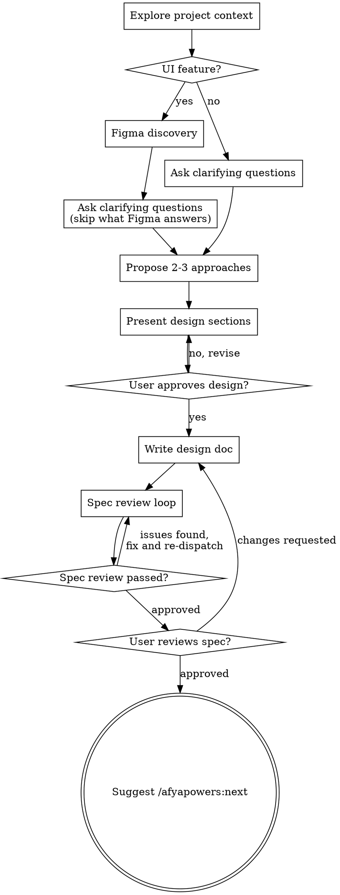
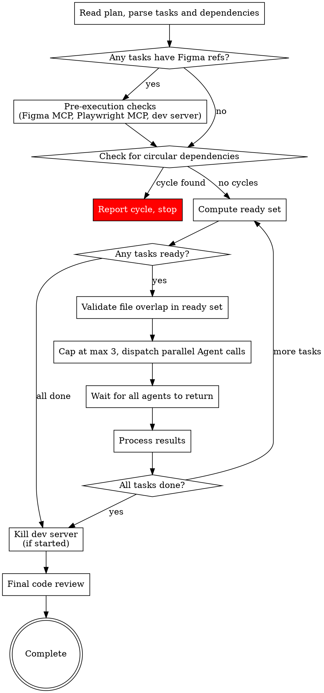

# Figma Workflow Improvements Implementation Plan

> **For agentic workers:** REQUIRED: Use the afyapowers implementing skill to implement this plan. Steps use checkbox (`- [ ]`) syntax for tracking.

**Goal:** Move Figma discovery to the beginning of the design phase and add a visual fidelity review stage to the SDD pipeline.

**Architecture:** Two changes: (1) the design skill invokes figma-discovery early (step 2) instead of late (step 5), so layouts inform the entire conversation; (2) the SDD gains a third review stage (visual fidelity) that uses Figma MCP + Playwright MCP to validate implementation accuracy, plus pre-execution checks for MCP tools and dev server startup.

**Tech Stack:** Markdown skill files, Figma MCP tools (agnostic), Playwright MCP tools (agnostic)

---

## Chunk 1: Early Figma Discovery

### Task 1: Move Figma Discovery to Beginning of Design Phase

**Files:**
- Modify: `skills/design/SKILL.md`
**Depends on:** none

- [ ] **Step 1: Update the checklist to move Figma discovery to step 2**

In `skills/design/SKILL.md`, replace the current checklist (lines 28-37):

```markdown
## Checklist

You MUST complete these items in order:

1. **Explore project context** — check files, docs, recent commits
2. **Ask clarifying questions** — one at a time, understand purpose/constraints/success criteria
3. **Propose 2-3 approaches** — with trade-offs and your recommendation
4. **Present design** — in sections scaled to their complexity, get user approval after each section
5. **Figma discovery** (UI features only) — if the feature involves front-end/UI work, invoke the `figma-discovery` skill to identify Figma references before writing the spec
6. **Write design doc** — save to `.afyapowers/features/<feature>/artifacts/design.md`
7. **Spec review loop** — dispatch spec-document-reviewer subagent; fix issues and re-dispatch until approved (max 5 iterations, then surface to human)
8. **User reviews written spec** — ask user to review the spec file before proceeding
```

With:

```markdown
## Checklist

You MUST complete these items in order:

1. **Explore project context** — check files, docs, recent commits
2. **Figma discovery** (UI features only) — if the feature involves front-end/UI work, invoke the `figma-discovery` skill to discover Figma layouts that will inform the design conversation
3. **Ask clarifying questions** — one at a time, understand purpose/constraints/success criteria. Skip questions that the discovered Figma layouts already answer.
4. **Propose 2-3 approaches** — with trade-offs and your recommendation, informed by Figma layout constraints when available
5. **Present design** — in sections scaled to their complexity, get user approval after each section
6. **Write design doc** — save to `.afyapowers/features/<feature>/artifacts/design.md`
7. **Spec review loop** — dispatch spec-document-reviewer subagent; fix issues and re-dispatch until approved (max 5 iterations, then surface to human)
8. **User reviews written spec** — ask user to review the spec file before proceeding
```

- [ ] **Step 2: Update the process flow digraph**

Replace the entire `digraph design` block (lines 42-70) with:



- [ ] **Step 3: Update the Figma discovery instructions section**

Replace the "Figma discovery (UI features only)" section (lines 109-114) with:

```markdown
**Figma discovery (UI features only):**

- Right after exploring the project context, check whether the feature involves front-end/UI work (based on the user's request — components, screens, layouts, visual elements)
- If it does → invoke the `figma-discovery` skill (located at `skills/figma-discovery/SKILL.md`). The skill will ask about Figma layouts, discover nodes, and output a `## Figma References` section. The discovered layouts become working context for the rest of the design conversation — use them to inform your clarifying questions, approach proposals, and design sections. Skip questions that the Figma layouts already answer.
- If it doesn't (purely backend, infrastructure, data pipeline, etc.) → skip entirely and proceed to clarifying questions
- Do NOT ask about Figma yourself — delegate entirely to the Figma discovery skill
```

- [ ] **Step 4: Verify the changes**

Read `skills/design/SKILL.md` and confirm:
- The checklist has Figma discovery as step 2 (right after context exploration)
- The digraph shows the early Figma branch with the non-UI bypass
- The instructions section references early invocation, not late
- No existing content was accidentally altered

- [ ] **Step 5: Commit**

```bash
git add skills/design/SKILL.md
git commit -m "feat: move Figma discovery to beginning of design phase"
```

## Chunk 2: Visual Fidelity Review

### Task 2: Create the Visual Fidelity Reviewer Prompt

**Files:**
- Create: `skills/implementing/visual-fidelity-reviewer-prompt.md`
**Depends on:** none

- [ ] **Step 1: Create the reviewer prompt file**

Create `skills/implementing/visual-fidelity-reviewer-prompt.md` with the following content:

```markdown
# Visual Fidelity Reviewer Prompt Template

Use this template when dispatching a visual fidelity reviewer subagent.

**Purpose:** Verify implementation visually matches Figma design (layout, spacing, colors, typography, states)

**Only dispatch after code quality review passes, and only for tasks with `**Figma:**` references.**

` ` `
Task tool (general-purpose):
  description: "Review visual fidelity for Task N"
  prompt: |
    You are reviewing whether a UI implementation visually matches its Figma design.

    ## Task Figma References

    [FIGMA REFERENCES FROM TASK'S **Figma:** SECTION]

    ## Files Changed

    [LIST OF FILES THE IMPLEMENTER MODIFIED]

    ## What Implementer Claims They Built

    [FROM IMPLEMENTER'S REPORT]

    ## Your Job

    Compare the running implementation against the Figma design. You must use
    both Figma MCP tools and Playwright MCP tools to perform this review.

    ### Step 1: Fetch Figma Visual Details

    Inspect the available MCP tools in your environment to find Figma-related
    tools (do NOT hardcode tool names — different servers use different names).

    For each node URL in the Figma references, fetch:
    - Layout structure and hierarchy
    - Spacing and sizing values (padding, margin, gap, width, height)
    - Colors (fill, stroke, background — exact hex/rgba values)
    - Typography (font family, size, weight, line height, letter spacing)
    - Design tokens if available
    - Component states (hover, active, disabled, focus) if defined
    - Responsive behavior / constraints if specified

    ### Step 2: Inspect the Running Implementation

    Inspect the available MCP tools in your environment to find Playwright-related
    tools (do NOT hardcode tool names).

    Using Playwright MCP tools:
    1. Navigate to the relevant page/component in the running dev server
    2. Take screenshots of the implemented component(s)
    3. Inspect computed styles, dimensions, and spacing of key elements
    4. Check component states if defined in Figma (hover, active, disabled, etc.)
    5. Check responsive behavior if specified in Figma

    ### Step 3: Compare

    For each Figma reference, compare the implementation against the design on:

    | Aspect | What to Check |
    |--------|---------------|
    | Layout | Element hierarchy, positioning, flex/grid structure |
    | Spacing | Padding, margin, gap values (exact match) |
    | Sizing | Width, height, min/max constraints |
    | Colors | Background, text, border, shadow colors (exact hex match) |
    | Typography | Font family, size, weight, line height, letter spacing |
    | States | Hover, active, disabled, focus appearances |
    | Responsive | Breakpoint behavior if specified in Figma |

    **Be precise.** Compare actual values, not approximations. A 2px spacing
    difference or a slightly different shade of blue counts as a discrepancy.

    ### Step 4: Report

    Report your findings:

    - **✅ Visual fidelity passed** — implementation matches Figma design
    - **❌ Visual fidelity failed** — list each discrepancy:
      - Element: [which element]
      - Aspect: [layout/spacing/color/typography/states/responsive]
      - Expected (Figma): [exact value]
      - Actual (Implementation): [exact value]
      - Fix required: [what needs to change]

    **CRITICAL:** Do NOT pass a review with known discrepancies. If there is
    any mismatch between the Figma design and the implementation, report it
    as failed. The implementer will be re-dispatched to fix the issues.
` ` `

**Reviewer returns:** Pass/Fail with detailed discrepancy report if failed.
```

Note: The triple backticks inside the code block above are shown with spaces (`` ` ` ` ``) to avoid escaping issues. The actual file should use proper triple backticks (`` ``` ``).

- [ ] **Step 2: Verify the file was created**

Check that `skills/implementing/visual-fidelity-reviewer-prompt.md` exists and has the correct structure (Purpose, template with steps 1-4).

- [ ] **Step 3: Commit**

```bash
git add skills/implementing/visual-fidelity-reviewer-prompt.md
git commit -m "feat: add visual fidelity reviewer prompt template"
```

### Task 3: Add Pre-Execution Checks to SDD

**Files:**
- Modify: `skills/subagent-driven-development/SKILL.md`
**Depends on:** none

- [ ] **Step 1: Add pre-execution checks section**

In `skills/subagent-driven-development/SKILL.md`, after the `## The Process` digraph section (after line 45) and before `## Wave Execution Algorithm` (line 49), add a new section:

```markdown
## Pre-Execution Checks (Figma Tasks)

Before dispatching the first wave, if ANY task in the plan has a `**Figma:**` section, perform these checks once:

### Check 1: Figma MCP Tools

Inspect available MCP tools for Figma-related tools. If none are found:

> "Figma MCP tools are not available. Visual fidelity validation requires them to verify your implementation matches the Figma designs. Please install a Figma MCP server and return to this conversation. Do you want to continue without visual validation?"

If the user chooses to continue without validation, skip the visual fidelity review stage for all tasks. Note this decision in the execution log.

### Check 2: Playwright MCP Tools

Inspect available MCP tools for Playwright-related tools. If none are found:

> "Playwright MCP tools are not available. Visual fidelity validation requires them to inspect your running implementation in the browser. Please install Playwright MCP tools and return to this conversation. Do you want to continue without visual validation?"

Same behavior as Check 1 — user can opt to continue without validation.

### Check 3: Dev Server

Inspect the codebase to determine how to start the dev server:
1. Read `package.json` — look for `dev`, `start`, or framework-specific scripts
2. Check for framework config files (e.g., `next.config.*`, `vite.config.*`, `angular.json`) to understand the framework
3. Start the dev server in the background using the identified command
4. Wait for it to be ready (check that the port is responding)

If the dev server fails to start:

> "Could not start the dev server automatically. Please start it manually and confirm when it's ready."

The dev server stays running across all waves. After the final wave completes, kill the dev server process.
```

- [ ] **Step 2: Update the process digraph**

Replace the existing `digraph process` block (lines 14-44) with:



- [ ] **Step 3: Verify the changes**

Read `skills/subagent-driven-development/SKILL.md` and confirm:
- The new pre-execution checks section exists between the digraph and the wave execution algorithm
- The digraph includes the Figma checks branch and dev server cleanup
- No existing content was accidentally altered

- [ ] **Step 4: Commit**

```bash
git add skills/subagent-driven-development/SKILL.md
git commit -m "feat: add pre-execution checks for Figma MCP, Playwright MCP, and dev server"
```

### Task 4: Add Visual Fidelity Review Stage to SDD

**Files:**
- Modify: `skills/subagent-driven-development/SKILL.md`
**Depends on:** Task 2, Task 3

- [ ] **Step 1: Update the core principle line**

Replace line 10:

```markdown
**Core principle:** Fresh subagent per task + two-stage review (spec then quality) = high quality, fast iteration
```

With:

```markdown
**Core principle:** Fresh subagent per task + three-stage review (spec compliance → code quality → visual fidelity) = high quality, fast iteration
```

- [ ] **Step 2: Update the process description**

Replace line 47:

```markdown
Each dispatched Agent runs the full task pipeline: implement → spec review → quality review. Multiple pipelines run concurrently.
```

With:

```markdown
Each dispatched Agent runs the full task pipeline: implement → spec review → quality review → visual fidelity review (if task has Figma refs). Multiple pipelines run concurrently.
```

- [ ] **Step 3: Add the visual fidelity review stage section**

After the `## Handling Implementer Status` section (after line 198) and before `## Prompt Templates` (line 201), add:

```markdown
## Visual Fidelity Review (Third Stage)

After code quality review passes, if the task has a `**Figma:**` section AND visual validation was not skipped during pre-execution checks, dispatch a visual fidelity reviewer.

**Dispatch using:** `skills/implementing/visual-fidelity-reviewer-prompt.md`

**Provide to the reviewer:**
- The task's `**Figma:**` references
- The list of files the implementer modified
- The implementer's report summary

**If ✅ Visual fidelity passed:** Mark task as completed.

**If ❌ Visual fidelity failed:** Re-dispatch the implementer with the discrepancy report:

> "Your implementation has visual fidelity issues. Fix each discrepancy listed below. Do not make unrelated changes."
>
> [PASTE FULL DISCREPANCY REPORT FROM REVIEWER]

After the implementer fixes, run the visual fidelity review again (skip spec compliance and code quality — those already passed).

**Iteration cap:** If visual fidelity fails 3 times for the same task, stop retrying. Mark the task as `BLOCKED` with the accumulated discrepancy reports and surface to the user:

> "Task N has failed visual fidelity review 3 times. The following discrepancies could not be resolved automatically: [list]. Please review and provide guidance."

**Tasks without `**Figma:**` references:** Skip this stage entirely. Mark task as completed after code quality review passes.
```

- [ ] **Step 4: Update the Prompt Templates section**

Find the `## Prompt Templates` section and add the new template:

```markdown
- `skills/implementing/visual-fidelity-reviewer-prompt.md` - Dispatch visual fidelity reviewer subagent
```

- [ ] **Step 5: Update the Red Flags section**

In the `## Red Flags` section, in the "Never" list, add after the line about code quality review order:

```markdown
- **Start visual fidelity review before code quality passes** (wrong order)
- Skip visual fidelity review for tasks with `**Figma:**` references (unless user opted out during pre-execution checks)
```

- [ ] **Step 6: Update the Integration section**

In the `## Integration` section, under "Subagent prompts", add:

```markdown
- `skills/implementing/visual-fidelity-reviewer-prompt.md` — visual fidelity review (third stage, Figma tasks only)
```

- [ ] **Step 7: Verify the changes**

Read `skills/subagent-driven-development/SKILL.md` and confirm:
- Core principle mentions three-stage review
- Visual fidelity review section exists with iteration cap and escalation
- Prompt templates list includes the new reviewer
- Red flags include visual fidelity ordering rules
- Integration section lists the new subagent prompt
- No existing content was accidentally altered

- [ ] **Step 8: Commit**

```bash
git add skills/subagent-driven-development/SKILL.md
git commit -m "feat: add visual fidelity review as third stage in SDD pipeline"
```

### Task 5: Update Implementer Prompt for Visual Fidelity Re-Dispatch

**Files:**
- Modify: `skills/implementing/implementer-prompt.md`
**Depends on:** Task 2

- [ ] **Step 1: Add visual fidelity re-dispatch instructions**

In `skills/implementing/implementer-prompt.md`, find the `## Figma References` section (lines 38-55). After the existing content and before `## Your Job` (line 57), add:

```markdown
    ## Visual Fidelity Re-Dispatch

    If you are being re-dispatched due to a visual fidelity review failure, you
    will receive a discrepancy report listing specific elements with expected vs
    actual values.

    **Your job on re-dispatch:**
    1. Read each discrepancy carefully — element, aspect, expected value, actual value
    2. Fix each listed discrepancy precisely (match the exact Figma values)
    3. Do NOT make unrelated changes — only fix what's in the discrepancy report
    4. Use Figma MCP tools to re-verify the expected values if needed
    5. Use Playwright MCP tools to verify your fixes match before reporting back

    Report status as usual. Include `**Figma Status: fixes applied**` in your report.
```

- [ ] **Step 2: Verify the changes**

Read `skills/implementing/implementer-prompt.md` and confirm:
- The visual fidelity re-dispatch section exists between Figma References and Your Job
- The instructions are clear about fixing only listed discrepancies
- No existing content was accidentally altered

- [ ] **Step 3: Commit**

```bash
git add skills/implementing/implementer-prompt.md
git commit -m "feat: add visual fidelity re-dispatch instructions to implementer prompt"
```
