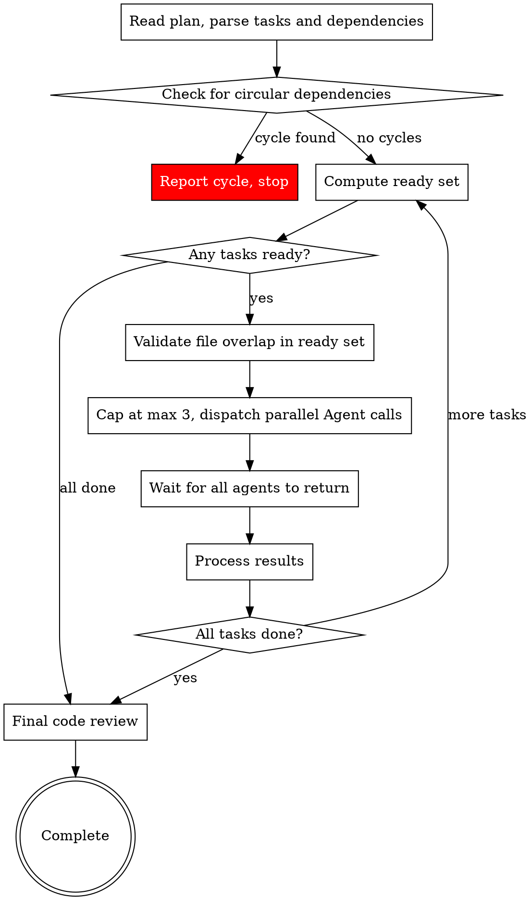

# Parallel Task Execution Implementation Plan

> **For agentic workers:** REQUIRED: Use the afyapowers implementing skill to implement this plan. Steps use checkbox (`- [ ]`) syntax for tracking.

**Goal:** Add parallel task execution support to the implement phase by updating plan format, SDD skill, and related skills/templates.

**Architecture:** Dependency declarations (`**Depends on:**`) in plans, resolved into waves by SDD at runtime. Plan-time + execution-time file overlap validation prevents conflicts. Max 3 concurrent Agent calls per wave.

**Tech Stack:** Markdown skill files (prompt engineering), no application code.

---

## Chunk 1: Plan Format & Template Changes

### Task 1: Update plan template

**Files:**
- Modify: `templates/plan.md`
**Depends on:** none

- [ ] **Step 1: Replace the plan template with the heading-based task format**

Replace the entire contents of `templates/plan.md` with:

```markdown
# Implementation Plan: {{feature_name}}

> **For agentic workers:** REQUIRED: Use the afyapowers implementing skill to implement this plan. Steps use checkbox (`- [ ]`) syntax for tracking.

**Goal:** [One sentence describing what this builds]

**Architecture:** [2-3 sentences about approach]

**Tech Stack:** [Key technologies/libraries]

---

### Task 1: [Component Name]

**Files:**
- Create: `exact/path/to/file`
- Modify: `exact/path/to/existing:lines`
- Test: `tests/exact/path/to/test`

**Depends on:** none

- [ ] Step 1: ...
- [ ] Step 2: ...

### Task 2: [Component Name]

**Files:**
- Create: `exact/path/to/file`

**Depends on:** Task 1

- [ ] Step 1: ...
```

- [ ] **Step 2: Verify the template file is valid markdown**

Read the file back and confirm: heading-based task structure, `**Files:**` with multi-line bulleted format, `**Depends on:**` field present, checkbox syntax for steps.

- [ ] **Step 3: Commit**

```bash
git add templates/plan.md
git commit -m "chore: update plan template with dependency declarations and heading-based task format"
```

---

### Task 2: Update writing-plans skill with dependency requirements

**Files:**
- Modify: `skills/writing-plans/SKILL.md`
**Depends on:** none

- [ ] **Step 1: Add `**Depends on:**` to the Task Structure example**

In `skills/writing-plans/SKILL.md`, find the Task Structure code block (lines 69-108). Insert a single line `**Depends on:** none | Task X, Task Y` after line 75 (`- Test: \`tests/exact/path/to/test.py\``) and before the blank line that precedes Step 1. The existing Steps 1-5 remain unchanged. The result should look like:

````markdown
### Task N: [Component Name]

**Files:**
- Create: `exact/path/to/file.py`
- Modify: `exact/path/to/existing.py:123-145`
- Test: `tests/exact/path/to/test.py`

**Depends on:** none | Task X, Task Y

- [ ] **Step 1: Write the failing test**

```python
def test_specific_behavior():
    result = function(input)
    assert result == expected
```

... (Steps 2-5 remain exactly as they are)
````

- [ ] **Step 2: Add a "Dependency Declaration" section after "Bite-Sized Task Granularity"**

Add the following section after the "Bite-Sized Task Granularity" section and before the "Plan Document Header" section:

```markdown
## Dependency Declaration

Every task MUST have a `**Depends on:**` line immediately after the `**Files:**` block.

- Use `none` if the task has no dependencies
- Use `Task N` or `Task N, Task M` (comma-separated) to declare dependencies on other tasks
- Dependencies are by task number, matching the `### Task N:` heading

**What counts as a dependency:**
- Task B modifies a file that Task A creates → Task B depends on Task A
- Task B imports a module that Task A creates → Task B depends on Task A
- Task B builds on an interface that Task A defines → Task B depends on Task A
- Task B and Task A are completely independent → no dependency needed

**Plan-time file overlap validation:**
After declaring dependencies, check that tasks which could run in parallel (no mutual dependency) don't share files in their `**Files:**` lists. If two parallel-eligible tasks touch the same file, add a dependency between them to force sequential execution.

File overlap validation is a safety net, not a substitute for thinking about task ordering. Always declare logical dependencies (imports, shared interfaces) explicitly.
```

- [ ] **Step 3: Verify the skill file reads coherently**

Read the full file and confirm: the new sections integrate smoothly, no duplicate content, the task structure example includes `**Depends on:**`.

- [ ] **Step 4: Commit**

```bash
git add skills/writing-plans/SKILL.md
git commit -m "feat: add dependency declaration requirements to writing-plans skill"
```

---

### Task 3: Update plan-document-reviewer to validate dependencies

**Files:**
- Modify: `skills/writing-plans/plan-document-reviewer-prompt.md`
**Depends on:** none

- [ ] **Step 1: Add dependency validation to the "What to Check" table**

In `skills/writing-plans/plan-document-reviewer-prompt.md`, add a new row at the end of the "What to Check" table (after the `Chunk Size` row, line 28):

```markdown
| Dependencies | Every task has `**Depends on:**` line, references valid task numbers, no circular deps |
```

- [ ] **Step 2: Add dependency checks to the "CRITICAL" section**

Add these items to the "Look especially hard for" list:

```markdown
- Tasks missing a `**Depends on:**` line
- Dependency references to non-existent task numbers
- Parallel-eligible tasks (no mutual dependency) that share files in their `**Files:**` lists
```

- [ ] **Step 3: Verify the file reads coherently**

Read the file back and confirm the new checks integrate with existing content.

- [ ] **Step 4: Commit**

```bash
git add skills/writing-plans/plan-document-reviewer-prompt.md
git commit -m "feat: add dependency validation to plan-document-reviewer"
```

---

## Chunk 2: SDD Skill — Wave Executor

### Task 4: Add wave execution logic to subagent-driven-development skill

**Files:**
- Modify: `skills/subagent-driven-development/SKILL.md`
**Depends on:** none

This is the largest change. The SDD skill gains a new "Wave Execution" section that describes the dependency resolution and parallel dispatch algorithm.

- [ ] **Step 1: Update the opening description**

Change line 8 from:
```
Execute plan by dispatching fresh subagent per task, with two-stage review after each: spec compliance review first, then code quality review.
```
To:
```
Execute plan by dispatching subagents per task with two-stage review (spec compliance then code quality). Tasks with no mutual dependencies run in parallel waves for faster execution.
```

- [ ] **Step 2: Replace the process flowchart with the wave-based version**

Replace the entire `## The Process` section (lines 12-57, the dot graph) with:

````markdown
## The Process



Each dispatched Agent runs the full task pipeline: implement → spec review → quality review. Multiple pipelines run concurrently.
````

- [ ] **Step 3: Add the "Wave Execution Algorithm" section after the process flowchart**

Add this new section immediately after the process flowchart:

````markdown
## Wave Execution Algorithm

Follow these steps exactly to resolve dependencies and dispatch tasks in parallel waves.

### Step 1: Parse Tasks

Read the plan and extract all tasks. For each task, record:
- Task number (from `### Task N:` heading)
- Dependencies (from `**Depends on:**` line — parse as list of task numbers, or empty if `none`)
- File list (from `**Files:**` section — all file paths mentioned)
- Status: pending, in-flight, completed, or needs-retry

Example:
```
Task 1: deps=[]      files=[src/a.py, tests/test_a.py]     status=pending
Task 2: deps=[]      files=[src/b.py, tests/test_b.py]     status=pending
Task 3: deps=[1,2]   files=[src/c.py, tests/test_c.py]     status=pending
Task 4: deps=[1,2]   files=[src/d.py, tests/test_d.py]     status=pending
Task 5: deps=[3,4]   files=[src/e.py, tests/test_e.py]     status=pending
```

### Step 2: Check for Cycles

Before executing anything, verify no circular dependencies exist. If task A depends on B and B depends on A (directly or transitively), report: "Circular dependency detected — the following tasks form a cycle: [list]. Please fix the plan." Do NOT proceed until cycles are resolved.

### Step 3: Compute Ready Set

A task is **ready** if:
- Status is `pending` or `needs-retry`
- All tasks in its `deps` list have status `completed`

```
Completed: [1, 2]
Ready: [3, 4]    (deps [1,2] all completed)
Waiting: [5]     (dep 3 not completed)
```

### Step 4: Validate File Overlap

Check every pair of tasks in the ready set. If two tasks share any file path in their file lists, remove one from the ready set (move it back to waiting). It will be picked up in the next cycle.

### Step 5: Cap Concurrency

If more than 3 tasks are ready, dispatch only the first 3 (by task number). The rest wait for the next cycle.

### Step 6: Dispatch

Dispatch all ready tasks as parallel Agent tool calls in a single message. Each agent gets:
- Full task text (steps, file list, code) — paste directly, don't make agent read files
- Design spec content for context
- File constraint: "You may ONLY modify these files: [list from task's Files: section]"
- Return format: status (DONE / DONE_WITH_CONCERNS / NEEDS_CONTEXT / BLOCKED) + summary

### Step 7: Wait and Process Results

All Agent calls return together. For each result:
- **DONE** (passed both reviews): mark task `completed`, update plan checkbox to `- [x]`
- **DONE_WITH_CONCERNS**: read concerns. If about correctness/scope, address before marking complete. If observations only, note and mark `completed`
- **NEEDS_CONTEXT**: surface question to user. Mark task `needs-retry`. Continue with other tasks — do NOT pause the entire execution
- **BLOCKED**: assess blocker per standard SDD rules (more context, more capable model, break into pieces, or escalate). Mark task `needs-retry`

### Step 8: Repeat

Go back to Step 3. Recompute the ready set from scratch based on current task statuses. Continue until all tasks are `completed`.

If no tasks are ready and not all tasks are completed, there's a problem:
- If tasks are `needs-retry`: surface all blockers to the user
- If tasks are waiting on incomplete tasks that aren't in-flight: there may be a cycle that wasn't caught — report it

### Worked Example

```
Plan: 5 tasks. Task 1,2 have no deps. Task 3,4 depend on 1,2. Task 5 depends on 3,4.

--- Cycle 1 ---
Completed: []
Ready: [1, 2] → no file overlap → dispatch both
  → Agent(Task 1), Agent(Task 2) dispatched in parallel
  → Both return DONE, pass reviews
Completed: [1, 2]

--- Cycle 2 ---
Ready: [3, 4] (deps [1,2] all completed) → no file overlap → dispatch both
  → Agent(Task 3), Agent(Task 4) dispatched in parallel
  → Task 3 fails spec review, gets fixed, passes on re-review
  → Task 4 passes
Completed: [1, 2, 3, 4]

--- Cycle 3 ---
Ready: [5] (deps [3,4] all completed) → dispatch
  → Agent(Task 5) dispatched
  → Passes
Completed: [1, 2, 3, 4, 5] → Done
```
````

- [ ] **Step 4: Update the Red Flags section**

Replace this line in the Red Flags section:
```
- Dispatch multiple implementation subagents in parallel (conflicts)
```
With:
```
- Dispatch implementation subagents that modify the same files in parallel (file overlap = sequential)
- Dispatch more than 3 implementation subagents simultaneously
```

- [ ] **Step 5: Add a "Fallback to Sequential" note at the end of the Wave Execution Algorithm section**

```markdown
### Fallback to Sequential

If the plan has no `**Depends on:**` lines on any task, warn: "Plan is missing dependency declarations. Falling back to sequential execution." Then execute tasks one at a time in order, identical to pre-parallel SDD behavior.

If a plan has all tasks depending on the previous one (linear chain), the wave executor naturally dispatches one task at a time — no special case needed.
```

- [ ] **Step 6: Verify the complete SDD skill file reads coherently**

Read the full file. Confirm: flowchart is valid, algorithm steps are numbered correctly, red flags updated, no duplicate/contradictory content with existing sections (Model Selection, Handling Implementer Status, Prompt Templates, Integration).

- [ ] **Step 7: Commit**

```bash
git add skills/subagent-driven-development/SKILL.md
git commit -m "feat: add wave execution algorithm for parallel task dispatch to SDD skill"
```

---

## Chunk 3: Supporting Changes

### Task 5: Add file constraint to implementer prompt

**Files:**
- Modify: `skills/implementing/implementer-prompt.md`
**Depends on:** none

- [ ] **Step 1: Add file constraint section to the implementer prompt template**

In `skills/implementing/implementer-prompt.md`, add the following section after the `## Context` section (after line 17) and before `## Before You Begin`:

```markdown
    ## File Constraint

    You may ONLY modify the files listed in your task's **Files:** section:
    [LIST OF FILES FROM TASK]

    Do NOT create, modify, or delete any other files. If you believe you need to
    touch a file not in this list, report back with status NEEDS_CONTEXT and explain
    what file you need and why.
```

- [ ] **Step 2: Verify the prompt template reads coherently**

Read the full file. Confirm: the new section integrates between Context and Before You Begin, indentation matches the rest of the template (4 spaces inside the code block).

- [ ] **Step 3: Commit**

```bash
git add skills/implementing/implementer-prompt.md
git commit -m "feat: add file constraint section to implementer prompt template"
```

---

### Task 6: Update dispatching-parallel-agents skill with cross-reference

**Files:**
- Modify: `skills/dispatching-parallel-agents/SKILL.md`
**Depends on:** Task 4

- [ ] **Step 1: Add a note distinguishing this skill from SDD parallel execution**

Add the following section at the top of the skill, immediately after the frontmatter and before `# Dispatching Parallel Agents`:

```markdown
> **Note:** This skill is for ad-hoc parallel investigation (debugging, test fixing, research). For parallel execution of implementation plan tasks, see the wave execution algorithm in `skills/subagent-driven-development/SKILL.md`.
```

- [ ] **Step 2: Verify the file reads coherently**

Read the file back and confirm the note is clear and doesn't conflict with existing content.

- [ ] **Step 3: Commit**

```bash
git add skills/dispatching-parallel-agents/SKILL.md
git commit -m "docs: add cross-reference to SDD for implementation parallelism"
```

---

### Task 7: Merge best patterns from superpowers dispatching-parallel-agents into SDD

**Files:**
- Modify: `skills/subagent-driven-development/SKILL.md`
**Depends on:** Task 4

- [ ] **Step 1: Add a "Post-Wave Verification" subsection inside the Wave Execution Algorithm section**

Add this as a `###` subsection immediately after the "Fallback to Sequential" subsection (still inside `## Wave Execution Algorithm`):

```markdown
### Post-Wave Verification

After each wave completes:
1. **Review each agent's summary** — understand what changed
2. **Check for conflicts** — did any agents edit the same code despite file validation?
3. **Run the test suite** — verify all changes work together
4. **Spot check** — agents can make systematic errors, especially in parallel
```

- [ ] **Step 2: Add an "Agent Prompt Best Practices" section to SDD**

Add the following as a new `##` top-level section AFTER the entire `## Wave Execution Algorithm` section (including all its subsections: Steps 1-8, Worked Example, Fallback to Sequential, Post-Wave Verification) and BEFORE the `## Model Selection` section. The final section order should be:

```
## Wave Execution Algorithm
  ### Step 1-8, Worked Example, Fallback to Sequential, Post-Wave Verification
## Agent Prompt Best Practices    ← new
## Model Selection                ← existing
```

Content:

```markdown
## Agent Prompt Best Practices

When dispatching implementer subagents (whether sequential or parallel), craft focused prompts:

1. **Focused** — One clear task per agent. Don't combine unrelated work.
2. **Self-contained** — Paste all context the agent needs. Don't make it search or read plan files.
3. **Constrained** — Specify which files may be modified. Specify what NOT to do.
4. **Specific about output** — Define the exact return format (status + summary).

**Common mistakes:**
- Too broad: "Implement the feature" — agent gets lost
- No context: "Fix the function" — agent doesn't know which
- No constraints: agent refactors everything
- Vague output: "Fix it" — you don't know what changed
```

- [ ] **Step 3: Verify the SDD file reads coherently**

Read the full file. Confirm: new sections integrate cleanly, no duplication with existing content.

- [ ] **Step 4: Commit**

```bash
git add skills/subagent-driven-development/SKILL.md
git commit -m "feat: add agent prompt best practices and post-wave verification to SDD"
```
