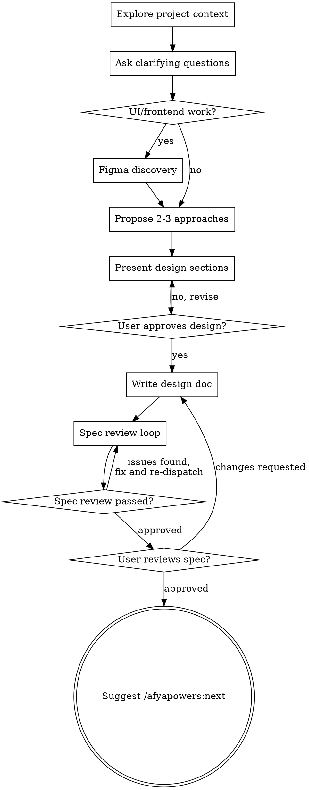

# Figma Workflow Integration Implementation Plan

> **For agentic workers:** REQUIRED: Use the afyapowers implementing skill to implement this plan. Steps use checkbox (`- [ ]`) syntax for tracking.

**Goal:** Add conditional Figma support across design, planning, and implementation phases while keeping the existing workflow intact for non-Figma tasks.

**Architecture:** Conditional steps in existing skills (design, writing-plans, SDD) detect Figma-driven work and adapt behavior. A new Figma implementer prompt replaces the standard TDD implementer for Figma tasks. Detection uses the presence of a `**Figma:**` section in task text.

**Tech Stack:** Figma MCP server (remote), MCP tools (`get_metadata`, `get_design_context`, `get_screenshot`, `get_variable_defs`)

---

## Chunk 1: Templates and Figma Implementer Prompt

### Task 1: Add Figma Resources section to design template

**Files:**
- Modify: `templates/design.md:39-40`

**Depends on:** none

- [ ] **Step 1: Add optional Figma Resources section at the end of `templates/design.md`**

After the existing `## Open Questions` section (line 39-40), append the following:

```markdown

## Figma Resources
<!-- Only included when feature has Figma designs. Remove this section if not applicable. -->

**File:** `<figma_url>`
**File Key:** `<file_key>`

### Breakpoints
<!-- Discovered from top-level frame analysis via get_design_context -->
- <breakpoint_name>: <width>px (Frame "<frame_name>", node `<node_id>`)

### Node Map
<!-- Hierarchical structure from get_metadata -->

#### Page: <page_name>
- **<section_name>** (node `<node_id>`, <type>, <width>x<height>)
  - <component_name> (node `<node_id>`, <type>)
    - <child_name> (node `<node_id>`, <type>)
```

- [ ] **Step 2: Verify the template reads correctly end-to-end**

Read `templates/design.md` and confirm the new section appears after Open Questions and follows the same formatting conventions as the rest of the template.

- [ ] **Step 3: Commit**

```bash
git add templates/design.md
git commit -m "feat: add optional Figma Resources section to design template"
```

---

### Task 2: Add Figma task format to plan template

**Files:**
- Modify: `templates/plan.md:25-33`

**Depends on:** none

- [ ] **Step 1: Add Figma task template after the existing Task 2 example in `templates/plan.md`**

At the end of the file (after line 33), append a new Figma task example:

```markdown

### Task N: [UI Component Name] (Figma)

**Files:**
- Create: `exact/path/to/component`

**Depends on:** none | Task X

**Figma:**
- **File Key:** `<file_key>`
- **Breakpoints:** <breakpoint_name> (<width>px), ...
- **Nodes:**
  | Node ID | Name | Type | Parent |
  |---------|------|------|--------|
  | `<id>` | <name> | <type> | <parent> |

- [ ] Step 1: Fetch design context for all task nodes
- [ ] Step 2: Capture screenshot for visual reference
- [ ] Step 3: Download required assets (images, icons, SVGs)
- [ ] Step 4: Translate to project conventions
- [ ] Step 5: Achieve 1:1 visual parity across all breakpoints
- [ ] Step 6: Validate against Figma screenshot
- [ ] Step 7: Commit
```

- [ ] **Step 2: Verify the template reads correctly end-to-end**

Read `templates/plan.md` and confirm both task formats (standard TDD and Figma) are present and clearly differentiated.

- [ ] **Step 3: Commit**

```bash
git add templates/plan.md
git commit -m "feat: add Figma task format to plan template"
```

---

### Task 3: Create Figma implementer prompt

**Files:**
- Create: `skills/implementing/implement-figma-design.md`

**Depends on:** none

- [ ] **Step 1: Create `skills/implementing/implement-figma-design.md`**

Create the file with the following content. This prompt is heavily based on the official Figma implement-design skill (`figma-implement-design-example.md`), adapted to run at task level within the SDD pipeline.

```markdown
# Figma Design Implementer Subagent Prompt Template

Use this template when dispatching an implementer subagent for a task that has a **Figma:** section. This replaces the standard `implementer-prompt.md` for Figma tasks.

**Key difference from standard implementer:** No TDD. The workflow follows the Figma implement-design pattern — fetch design context, capture visual reference, download assets, translate to project conventions, achieve visual parity, validate against Figma.

` ` `
Task tool (general-purpose):
  description: "Implement Figma Task N: [task name]"
  prompt: |
    You are implementing a Figma design task: Task N — [task name]

    ## Task Description

    [FULL TEXT of task from plan - paste it here, don't make subagent read file]

    ## Context

    [Scene-setting: where this fits, dependencies, architectural context]

    ## Figma Resources

    **File Key:** [FILE_KEY from task's Figma section]
    **Breakpoints:** [BREAKPOINTS from task's Figma section]
    **Nodes:**
    [NODES TABLE from task's Figma section]

    ## File Constraint

    You may ONLY modify the files listed in your task's **Files:** section:
    [LIST OF FILES FROM TASK]

    Do NOT create, modify, or delete any other files. If you believe you need to
    touch a file not in this list, report back with status NEEDS_CONTEXT and explain
    what file you need and why.

    ## Before You Begin

    If you have questions about:
    - The design requirements or component behavior
    - The project's design system or conventions
    - Dependencies or assumptions
    - Anything unclear in the task description

    **Ask them now.** Raise any concerns before starting work.

    ## Prerequisites

    - Figma MCP server must be connected and accessible
      - Before proceeding, verify the Figma MCP server is connected by checking if
        Figma MCP tools (e.g., `get_design_context`) are available.
      - If the tools are not available, report back with status BLOCKED and explain
        that the Figma MCP server is required but not accessible.

    ## Your Job: Required Workflow

    **Follow these steps in order. Do not skip steps.**

    ### Step 1: Fetch Design Context

    Run `get_design_context` for each node ID in your Figma Resources table.

    ` ` `
    get_design_context(fileKey="<file_key>", nodeId="<node_id>")
    ` ` `

    This provides the structured data including:
    - Layout properties (Auto Layout, constraints, sizing)
    - Typography specifications
    - Color values and design tokens
    - Component structure and variants
    - Spacing and padding values

    **If the response is too large or truncated:**
    1. Run `get_metadata(fileKey="<file_key>", nodeId="<node_id>")` to get the
       high-level node map
    2. Identify the specific child nodes needed from the metadata
    3. Fetch individual child nodes with
       `get_design_context(fileKey="<file_key>", nodeId="<child_node_id>")`

    ### Step 2: Capture Visual Reference

    Run `get_screenshot` for the primary node(s) in your task.

    ` ` `
    get_screenshot(fileKey="<file_key>", nodeId="<node_id>")
    ` ` `

    This screenshot serves as the **source of truth** for visual validation. Keep it
    accessible throughout implementation. You will compare your output against this
    screenshot before reporting back.

    ### Step 3: Download Required Assets

    Download any assets (images, icons, SVGs) returned by the Figma MCP server.

    **IMPORTANT:** Follow these asset rules:
    - Use asset URLs exactly as returned by the Figma MCP server — do NOT modify them
    - DO NOT import or add new icon packages — all assets should come from the Figma
      payload
    - DO NOT use or create placeholders if a source URL is provided by the MCP server
    - If an asset URL is inaccessible, note it as a concern but continue with the rest

    ### Step 4: Translate to Project Conventions

    Translate the Figma output into the project's framework, styles, and conventions.

    **Key principles:**
    - Treat the Figma MCP output (typically React + Tailwind) as a representation of
      design and behavior, **not** as final code style
    - Replace Tailwind utility classes with the project's preferred utilities or design
      system tokens
    - Reuse existing components (buttons, inputs, typography, icon wrappers) instead of
      duplicating functionality
    - Use the project's color system, typography scale, and spacing tokens consistently
    - Respect existing routing, state management, and data-fetch patterns

    **Design System Integration:**
    - ALWAYS use components from the project's design system when possible
    - Map Figma design tokens to project design tokens
    - When a matching component exists, extend it rather than creating a new one
    - Document any new components added to the design system

    ### Step 5: Achieve 1:1 Visual Parity

    Strive for pixel-perfect visual parity with the Figma design across **all
    breakpoints specified in your task**.

    **Guidelines:**
    - Prioritize Figma fidelity to match designs exactly
    - Avoid hardcoded values — use design tokens from Figma where available
      (fetch with `get_variable_defs` if needed)
    - When conflicts arise between design system tokens and Figma specs, prefer design
      system tokens but adjust spacing or sizes minimally to match visuals
    - Follow WCAG requirements for accessibility
    - Keep components composable and reusable
    - Add TypeScript types for component props
    - Avoid inline styles unless truly necessary for dynamic values

    ### Step 6: Validate Against Figma

    Before marking complete, validate the final UI against the Figma screenshot from
    Step 2.

    **Validation checklist:**
    - [ ] Layout matches (spacing, alignment, sizing)
    - [ ] Typography matches (font, size, weight, line height)
    - [ ] Colors match exactly
    - [ ] Interactive states work as designed (hover, active, disabled)
    - [ ] Responsive behavior across all specified breakpoints
    - [ ] Assets render correctly
    - [ ] Accessibility standards met

    If you find discrepancies, fix them now. Compare side-by-side with the screenshot.
    Check spacing, colors, and typography values in the design context data.

    ### Step 7: Commit

    Commit your work with a descriptive message.

    ## Code Organization

    You reason best about code you can hold in context at once, and your edits are more
    reliable when files are focused. Keep this in mind:
    - Follow the file structure defined in the plan
    - Each file should have one clear responsibility with a well-defined interface
    - Place UI components in the project's designated design system directory
    - Follow the project's component naming conventions
    - If a file you're creating is growing beyond the plan's intent, stop and report
      it as DONE_WITH_CONCERNS — don't split files on your own without plan guidance
    - In existing codebases, follow established patterns

    ## When You're in Over Your Head

    It is always OK to stop and say "this is too hard for me." Bad work is worse than
    no work. You will not be penalized for escalating.

    **STOP and escalate when:**
    - The design is too complex to implement accurately in one pass
    - You need to understand code beyond what was provided and can't find clarity
    - You feel uncertain about whether your implementation matches the design
    - The task involves restructuring existing code in ways the plan didn't anticipate
    - Asset URLs are inaccessible and the design can't be implemented without them

    **How to escalate:** Report back with status BLOCKED or NEEDS_CONTEXT. Describe
    specifically what you're stuck on, what you've tried, and what kind of help you need.

    ## Before Reporting Back: Self-Review

    Review your work with fresh eyes. Ask yourself:

    **Visual Fidelity:**
    - Does the implementation match the Figma screenshot pixel-for-pixel?
    - Are all breakpoints covered and responsive behavior correct?
    - Did I capture all interactive states (hover, active, disabled, focus)?

    **Design System Integration:**
    - Did I reuse existing components where possible?
    - Are design tokens mapped correctly (project tokens over hardcoded values)?
    - Does the component follow the project's naming and organization conventions?

    **Asset Handling:**
    - Are all assets from the Figma payload used correctly?
    - Did I avoid importing external icon packages?
    - Do all assets render correctly?

    **Quality:**
    - Is the code clean and maintainable?
    - Did I avoid overbuilding (YAGNI)?
    - Did I follow existing patterns in the codebase?

    **Deviations:**
    - If I deviated from the Figma design, did I document why in code comments?
    - Are deviations limited to accessibility or technical constraints?

    If you find issues during self-review, fix them now before reporting.

    ## Report Format

    When done, report:
    - **Status:** DONE | DONE_WITH_CONCERNS | BLOCKED | NEEDS_CONTEXT
    - What you implemented (component structure, key decisions)
    - Visual validation results (did it match the screenshot?)
    - Breakpoints covered
    - Files changed
    - Self-review findings (if any)
    - Any deviations from the Figma design and why

    Use DONE_WITH_CONCERNS if you completed the work but have doubts about visual
    accuracy or asset handling. Use BLOCKED if you cannot complete the task (e.g.,
    Figma MCP unavailable). Use NEEDS_CONTEXT if you need information that wasn't
    provided. Never silently produce work you're unsure about.

    ## Common Issues and Solutions

    ### Issue: Figma output is truncated
    **Cause:** The design is too complex or has too many nested layers.
    **Solution:** Use `get_metadata` to get the node structure, then fetch specific
    nodes individually with `get_design_context`.

    ### Issue: Design doesn't match after implementation
    **Cause:** Visual discrepancies between implemented code and Figma design.
    **Solution:** Compare side-by-side with screenshot from Step 2. Check spacing,
    colors, and typography values in the design context data.

    ### Issue: Assets not loading
    **Cause:** Asset URLs are inaccessible or have been modified.
    **Solution:** Use asset URLs exactly as returned by the Figma MCP server. Do not
    modify, proxy, or replace them. If still inaccessible, report as DONE_WITH_CONCERNS.

    ### Issue: Design token values differ from project
    **Cause:** Project design system tokens have different values than Figma specs.
    **Solution:** Prefer project tokens for consistency but adjust spacing/sizing
    minimally to maintain visual fidelity. Document the deviation.
` ` `
```

- [ ] **Step 2: Fix backtick escaping**

The content above uses spaced backticks (`` ` ` ` ``) to avoid breaking the plan's markdown nesting. After creating the file, replace ALL instances of `` ` ` ` `` (backtick-space-backtick-space-backtick) with actual triple backticks (` ``` `). Verify no spaced backticks remain.

- [ ] **Step 3: Verify the file is well-formed**

Read `skills/implementing/implement-figma-design.md` and confirm:
- The prompt template structure matches `implementer-prompt.md` (Task Description, Context, File Constraint, Before You Begin, Your Job, Self-Review, Report Format)
- The workflow steps match the official Figma skill starting from Step 2 (node IDs are pre-provided in the task's Figma section, so the "Get Node ID" step from the official skill is intentionally omitted)
- No TDD references exist in the prompt
- Asset handling says "use URLs as returned" (no localhost assumption)
- The escalation model matches (DONE / DONE_WITH_CONCERNS / NEEDS_CONTEXT / BLOCKED)

- [ ] **Step 4: Commit**

```bash
git add skills/implementing/implement-figma-design.md
git commit -m "feat: create Figma design implementer prompt template"
```

---

## Chunk 2: Skill Modifications

### Task 4: Add conditional Figma discovery to design skill

**Files:**
- Modify: `skills/design/SKILL.md`

**Depends on:** Task 1

> **Note:** Line numbers below reference the file before any edits in this task. Use the quoted content to locate the insertion/replacement point, not the line number.

- [ ] **Step 1: Add Figma discovery step to the checklist**

In `skills/design/SKILL.md`, find the current checklist (lines 28-36) which reads:

```markdown
## Checklist

You MUST complete these items in order:

1. **Explore project context** — check files, docs, recent commits
2. **Ask clarifying questions** — one at a time, understand purpose/constraints/success criteria
3. **Propose 2-3 approaches** — with trade-offs and your recommendation
4. **Present design** — in sections scaled to their complexity, get user approval after each section
5. **Write design doc** — save to `.afyapowers/features/<feature>/artifacts/design.md`
6. **Spec review loop** — dispatch spec-document-reviewer subagent; fix issues and re-dispatch until approved (max 5 iterations, then surface to human)
7. **User reviews written spec** — ask user to review the spec file before proceeding
```

Replace it with:

```markdown
## Checklist

You MUST complete these items in order:

1. **Explore project context** — check files, docs, recent commits
2. **Ask clarifying questions** — one at a time, understand purpose/constraints/success criteria
3. **Figma discovery (conditional)** — if the feature involves UI/frontend work, run the Figma discovery process (see below)
4. **Propose 2-3 approaches** — with trade-offs and your recommendation
5. **Present design** — in sections scaled to their complexity, get user approval after each section
6. **Write design doc** — save to `.afyapowers/features/<feature>/artifacts/design.md`
7. **Spec review loop** — dispatch spec-document-reviewer subagent; fix issues and re-dispatch until approved (max 5 iterations, then surface to human)
8. **User reviews written spec** — ask user to review the spec file before proceeding
```

- [ ] **Step 2: Add Figma discovery step to the process flow**

In the process flow `digraph` (lines 40-66), add the Figma discovery node. Replace the current flow with:



- [ ] **Step 3: Add Figma Discovery section to The Process**

After the "Understanding the idea" subsection (after line 80) and before "Exploring approaches" (line 82), insert a new subsection:

```markdown
**Figma discovery (conditional):**

If the feature involves UI/frontend work, ask the user:

> "Does this feature have Figma designs? If so, please share the Figma URL(s)."

If the user provides Figma URL(s):

1. **Parse each URL** to extract the file key and node ID
   - URL format: `https://figma.com/design/:fileKey/:fileName?node-id=X-Y`
   - Extract `:fileKey` (segment after `/design/`) and `X-Y` (value of `node-id` parameter)

2. **Fetch structural metadata** using `get_metadata` for each provided node
   ```
   get_metadata(fileKey=":fileKey", nodeId="X-Y")
   ```
   This returns a sparse XML representation with node IDs, names, types, positions, and sizes. Use this to build the hierarchical Node Map for the design doc.

3. **Fetch top-level frame analysis** using `get_design_context` on top-level frames only
   ```
   get_design_context(fileKey=":fileKey", nodeId="<top_level_frame_id>")
   ```
   Use this to discover breakpoints and overall layout patterns. Do NOT fetch `get_design_context` for every node — only top-level frames. This keeps discovery lightweight.

4. **Build the `## Figma Resources` section** for the design doc using the data gathered:
   - File info (URL, file key)
   - Breakpoints (discovered from top-level frame analysis)
   - Node Map (hierarchical structure from `get_metadata`: page → section → component)

   Use the template from `templates/design.md` for the section structure.

**If the Figma MCP server is unavailable:** Warn the user and suggest checking the MCP server connection. You cannot proceed with Figma discovery without it, but you can still continue the design process without the Figma Resources section.

**If no Figma designs:** Proceed normally. Do not include the Figma Resources section in the design doc.

**Design tokens are NOT extracted during design phase.** They are deferred to implementation time — the implementer subagent will fetch them via `get_variable_defs` when needed.
```

- [ ] **Step 4: Update the design template reference**

In the "Presenting the design" subsection (around line 94), after the line that says:
```
- Cover all sections from the design template: problem statement, requirements, constraints, chosen approach, architecture, data flow, interfaces, error handling, testing strategy, dependencies
```

Add:
```markdown
- If Figma discovery was performed, include the `## Figma Resources` section with file info, breakpoints, and node map
```

- [ ] **Step 5: Verify the skill reads correctly end-to-end**

Read `skills/design/SKILL.md` and confirm:
- The checklist has 8 items with Figma discovery at position 3
- The process flow diagram includes the Figma discovery decision diamond
- The Figma discovery process section is complete with URL parsing, `get_metadata`, `get_design_context`, and section building instructions
- The rest of the skill is unchanged (phase gate, approaches, spec review loop, completion)

- [ ] **Step 6: Commit**

```bash
git add skills/design/SKILL.md
git commit -m "feat: add conditional Figma discovery step to design skill"
```

---

### Task 5: Add Figma task format to writing-plans skill

**Files:**
- Modify: `skills/writing-plans/SKILL.md`

**Depends on:** Task 2

> **Note:** Line numbers below reference the file before any edits in this task. Use the quoted content to locate the insertion/replacement point, not the line number.

- [ ] **Step 1: Update Bite-Sized Task Granularity to note Figma exception**

In `skills/writing-plans/SKILL.md`, the current "Bite-Sized Task Granularity" section (lines 40-47) reads:

```markdown
## Bite-Sized Task Granularity

**Each step is one action (2-5 minutes):**
- "Write the failing test" - step
- "Run it to make sure it fails" - step
- "Implement the minimal code to make the test pass" - step
- "Run the tests and make sure they pass" - step
- "Commit" - step
```

Replace it with:

```markdown
## Bite-Sized Task Granularity

**For standard (non-Figma) tasks, each step is one action (2-5 minutes):**
- "Write the failing test" - step
- "Run it to make sure it fails" - step
- "Implement the minimal code to make the test pass" - step
- "Run the tests and make sure they pass" - step
- "Commit" - step

**For Figma tasks, steps follow the implement-design workflow instead of TDD:**
- "Fetch design context for all task nodes" - step
- "Capture screenshot for visual reference" - step
- "Download required assets" - step
- "Translate to project conventions" - step
- "Achieve 1:1 visual parity across all breakpoints" - step
- "Validate against Figma screenshot" - step
- "Commit" - step
```

- [ ] **Step 2: Add Figma Task Structure section**

After the existing "Task Structure" section (which ends at line 128 with the closing `````), add a new section:

````markdown
## Figma Task Structure

Use this format for tasks that implement UI components with Figma designs. The design doc's `## Figma Resources` section provides the source data for the Figma block.

**How to identify Figma tasks:** If the component being implemented has corresponding nodes in the design doc's `## Figma Resources` Node Map, it is a Figma task. Backend tasks, API routes, data models, business logic, and other non-UI tasks use the standard task structure above.

**No TDD, no code snippets.** Figma tasks describe what to achieve — the implementer subagent uses the Figma MCP tools and the implement-figma-design workflow to determine how.

```markdown
### Task N: [UI Component Name] (Figma)

**Files:**
- Create: `exact/path/to/component`
- Create: `exact/path/to/styles` (if applicable)
**Depends on:** none | Task X, Task Y

**Figma:**
- **File Key:** `<file_key>`
- **Breakpoints:** <breakpoint_name> (<width>px), <breakpoint_name> (<width>px)
- **Nodes:**
  | Node ID | Name | Type | Parent |
  |---------|------|------|--------|
  | `<id>` | <name> | <type> | <parent> |
  | `<id>` | <name> | <type> | <parent> |

- [ ] Step 1: Fetch design context for all task nodes
- [ ] Step 2: Capture screenshot for visual reference
- [ ] Step 3: Download required assets (images, icons, SVGs)
- [ ] Step 4: Translate to project conventions
- [ ] Step 5: Achieve 1:1 visual parity across all breakpoints
- [ ] Step 6: Validate against Figma screenshot
- [ ] Step 7: Commit
```

**Building the Figma block:**
- **File Key:** Copy from the design doc's `## Figma Resources` section
- **Breakpoints:** Include only the breakpoints relevant to this task's component (not all breakpoints in the design)
- **Nodes:** Select the nodes from the design doc's Node Map that correspond to this task's component and its children. Include the node ID, name, type, and parent for each.

**Mixed plans:** Figma and non-Figma tasks coexist in the same plan with standard dependency handling. A feature might have Tasks 1-2 as data models (standard TDD), Tasks 3-5 as UI components (Figma), and Task 6 as integration (standard TDD).
````

- [ ] **Step 3: Update the Remember section**

In the "Remember" section (lines 130-134), add a bullet point:

```markdown
## Remember
- Exact file paths always
- Complete code in plan (not "add validation") — except for Figma tasks which use design-workflow steps instead of code
- Exact commands with expected output
- DRY, YAGNI, TDD (standard tasks), frequent commits
- Figma tasks: no TDD, no code snippets — steps describe what to achieve, not how to code it
```

- [ ] **Step 4: Verify the skill reads correctly end-to-end**

Read `skills/writing-plans/SKILL.md` and confirm:
- Bite-Sized Task Granularity covers both standard and Figma step types
- Both task structures (standard TDD and Figma) are documented
- The Figma task structure includes the `**Figma:**` block format with nodes table
- The Remember section reflects the Figma exception
- All other sections (Phase Gate, Scope Check, File Structure, Dependency Declaration, Plan Review Loop, Completion) are unchanged

- [ ] **Step 5: Commit**

```bash
git add skills/writing-plans/SKILL.md
git commit -m "feat: add Figma task format to writing-plans skill"
```

---

### Task 6: Add prompt routing to SDD skill

**Files:**
- Modify: `skills/subagent-driven-development/SKILL.md`

**Depends on:** Task 3

> **Note:** Line numbers below reference the file before any edits in this task. Use the quoted content to locate the insertion/replacement point, not the line number.

- [ ] **Step 1: Add prompt routing to the Dispatch step**

In `skills/subagent-driven-development/SKILL.md`, the current Step 6 (Dispatch, lines 94-100) reads:

```markdown
### Step 6: Dispatch

Dispatch all ready tasks as parallel Agent tool calls in a single message. Each agent gets:
- Full task text (steps, file list, code) — paste directly, don't make agent read files
- Design spec content for context
- File constraint: "You may ONLY modify these files: [list from task's Files: section]"
- Return format: status (DONE / DONE_WITH_CONCERNS / NEEDS_CONTEXT / BLOCKED) + summary
```

Replace it with:

```markdown
### Step 6: Dispatch

Dispatch all ready tasks as parallel Agent tool calls in a single message.

**Prompt routing:** Select the correct implementer prompt based on the task type:
- If the task text contains a `**Figma:**` section → use `skills/implementing/implement-figma-design.md` prompt template. Include the Figma metadata (file key, nodes table, breakpoints) in the agent context.
- If the task does NOT contain a `**Figma:**` section → use `skills/implementing/implementer-prompt.md` prompt template (standard TDD implementer).

Each agent gets:
- Full task text (steps, file list, code/Figma metadata) — paste directly, don't make agent read files
- Design spec content for context
- File constraint: "You may ONLY modify these files: [list from task's Files: section]"
- Return format: status (DONE / DONE_WITH_CONCERNS / NEEDS_CONTEXT / BLOCKED) + summary
```

- [ ] **Step 2: Update the Prompt Templates section**

In the "Prompt Templates" section (lines 202-205), add the Figma implementer prompt:

```markdown
## Prompt Templates

- `skills/implementing/implementer-prompt.md` - Dispatch standard implementer subagent (TDD workflow)
- `skills/implementing/implement-figma-design.md` - Dispatch Figma design implementer subagent (visual fidelity workflow)
- `skills/implementing/spec-reviewer-prompt.md` - Dispatch spec compliance reviewer subagent
- `skills/implementing/code-quality-reviewer-prompt.md` - Dispatch code quality reviewer subagent
```

- [ ] **Step 3: Update the Integration section**

In the "Integration" section (lines 239-249), update the subagent prompts list:

```markdown
**Subagent prompts:**
- `skills/implementing/implementer-prompt.md` — TDD rules are embedded directly in this prompt (used for standard tasks)
- `skills/implementing/implement-figma-design.md` — Figma implement-design workflow (used for tasks with `**Figma:**` section)
- `skills/implementing/spec-reviewer-prompt.md` — spec compliance review
- `skills/implementing/code-quality-reviewer-prompt.md` — code quality review
```

- [ ] **Step 4: Verify the skill reads correctly end-to-end**

Read `skills/subagent-driven-development/SKILL.md` and confirm:
- Step 6 (Dispatch) includes the prompt routing logic with clear detection mechanism (`**Figma:**` section)
- Prompt Templates section lists both implementer prompts
- Integration section lists both implementer prompts
- All other sections (Wave Execution Algorithm steps 1-5, 7-8, Post-Wave Verification, Agent Prompt Best Practices, Model Selection, Handling Implementer Status, Red Flags) are unchanged

- [ ] **Step 5: Commit**

```bash
git add skills/subagent-driven-development/SKILL.md
git commit -m "feat: add Figma prompt routing to SDD skill"
```
