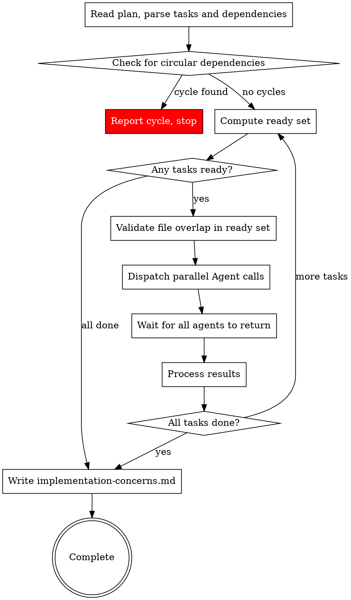

# Defer Per-Task Reviews to Review Phase — Implementation Plan

> **For agentic workers:** REQUIRED: Use superpowers:subagent-driven-development (if subagents available) or superpowers:executing-plans to implement this plan. Steps use checkbox (`- [ ]`) syntax for tracking.

**Goal:** Remove per-task spec-compliance and code-quality review dispatches from the implementation phase, deferring all reviews to the review phase.

**Architecture:** Edit 5 markdown skill files to remove per-task review instructions, add concerns collection to the SDD orchestrator, and feed collected concerns into the review phase as priority areas.

**Tech Stack:** Markdown skill files (no code changes)

**Spec:** `docs/superpowers/specs/2026-03-18-defer-reviews-to-review-phase-design.md`

---

## Chunk 1: All Tasks

### Task 1: Update SDD Orchestrator — Description, Graph, and Core Principle

**Files:**
- Modify: `skills/subagent-driven-development/SKILL.md:1-47`

**Depends on:** none

- [ ] **Step 1: Update the file description (line 8)**

Replace:
```
Execute plan by dispatching subagents per task with two-stage review (spec compliance then code quality). Tasks with no mutual dependencies run in parallel waves for faster execution.
```
With:
```
Execute plan by dispatching subagents per task. Tasks with no mutual dependencies run in parallel waves for faster execution.
```

- [ ] **Step 2: Update the core principle (line 10)**

Replace:
```
**Core principle:** Fresh subagent per task + two-stage review (spec then quality) = high quality, fast iteration
```
With:
```
**Core principle:** Fresh subagent per task + self-review + concerns collection = fast iteration with deferred quality review
```

- [ ] **Step 3: Update the process graph (lines 14-44)**

Replace the entire `digraph process` block with:


- [ ] **Step 4: Update the pipeline description (line 47)**

Replace:
```
Each dispatched Agent runs the full task pipeline: implement → spec review → quality review. Multiple pipelines run concurrently.
```
With:
```
Each dispatched Agent implements the task, performs a self-review, and returns a status with any concerns. Multiple agents run concurrently.
```

- [ ] **Step 5: Commit**

```bash
git add skills/subagent-driven-development/SKILL.md
git commit -m "refactor(sdd): update description, graph, and core principle to remove per-task reviews"
```

### Task 2: Update SDD Orchestrator — Step 6 Status Handling

**Files:**
- Modify: `skills/subagent-driven-development/SKILL.md:104-111`

**Depends on:** Task 1

- [ ] **Step 1: Update Step 6 status handling (lines 106-110)**

Replace:
```markdown
All Agent calls return together. For each result:
- **DONE** (passed both reviews): mark task `completed`, update plan checkbox to `- [x]`
- **DONE_WITH_CONCERNS**: read concerns. If about correctness/scope, address before marking complete. If observations only, note and mark `completed`
- **NEEDS_CONTEXT**: surface question to user. Mark task `needs-retry`. Continue with other tasks — do NOT pause the entire execution
- **BLOCKED**: assess blocker per standard SDD rules (more context, more capable model, break into pieces, or escalate). Mark task `needs-retry`
```
With:
```markdown
All Agent calls return together. For each result:
- **DONE**: mark task `completed`, update plan checkbox to `- [x]`
- **DONE_WITH_CONCERNS**: read concerns. Store in concerns list and mark `completed`. If the concern indicates the task is fundamentally broken, treat as `BLOCKED` instead.
  - **Treat as BLOCKED examples:** "I couldn't get tests to pass", "Tests fail and I can't figure out why", "Core dependency is missing and I had to stub the entire integration"
  - **Store-and-continue examples:** "I'm not sure this edge case is handled correctly", "The API response format might differ in production", "This works but the approach feels fragile"
- **NEEDS_CONTEXT**: surface question to user. Mark task `needs-retry`. Continue with other tasks — do NOT pause the entire execution
- **BLOCKED**: assess blocker per standard SDD rules (more context, more capable model, break into pieces, or escalate). Mark task `needs-retry`
```

- [ ] **Step 2: Commit**

```bash
git add skills/subagent-driven-development/SKILL.md
git commit -m "refactor(sdd): update status handling to collect concerns instead of dispatching reviews"
```

### Task 3: Update SDD Orchestrator — Worked Example

**Files:**
- Modify: `skills/subagent-driven-development/SKILL.md:120-144`

**Depends on:** Task 2

- [ ] **Step 1: Replace the worked example (lines 122-144)**

Replace the entire code block contents inside the worked example:
```
Plan: 5 tasks. Task 1,2 have no deps. Task 3,4 depend on 1,2. Task 5 depends on 3,4.

--- Cycle 1 ---
Completed: []
Ready: [1, 2] → no file overlap → dispatch both
  → Agent(Task 1), Agent(Task 2) dispatched in parallel
  → Both return DONE, pass reviews
Completed: [1, 2]

--- Cycle 2 ---
Ready: [3, 4] (deps [1,2] all completed) → no file overlap → dispatch both
  → Agent(Task 3), Agent(Task 4) dispatched in parallel
  → Task 3 fails spec review, gets fixed, passes on re-review
  → Task 4 passes
Completed: [1, 2, 3, 4]

--- Cycle 3 ---
Ready: [5] (deps [3,4] all completed) → dispatch
  → Agent(Task 5) dispatched
  → Passes
Completed: [1, 2, 3, 4, 5] → Done
```
With:
```
Plan: 5 tasks. Task 1,2 have no deps. Task 3,4 depend on 1,2. Task 5 depends on 3,4.

--- Cycle 1 ---
Completed: []
Ready: [1, 2] → no file overlap → dispatch both
  → Agent(Task 1), Agent(Task 2) dispatched in parallel
  → Both return DONE
Completed: [1, 2]

--- Cycle 2 ---
Ready: [3, 4] (deps [1,2] all completed) → no file overlap → dispatch both
  → Agent(Task 3), Agent(Task 4) dispatched in parallel
  → Task 3 returns DONE_WITH_CONCERNS (concern noted)
  → Task 4 returns DONE
Completed: [1, 2, 3, 4]
Concerns collected: [Task 3: "..."]

--- Cycle 3 ---
Ready: [5] (deps [3,4] all completed) → dispatch
  → Agent(Task 5) dispatched
  → Returns DONE
Completed: [1, 2, 3, 4, 5] → Write implementation-concerns.md → Done
```

- [ ] **Step 2: Commit**

```bash
git add skills/subagent-driven-development/SKILL.md
git commit -m "refactor(sdd): update worked example to show concerns collection instead of reviews"
```

### Task 4: Update SDD Orchestrator — Handling Implementer Status, Prompt Templates, Red Flags, Integration

**Files:**
- Modify: `skills/subagent-driven-development/SKILL.md:185-252`

**Depends on:** Task 3

- [ ] **Step 1: Update Handling Implementer Status section (lines 185-201)**

Replace:
```markdown
## Handling Implementer Status

Implementer subagents report one of four statuses:

**DONE:** Proceed to spec compliance review.

**DONE_WITH_CONCERNS:** Read concerns before proceeding. If about correctness/scope, address first. If observations, note and proceed.

**NEEDS_CONTEXT:** Provide missing context and re-dispatch.

**BLOCKED:** Assess blocker:
1. Context problem → provide more context, re-dispatch
2. Needs more reasoning → re-dispatch with more capable model
3. Task too large → break into smaller pieces
4. Plan wrong → escalate to human

**Never** ignore an escalation or force retry without changes.
```
With:
```markdown
## Handling Implementer Status

Implementer subagents report one of four statuses:

**DONE:** Mark task `completed`, update plan checkbox. No review dispatch.

**DONE_WITH_CONCERNS:** Read concerns. Store in concerns list and mark `completed`. If the concern indicates the task is fundamentally broken (e.g., "I couldn't get tests to pass", "Core dependency is missing and I had to stub the entire integration"), treat as `BLOCKED` instead. Examples of store-and-continue concerns: "I'm not sure this edge case is handled correctly", "The API response format might differ in production", "This works but the approach feels fragile."

**NEEDS_CONTEXT:** Provide missing context and re-dispatch.

**BLOCKED:** Assess blocker:
1. Context problem → provide more context, re-dispatch
2. Needs more reasoning → re-dispatch with more capable model
3. Task too large → break into smaller pieces
4. Plan wrong → escalate to human

**Never** ignore an escalation or force retry without changes.
```

- [ ] **Step 2: Update Prompt Templates section (lines 203-208)**

Replace:
```markdown
## Prompt Templates

- `skills/implementing/implementer-prompt.md` - Dispatch standard implementer subagent (TDD workflow)
- `skills/implementing/implement-figma-design.md` - Dispatch Figma design implementer subagent (visual fidelity workflow)
- `skills/implementing/spec-reviewer-prompt.md` - Dispatch spec compliance reviewer subagent
- `skills/implementing/code-quality-reviewer-prompt.md` - Dispatch code quality reviewer subagent
```
With:
```markdown
## Prompt Templates

- `skills/implementing/implementer-prompt.md` - Dispatch standard implementer subagent (TDD workflow)
- `skills/implementing/implement-figma-design.md` - Dispatch Figma design implementer subagent (visual fidelity workflow)
```

- [ ] **Step 3: Update Red Flags section (lines 210-239)**

Replace the entire Red Flags section:
```markdown
## Red Flags

**Never:**
- Start implementation on main/master branch without explicit user consent
- Skip reviews (spec compliance OR code quality)
- Proceed with unfixed issues
- Dispatch implementation subagents that modify the same files in parallel (file overlap = sequential)
- Make subagent read plan file (provide full text instead)
- Skip scene-setting context
- Ignore subagent questions
- Accept "close enough" on spec compliance
- Skip review loops
- Let implementer self-review replace actual review
- **Start code quality review before spec compliance passes** (wrong order)
- Move to next task while either review has open issues

**If subagent asks questions:**
- Answer clearly and completely
- Provide additional context if needed
- Don't rush them into implementation

**If reviewer finds issues:**
- Implementer (same subagent) fixes them
- Reviewer reviews again
- Repeat until approved
- Don't skip the re-review

**If subagent fails task:**
- Dispatch fix subagent with specific instructions
- Don't try to fix manually (context pollution)
```
With:
```markdown
## Red Flags

**Never:**
- Start implementation on main/master branch without explicit user consent
- Dispatch implementation subagents that modify the same files in parallel (file overlap = sequential)
- Make subagent read plan file (provide full text instead)
- Skip scene-setting context
- Ignore subagent questions
- Silently discard DONE_WITH_CONCERNS notes — always collect and persist them

**If subagent asks questions:**
- Answer clearly and completely
- Provide additional context if needed
- Don't rush them into implementation

**If subagent fails task:**
- Dispatch fix subagent with specific instructions
- Don't try to fix manually (context pollution)
```

- [ ] **Step 4: Update Integration section (lines 241-252)**

Replace:
```markdown
## Integration

**Invoked by:**
- **implementing** (REQUIRED SUB-SKILL) — implementing loads the plan and design, then invokes SDD to execute all tasks

**Subagent prompts:**
- `skills/implementing/implementer-prompt.md` — TDD rules are embedded directly in this prompt (used for standard tasks)
- `skills/implementing/implement-figma-design.md` — Figma implement-design workflow (used for tasks with `**Figma:**` section)
- `skills/implementing/spec-reviewer-prompt.md` — spec compliance review
- `skills/implementing/code-quality-reviewer-prompt.md` — code quality review

**Context:** When invoked by implementing, the plan and design are already in the conversation context. Use them directly. If the plan is not in context (e.g., invoked standalone), read it from `.afyapowers/features/<feature>/artifacts/plan.md`.
```
With:
```markdown
## Integration

**Invoked by:**
- **implementing** (REQUIRED SUB-SKILL) — implementing loads the plan and design, then invokes SDD to execute all tasks

**Subagent prompts:**
- `skills/implementing/implementer-prompt.md` — TDD rules are embedded directly in this prompt (used for standard tasks)
- `skills/implementing/implement-figma-design.md` — Figma implement-design workflow (used for tasks with `**Figma:**` section)

**Context:** When invoked by implementing, the plan and design are already in the conversation context. Use them directly. If the plan is not in context (e.g., invoked standalone), read it from `.afyapowers/features/<feature>/artifacts/plan.md`.

## Concerns Collection

After all tasks complete, if any `DONE_WITH_CONCERNS` notes were collected during execution, write them to `.afyapowers/features/<feature>/artifacts/implementation-concerns.md`:

```markdown
# Implementation Concerns

Collected during implementation phase. Priority areas for the review phase.

## Task N: [task name verbatim from plan heading]
- [concern text from implementer report]

## Task M: [task name verbatim from plan heading]
- [concern text from implementer report]
```

If the implementation phase is re-run (e.g., after fixing a blocked task), overwrite `implementation-concerns.md` with fresh data from the current run — do not append to stale concerns from a previous run. If no concerns were collected, do not create the file.
```

- [ ] **Step 5: Commit**

```bash
git add skills/subagent-driven-development/SKILL.md
git commit -m "refactor(sdd): update status handling, templates, red flags, integration, add concerns collection"
```

### Task 5: Update Standard Implementer Prompt

**Files:**
- Modify: `skills/implementing/implementer-prompt.md:149-151`

**Depends on:** none

- [ ] **Step 1: Add DONE_WITH_CONCERNS encouragement to Report Format section**

After line 151 (the line that says `information that wasn't provided. Never silently produce work you're unsure about.`), add:

```

    Be thorough with DONE_WITH_CONCERNS — this is your primary channel for flagging
    issues to the review phase. If anything feels uncertain, incomplete, or fragile,
    flag it. The review phase will prioritize your concerns. Err on the side of
    flagging — a false alarm costs nothing, a missed concern costs a review cycle.
```

This goes inside the code fence (before the closing `` ``` ``), maintaining the same indentation (4 spaces) as the surrounding text.

- [ ] **Step 2: Commit**

```bash
git add skills/implementing/implementer-prompt.md
git commit -m "refactor(implementer): add DONE_WITH_CONCERNS encouragement for review phase"
```

### Task 6: Update Figma Implementer Prompt

**Files:**
- Modify: `skills/implementing/implement-figma-design.md:229-232`

**Depends on:** none

- [ ] **Step 1: Add DONE_WITH_CONCERNS encouragement to Report Format section**

After line 232 (the line that says `provided. Never silently produce work you're unsure about.`), add:

```

    Be thorough with DONE_WITH_CONCERNS — this is your primary channel for flagging
    issues to the review phase. If anything feels uncertain, incomplete, or fragile,
    flag it. The review phase will prioritize your concerns. Err on the side of
    flagging — a false alarm costs nothing, a missed concern costs a review cycle.
```

This goes inside the code fence (before the closing `` ``` `` at line 255), maintaining the same indentation (4 spaces) as the surrounding text.

- [ ] **Step 2: Commit**

```bash
git add skills/implementing/implement-figma-design.md
git commit -m "refactor(figma-implementer): add DONE_WITH_CONCERNS encouragement for review phase"
```

### Task 7: Update Implementing Skill

**Files:**
- Modify: `skills/implementing/SKILL.md:35-41`

**Depends on:** none

- [ ] **Step 1: Add concerns artifact notification to "After SDD Completes" section**

Replace:
```markdown
## After SDD Completes

1. Verify all plan checkboxes are marked complete (`- [x]`)
2. If any remain unchecked, report which tasks are incomplete and ask the user how to proceed
3. Update `state.yaml` to reflect progress
4. Tell the user: "Implement phase complete. Run `/afyapowers:next` to proceed to **review**."
```
With:
```markdown
## After SDD Completes

1. Verify all plan checkboxes are marked complete (`- [x]`)
2. If any remain unchecked, report which tasks are incomplete and ask the user how to proceed
3. Update `state.yaml` to reflect progress
4. If `.afyapowers/features/<feature>/artifacts/implementation-concerns.md` exists, mention it to the user: "Implementation concerns were collected — they will be prioritized during the review phase."
5. Tell the user: "Implement phase complete. Run `/afyapowers:next` to proceed to **review**."
```

- [ ] **Step 2: Commit**

```bash
git add skills/implementing/SKILL.md
git commit -m "refactor(implementing): add concerns artifact notification after SDD completes"
```

### Task 8: Update Review Phase

**Files:**
- Modify: `skills/reviewing/SKILL.md:18-46`

**Depends on:** none

- [ ] **Step 1: Update Step 1 (Gather Context) to read concerns**

Replace:
```markdown
### Step 1: Gather Context

1. Read `.afyapowers/features/<feature>/artifacts/design.md` — the requirements
2. Read `.afyapowers/features/<feature>/artifacts/plan.md` — the implementation plan
3. Get the git diff for the feature's changes (use `git log` and `git diff` to identify the relevant commits)
```
With:
```markdown
### Step 1: Gather Context

1. Read `.afyapowers/features/<feature>/artifacts/design.md` — the requirements
2. Read `.afyapowers/features/<feature>/artifacts/plan.md` — the implementation plan
3. Get the git diff for the feature's changes (use `git log` and `git diff` to identify the relevant commits)
4. Read `.afyapowers/features/<feature>/artifacts/implementation-concerns.md` if it exists — these are concerns flagged by implementers during the implementation phase
```

- [ ] **Step 2: Update Step 2 (Spec Compliance Review) to pass concerns**

Replace:
```markdown
### Step 2: Spec Compliance Review

Dispatch a spec-reviewer subagent using `skills/implementing/spec-reviewer-prompt.md`:
- Provide the design spec content as "what was requested"
- Provide a summary of implemented changes as "what was built"
- Provide the relevant code diff

If the reviewer finds spec gaps:
1. Report the findings to the user
2. The user fixes issues (code changes happen during review phase)
3. Re-dispatch the spec reviewer
4. Repeat until spec-compliant (max 5 iterations)
```
With:
```markdown
### Step 2: Spec Compliance Review

Dispatch a spec-reviewer subagent using `skills/implementing/spec-reviewer-prompt.md`:
- Provide the design spec content as "what was requested"
- Provide a summary of implemented changes as "what was built"
- Provide the relevant code diff
- Include a "Priority Areas" section with the contents of `implementation-concerns.md` (or "No concerns were flagged." if the file doesn't exist)

If the reviewer finds spec gaps:
1. Report the findings to the user
2. The user fixes issues (code changes happen during review phase)
3. Re-dispatch the spec reviewer
4. Repeat until spec-compliant (max 5 iterations)
```

- [ ] **Step 3: Update Step 3 (Code Quality Review) to pass concerns**

Replace:
```markdown
### Step 3: Code Quality Review

Dispatch a code-quality-reviewer subagent using `skills/reviewing/code-reviewer.md`:
- Provide: what was implemented, plan reference, base/head SHAs, description

If the reviewer finds issues:
1. Categorize by severity (Critical, Important, Minor)
2. Critical and Important: must be fixed before proceeding
3. Minor: note for later, do not block
4. Fix issues and re-dispatch (max 5 iterations)
```
With:
```markdown
### Step 3: Code Quality Review

Dispatch a code-quality-reviewer subagent using `skills/reviewing/code-reviewer.md`:
- Provide: what was implemented, plan reference, base/head SHAs, description
- Include a "Priority Areas" section with the contents of `implementation-concerns.md` (or "No concerns were flagged." if the file doesn't exist)

If the reviewer finds issues:
1. Categorize by severity (Critical, Important, Minor)
2. Critical and Important: must be fixed before proceeding
3. Minor: note for later, do not block
4. Fix issues and re-dispatch (max 5 iterations)
```

- [ ] **Step 4: Commit**

```bash
git add skills/reviewing/SKILL.md
git commit -m "refactor(reviewing): read and pass implementation concerns as priority areas to reviewers"
```
