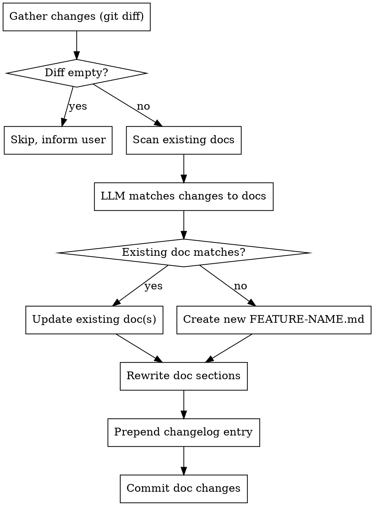

# Auto-Documentation Skill — Design Spec

## Overview

A cross-cutting skill that automatically generates and maintains feature documentation in `.afyapowers/docs/FEATURE-NAME.md`. It runs in two contexts:

1. **Within the afyapowers workflow** — as a step during the completing phase, before generating `completion.md`
2. **Standalone** — after any implementation work finishes, even without the `/afyapowers:*` workflow

## Skill Location & Discovery

- Path: `skills/auto-documentation/SKILL.md`
- Type: Cross-cutting skill (alongside TDD, debugging, verification, etc.)
- Discovered by the agent via YAML frontmatter convention (same as all other skills):

```yaml
---
name: auto-documentation
description: "Use after any implementation is finished to automatically generate or update feature documentation in .afyapowers/docs/ — analyzes changes, matches to existing docs by domain area, and maintains living documentation with changelog"
---
```

- No new slash command needed — the agent invokes it based on description match
- The completing skill references it explicitly in its process steps

## Directory & File Lifecycle

- Docs live in the **consumer project's** `.afyapowers/docs/` directory (per-project, alongside existing `.afyapowers/` state)
- The skill creates `.afyapowers/docs/` on first run if it doesn't exist
- Doc files **should be committed** to the project repo (unlike state/history YAML files, docs are valuable to the team)
- `.afyapowers/docs/` should NOT be gitignored

## Feature Matching Logic

When the skill runs:

1. **Gather changes** — read git diff comparing the current branch to the default branch (`main`/`master`). This captures all implementation changes for the feature branch. If on the default branch, use the diff of the last commit.
2. **Scan existing docs** — read all `.afyapowers/docs/*.md` files and extract their feature names, overviews, and key files sections
3. **Match or create** — the agent (LLM) analyzes whether the changes belong to an existing documented feature:
   - If a doc covers the same domain area → update that doc
   - If changes span multiple features → update each relevant doc
   - If no existing doc matches → create a new `FEATURE-NAME.md`
4. Feature names for new docs are derived from the logical domain area (e.g., `session-hooks.md`, `authentication.md`)
5. If git diff is empty (no changes), skip documentation and inform the user

Matching is done by the LLM — no keyword heuristics. The agent reads the doc contents and the diff, then decides.

## Document Format

A template is provided at `templates/feature-doc.md` for consistency. Each `.afyapowers/docs/FEATURE-NAME.md` follows this structure:

```markdown
# Feature Name

## Overview
Brief description of what this feature does and why it exists.

## Business Rules
- Rule 1: description
- Rule 2: description

## Usage
How to use the feature — configuration, API, commands, etc.

## Technical Details

### Architecture
Key components, how they connect, where they live.

### Key Files
- `path/to/file.ts` — purpose

### Data Flow
How data moves through the feature.

## Changelog

### 2026-03-13
- **What:** Detailed description of the changes made
- **Files:** `src/session/config.ts`, `src/session/middleware.ts`

### 2026-03-12
- **What:** Detailed description of the initial implementation
- **Files:** `src/session/index.ts`, `src/session/store.ts`
```

Key rules:
- Sections are only included when relevant (a simple utility might skip "Data Flow")
- Changelog entries are **prepended** (newest first)
- Documentation sections above the changelog are **rewritten** each time to reflect current state — living docs, not append-only
- Changelog is append-only (never removes previous entries, only prepends new ones)

## Integration with Completing Phase

The completing skill (`skills/completing/SKILL.md`) gets a new step inserted between Step 3 (Execute Choice) and Step 4 (Produce Completion Artifact):

**New Step 3.5: Auto-Documentation**

```markdown
### Step 3.5: Update Documentation

Read and follow `skills/auto-documentation/SKILL.md`.

The following context is available from the current feature:
- Feature name from `.afyapowers/active`
- Artifacts: brainstorm.md, tech-spec.md, plan.md, review.md (in `.afyapowers/<feature>/artifacts/`)
- Git diff from the feature branch

After documentation is updated, proceed to Step 4.
```

This ensures docs are always up-to-date before the completion artifact is generated.

## Standalone Trigger

When used outside the workflow, the skill is triggered by the agent when it recognizes implementation work is complete (based on its description matching the context).

The standalone flow:
1. Agent identifies what was implemented by reading git diff (current branch vs default branch)
2. Scans `.afyapowers/docs/` for existing docs
3. Updates or creates docs accordingly
4. Commits the documentation changes

No special context required — git diff is the source of truth. If afyapowers artifacts exist in `.afyapowers/<feature>/artifacts/`, the skill reads them for richer context but doesn't require them.

## Commit Behavior

- **Within workflow:** The skill commits doc changes immediately after generating/updating them (before the completion artifact step). Commit message: `docs: update .afyapowers/docs/<feature-name>.md`
- **Standalone:** Same — commits doc changes after generating/updating them.

## Context Sources (Priority Order)

1. **Afyapowers artifacts** (brainstorm.md, tech-spec.md, plan.md, review.md) — richest context, available during workflow
2. **Git diff** (current branch vs default branch) — always available, primary source for standalone usage
3. **Existing docs** in `.afyapowers/docs/` — used for matching and understanding current documented state

## Process Flow


