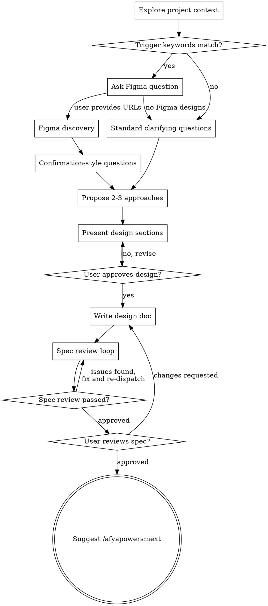

# Design: Figma Discovery Trigger Improvement

## Problem Statement

The design skill's Figma discovery step (step 3) is conditional on whether the feature "involves UI/frontend work," but the condition is implicit — there's no explicit guidance on how to determine this. As a result, requests like "implement a landing page" can skip Figma discovery entirely because the AI doesn't recognize the request as UI/frontend work that warrants asking about Figma designs.

Additionally, Figma discovery currently happens after clarifying questions (step 3), but Figma data often answers many of those questions (layout structure, breakpoints, component breakdown), making the ordering inefficient.

## Requirements

- The design skill must detect UI/frontend work using an explicit keyword trigger list
- When triggered, Figma discovery must happen before clarifying questions
- When Figma data is available, clarifying questions should shift to confirmation-style (present what Figma shows, ask user to confirm/correct) rather than open-ended
- Only ask follow-up questions about things not visible in Figma (business logic, data sources, dynamic behavior)

## Constraints

- Changes are scoped to `skills/design/SKILL.md` only (Approach A — inline)
- Must not break the existing flow for non-UI features
- Must not change how Figma discovery itself works (URL parsing, `get_metadata`, `get_design_context`)

## Approaches Considered

### Approach A: Inline trigger list in SKILL.md (Chosen)
Add keyword list and reordered flow directly in SKILL.md. Self-contained, easy to maintain.

### Approach B: Separate trigger config file
Extract keywords to `skills/design/figma-triggers.yaml`. Adds indirection for a small, stable list — overkill.

### Approach C: Pre-check before context exploration
Scan user request before exploring project context. Premature — need context first.

## Chosen Approach

**Approach A** — inline trigger list. The keyword list is small and stable, and keeping everything in one file makes the skill easier to follow.

## Changes

### 1. Checklist reorder

Current order:
1. Explore project context
2. Ask clarifying questions
3. Figma discovery (conditional)
4. Propose 2-3 approaches
5. ...

New order:
1. Explore project context
2. Figma discovery (trigger-based) — check user request against keyword list
3. Ask clarifying questions — confirmation-style if Figma data is available
4. Propose 2-3 approaches
5. ...

### 2. Explicit trigger keyword list

The following keywords in the user's request trigger the Figma question (case-insensitive, word-level matching):

> page, landing page, screen, view, layout, header, footer, navbar, sidebar, UI component, form, modal, dialog, card, hero, section, banner, responsive, breakpoint, mobile, desktop, dashboard, panel, widget

If a keyword matches but the request is clearly not UI work (e.g., "write unit tests for the landing page API endpoint"), use judgment — when in doubt, ask.

### 3. Process flow and dot diagram update

The existing graphviz dot diagram in SKILL.md (lines 41-72) must be replaced to reflect the new flow:

### 4. Confirmation-style questions (new)

When Figma data is available, replace open-ended clarifying questions with confirmation-style:

- Present what Figma shows (structure, breakpoints, component hierarchy)
- Ask user to confirm or correct
- Then only ask about things not visible in the design (business logic, data sources, interactions, dynamic behavior)

**Example:**

- **Open-ended (current):** "How should the page be structured?"
- **Confirmation-style (proposed):** "The Figma design shows a hero section, a 3-column feature grid, and a CTA footer across 3 breakpoints (mobile/tablet/desktop). Does this match what you want, or do you need changes?"

## Testing Strategy

- Manually invoke the design skill with "implement a landing page" and verify it asks about Figma
- Invoke with a backend-only request and verify it skips Figma
- Invoke with Figma data provided and verify confirmation-style questions appear

## Dependencies

- No new dependencies. Changes are contained within `skills/design/SKILL.md`.

## Open Questions

None.
