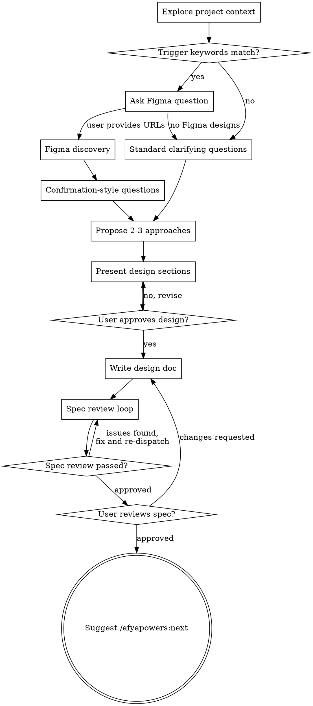

# Design Phase

Help turn ideas into fully formed technical designs through natural collaborative dialogue.

Start by understanding the current project context, then ask questions one at a time to refine the idea. Once you understand what you're building, present the full design — from requirements through architecture — and get user approval.

<HARD-GATE>
Do NOT invoke any implementation skill, write any code, scaffold any project, or take any implementation action until you have presented a design and the user has approved it. This applies to EVERY project regardless of perceived simplicity.
</HARD-GATE>

## Phase Gate

1. Read `.afyapowers/features/active` to get the active feature
2. Read `.afyapowers/features/<feature>/state.yaml` — confirm `current_phase` is `design`
3. If not in design phase, tell the user the current phase and stop

## Anti-Pattern: "This Is Too Simple To Need A Design"

Every project goes through this process. A todo list, a single-function utility, a config change — all of them. "Simple" projects are where unexamined assumptions cause the most wasted work. The design can be short (a few sentences for truly simple projects), but you MUST present it and get approval.

## Checklist

You MUST complete these items in order:

1. **Explore project context** — check files, docs, recent commits
2. **Figma discovery (trigger-based)** — check user request against trigger keywords (see below); if match, ask about Figma and run discovery before clarifying questions
3. **Ask clarifying questions** — if Figma data is available, use confirmation-style questions (see below); otherwise, standard one-at-a-time clarifying questions
4. **Propose 2-3 approaches** — with trade-offs and your recommendation
5. **Present design** — in sections scaled to their complexity, get user approval after each section
6. **Write design doc** — save to `.afyapowers/features/<feature>/artifacts/design.md`
7. **Spec review loop** — dispatch spec-document-reviewer subagent; fix issues and re-dispatch until approved (max 5 iterations, then surface to human)
8. **User reviews written spec** — ask user to review the spec file before proceeding

## Process Flow



**The terminal state is suggesting `/afyapowers:next`.** Do NOT invoke any implementation skill or advance phases. The `/afyapowers:next` command handles phase transitions.

## The Process

**Understanding the idea:**

- Check out the current project state first (files, docs, recent commits)
- Before asking detailed questions, assess scope: if the request describes multiple independent subsystems (e.g., "build a platform with chat, file storage, billing, and analytics"), flag this immediately. Don't spend questions refining details of a project that needs to be decomposed first.
- If the project is too large for a single spec, help the user decompose into sub-projects: what are the independent pieces, how do they relate, what order should they be built? Then design the first sub-project through the normal flow. Each sub-project gets its own design → plan → implementation cycle.
- For appropriately-scoped projects, ask questions one at a time to refine the idea
- Prefer multiple choice questions when possible, but open-ended is fine too
- Only one question per message - if a topic needs more exploration, break it into multiple questions
- Focus on understanding: purpose, constraints, success criteria

**Figma discovery (trigger-based):**

After exploring project context, check the user's request for these trigger keywords (case-insensitive, word-level matching):

> page, landing page, screen, view, layout, header, footer, navbar, sidebar, UI component, form, modal, dialog, card, hero, section, banner, responsive, breakpoint, mobile, desktop, dashboard, panel, widget

If any keyword matches, ask the user:

> "Does this feature have Figma designs? If so, please share the Figma URL(s)."

If a keyword matches but the request is clearly not UI work (e.g., "write unit tests for the landing page API endpoint"), use judgment — when in doubt, ask.

If no keywords match, skip Figma discovery and proceed to clarifying questions.

If the user provides Figma URL(s):

1. **Parse each URL** to extract the file key and node ID
   - URL format: `https://figma.com/design/:fileKey/:fileName?node-id=X-Y`
   - Extract `:fileKey` (segment after `/design/`) and `X-Y` (value of `node-id` parameter)

2. **Fetch structural metadata** using `get_metadata` for each provided node
   ```
   get_metadata(fileKey=":fileKey", nodeId="X-Y")
   ```
   This returns a sparse XML representation with node IDs, names, types, positions, and sizes. Use this to build the hierarchical Node Map for the design doc.

3. **Fetch top-level frame analysis** using `get_design_context` on top-level frames only
   ```
   get_design_context(fileKey=":fileKey", nodeId="<top_level_frame_id>")
   ```
   Use this to discover breakpoints and overall layout patterns. Do NOT fetch `get_design_context` for every node — only top-level frames. This keeps discovery lightweight.

4. **Build the `## Figma Resources` section** for the design doc using the data gathered:
   - File info (URL, file key)
   - Breakpoints (discovered from top-level frame analysis)
   - Node Map (hierarchical structure from `get_metadata`: page → section → component)

   Use the template from `templates/design.md` for the section structure.

**If the Figma MCP server is unavailable:** Warn the user and suggest checking the MCP server connection. You cannot proceed with Figma discovery without it, but you can still continue the design process without the Figma Resources section.

**If no Figma designs:** Proceed normally. Do not include the Figma Resources section in the design doc.

**Design tokens are NOT extracted during design phase.** They are deferred to implementation time — the implementer subagent will fetch them via `get_variable_defs` when needed.

**Clarifying questions (Figma-informed):**

When Figma data was gathered in the previous step, replace open-ended clarifying questions with confirmation-style:

- Present what Figma shows (structure, breakpoints, component hierarchy) and ask the user to confirm or correct
- Then only ask about things not visible in the design: business logic, data sources, interactions, dynamic behavior

Example:
- **Open-ended (without Figma):** "How should the page be structured?"
- **Confirmation-style (with Figma):** "The Figma design shows a hero section, a 3-column feature grid, and a CTA footer across 3 breakpoints (mobile/tablet/desktop). Does this match what you want, or do you need changes?"

When no Figma data is available, use the standard approach: ask questions one at a time to understand purpose, constraints, and success criteria.

**Exploring approaches:**

- Propose 2-3 different approaches with trade-offs
- Present options conversationally with your recommendation and reasoning
- Lead with your recommended option and explain why

**Presenting the design:**

- Once you believe you understand what you're building, present the full design
- Start with requirements and constraints, then move into architecture and technical details
- Scale each section to its complexity: a few sentences if straightforward, up to 200-300 words if nuanced
- Ask after each section whether it looks right so far
- Cover all sections from the design template: problem statement, requirements, constraints, chosen approach, architecture, data flow, interfaces, error handling, testing strategy, dependencies
- If Figma discovery was performed, include the `## Figma Resources` section with file info, breakpoints, and node map
- Be ready to go back and clarify if something doesn't make sense

**Design for isolation and clarity:**

- Break the system into smaller units that each have one clear purpose, communicate through well-defined interfaces, and can be understood and tested independently
- For each unit, you should be able to answer: what does it do, how do you use it, and what does it depend on?
- Can someone understand what a unit does without reading its internals? Can you change the internals without breaking consumers? If not, the boundaries need work.
- Smaller, well-bounded units are also easier for you to work with - you reason better about code you can hold in context at once, and your edits are more reliable when files are focused. When a file grows large, that's often a signal that it's doing too much.

**Working in existing codebases:**

- Explore the current structure before proposing changes. Follow existing patterns.
- Where existing code has problems that affect the work (e.g., a file that's grown too large, unclear boundaries, tangled responsibilities), include targeted improvements as part of the design - the way a good developer improves code they're working in.
- Don't propose unrelated refactoring. Stay focused on what serves the current goal.

## Required Sub-Skills

**REQUIRED:** Dispatch spec-document-reviewer subagent after writing the design artifact.

- Announce: "Using spec-document-reviewer to validate the design."
- Dispatch subagent using `skills/design/spec-document-reviewer-prompt.md`
- If issues found: fix and re-dispatch (max 5 iterations, then surface to human)
- After approval: resume the parent flow (user review gate)

## After the Design

**Documentation:**

- Write the validated design to `.afyapowers/features/<feature>/artifacts/design.md`
  - Use the template from `templates/design.md`
- Commit the design document to git

**Spec Review Loop:**
After writing the spec document:

1. Dispatch spec-document-reviewer subagent (see `skills/design/spec-document-reviewer-prompt.md`)
2. If Issues Found: fix, re-dispatch, repeat until Approved
3. If loop exceeds 5 iterations, surface to human for guidance

**User Review Gate:**
After the spec review loop passes, ask the user to review the written spec before proceeding:

> "Design written to `.afyapowers/features/<feature>/artifacts/design.md`. Please review it and let me know if you want to make any changes."

Wait for the user's response. If they request changes, make them and re-run the spec review loop. Only proceed once the user approves.

**Completion:**

- Update `state.yaml` to add `design.md` to the design phase's artifacts list
- Append `artifact_created` event to `history.yaml`
- Tell the user: "Design phase complete. Run `/afyapowers:next` to proceed to **plan**."

## Key Principles

- **One question at a time** - Don't overwhelm with multiple questions
- **Multiple choice preferred** - Easier to answer than open-ended when possible
- **YAGNI ruthlessly** - Remove unnecessary features from all designs
- **Explore alternatives** - Always propose 2-3 approaches before settling
- **Incremental validation** - Present design, get approval before moving on
- **Be flexible** - Go back and clarify when something doesn't make sense
