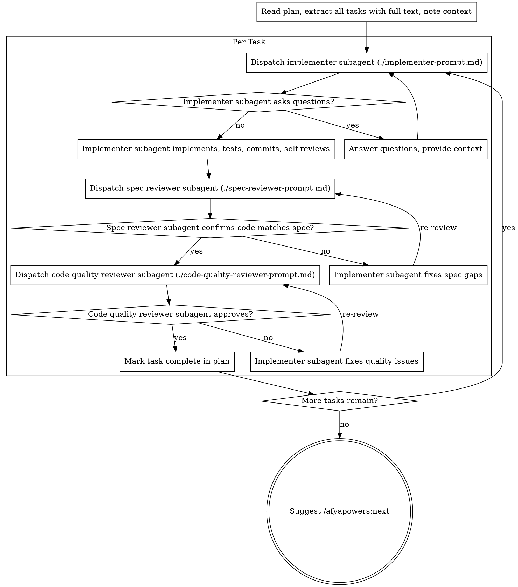

# Implementing Phase

Execute the implementation plan by dispatching fresh subagent per task, with two-stage review after each: spec compliance review first, then code quality review.

**Core principle:** Fresh subagent per task + two-stage review (spec then quality) = high quality, fast iteration

## Phase Gate

1. Read `.afyapowers/active` to get the active feature
2. Read `.afyapowers/<feature>/state.yaml` — confirm `current_phase` is `implement`
3. If not in implement phase, tell the user the current phase and stop
4. Read the plan from `.afyapowers/<feature>/artifacts/plan.md`
5. Read the tech spec from `.afyapowers/<feature>/artifacts/tech-spec.md` for context

## The Process

## Model Selection

Use the least powerful model that can handle each role to conserve cost and increase speed.

**Mechanical implementation tasks** (isolated functions, clear specs, 1-2 files): use a fast, cheap model. Most implementation tasks are mechanical when the plan is well-specified.

**Integration and judgment tasks** (multi-file coordination, pattern matching, debugging): use a standard model.

**Architecture, design, and review tasks**: use the most capable available model.

**Task complexity signals:**
- Touches 1-2 files with a complete spec → cheap model
- Touches multiple files with integration concerns → standard model
- Requires design judgment or broad codebase understanding → most capable model

## Handling Implementer Status

Implementer subagents report one of four statuses. Handle each appropriately:

**DONE:** Proceed to spec compliance review.

**DONE_WITH_CONCERNS:** The implementer completed the work but flagged doubts. Read the concerns before proceeding. If the concerns are about correctness or scope, address them before review. If they're observations (e.g., "this file is getting large"), note them and proceed to review.

**NEEDS_CONTEXT:** The implementer needs information that wasn't provided. Provide the missing context and re-dispatch.

**BLOCKED:** The implementer cannot complete the task. Assess the blocker:
1. If it's a context problem, provide more context and re-dispatch with the same model
2. If the task requires more reasoning, re-dispatch with a more capable model
3. If the task is too large, break it into smaller pieces
4. If the plan itself is wrong, escalate to the human

**Never** ignore an escalation or force the same model to retry without changes. If the implementer said it's stuck, something needs to change.

## Prompt Templates

- `skills/implementing/implementer-prompt.md` - Dispatch implementer subagent
- `skills/implementing/spec-reviewer-prompt.md` - Dispatch spec compliance reviewer subagent
- `skills/implementing/code-quality-reviewer-prompt.md` - Dispatch code quality reviewer subagent

## Completion

When all tasks are complete:
1. Mark all plan checkboxes as done (`- [x]`)
2. Update `state.yaml` to reflect progress
3. Tell the user: "Implement phase complete. Run `/afyapowers:next` to proceed to **review**."

## Red Flags

**Never:**
- Start implementation on main/master branch without explicit user consent
- Skip reviews (spec compliance OR code quality)
- Proceed with unfixed issues
- Dispatch multiple implementation subagents in parallel (conflicts)
- Make subagent read plan file (provide full text instead)
- Skip scene-setting context (subagent needs to understand where task fits)
- Ignore subagent questions (answer before letting them proceed)
- Accept "close enough" on spec compliance (spec reviewer found issues = not done)
- Skip review loops (reviewer found issues = implementer fixes = review again)
- Let implementer self-review replace actual review (both are needed)
- **Start code quality review before spec compliance is passed** (wrong order)
- Move to next task while either review has open issues

**If subagent asks questions:**
- Answer clearly and completely
- Provide additional context if needed
- Don't rush them into implementation

**If reviewer finds issues:**
- Implementer (same subagent) fixes them
- Reviewer reviews again
- Repeat until approved (max 5 iterations)
- Don't skip the re-review

**If subagent fails task:**
- Dispatch fix subagent with specific instructions
- Don't try to fix manually (context pollution)
