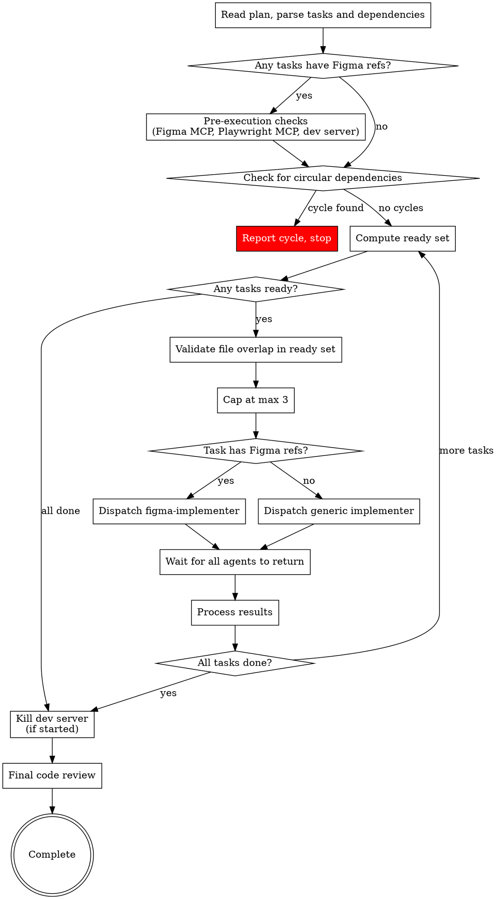

# Subagent-Driven Development

Execute plan by dispatching subagents per task with review stages. Non-Figma tasks: spec compliance → code quality. Figma tasks: spec compliance → visual fidelity (code quality skipped — the figma-implementer's internal self-correction loop handles visual accuracy). Tasks with no mutual dependencies run in parallel waves for faster execution.

**Core principle:** Fresh subagent per task + appropriate review stages = high quality, fast iteration

## The Process



Each dispatched Agent runs the task pipeline. Non-Figma tasks: implement → spec review → code quality review. Figma tasks: implement (via figma-implementer with internal self-correction) → spec review → visual fidelity review. Multiple pipelines run concurrently.

## Pre-Execution Checks (Figma Tasks)

Before dispatching the first wave, if ANY task in the plan has a `**Figma:**` section, perform these checks once:

### Check 1: Figma MCP Tools

Inspect available MCP tools for Figma-related tools. If none are found:

> "Figma MCP tools are not available. Visual fidelity validation requires them to verify your implementation matches the Figma designs. Please install a Figma MCP server and return to this conversation. Do you want to continue without visual validation?"

If the user chooses to continue without validation, skip the visual fidelity review stage for all tasks. Note this decision in the execution log.

### Check 2: Playwright MCP Tools

Inspect available MCP tools for Playwright-related tools. If none are found:

> "Playwright MCP tools are not available. Visual fidelity validation requires them to inspect your running implementation in the browser. Please install Playwright MCP tools and return to this conversation. Do you want to continue without visual validation?"

Same behavior as Check 1 — user can opt to continue without validation.

### Check 3: Dev Server

Inspect the codebase to determine how to start the dev server:
1. Read `package.json` — look for `dev`, `start`, or framework-specific scripts
2. Check for framework config files (e.g., `next.config.*`, `vite.config.*`, `angular.json`) to understand the framework
3. Start the dev server in the background using the identified command
4. Wait for it to be ready (check that the port is responding)

If the dev server fails to start:

> "Could not start the dev server automatically. Please start it manually and confirm when it's ready."

The dev server stays running across all waves. After the final wave completes, kill the dev server process.

**Important:** Visual fidelity review requires BOTH Figma MCP and Playwright MCP tools. If the user opts out of either check, skip the visual fidelity review stage for all tasks.

## Wave Execution Algorithm

Follow these steps exactly to resolve dependencies and dispatch tasks in parallel waves.

### Step 1: Parse Tasks

Read the plan and extract all tasks. For each task, record:
- Task number (from `### Task N:` heading)
- Dependencies (from `**Depends on:**` line — parse as list of task numbers, or empty if `none`)
- File list (from `**Files:**` section — all file paths mentioned)
- Status: pending, in-flight, completed, or needs-retry

Example:
```
Task 1: deps=[]      files=[src/a.py, tests/test_a.py]     status=pending
Task 2: deps=[]      files=[src/b.py, tests/test_b.py]     status=pending
Task 3: deps=[1,2]   files=[src/c.py, tests/test_c.py]     status=pending
Task 4: deps=[1,2]   files=[src/d.py, tests/test_d.py]     status=pending
Task 5: deps=[3,4]   files=[src/e.py, tests/test_e.py]     status=pending
```

### Step 2: Check for Cycles

Before executing anything, verify no circular dependencies exist. If task A depends on B and B depends on A (directly or transitively), report: "Circular dependency detected — the following tasks form a cycle: [list]. Please fix the plan." Do NOT proceed until cycles are resolved.

### Step 3: Compute Ready Set

A task is **ready** if:
- Status is `pending` or `needs-retry`
- All tasks in its `deps` list have status `completed`

```
Completed: [1, 2]
Ready: [3, 4]    (deps [1,2] all completed)
Waiting: [5]     (dep 3 not completed)
```

### Step 4: Validate File Overlap

Check every pair of tasks in the ready set. If two tasks share any file path in their file lists, remove one from the ready set (move it back to waiting). It will be picked up in the next cycle.

### Step 5: Cap Concurrency

If more than 3 tasks are ready, dispatch only the first 3 (by task number). The rest wait for the next cycle.

### Step 6: Dispatch

Dispatch all ready tasks as parallel Agent tool calls in a single message. Each agent gets:
- Full task text (steps, file list, code) — paste directly, don't make agent read files
- Design spec content for context
- File constraint: "You may ONLY modify these files: [list from task's Files: section]"
- Return format: status (DONE / DONE_WITH_CONCERNS / NEEDS_CONTEXT / BLOCKED) + summary

### Step 7: Wait and Process Results

All Agent calls return together. For each result:
- **DONE** (passed both reviews): mark task `completed`, update plan checkbox to `- [x]`
- **DONE_WITH_CONCERNS**: read concerns. If about correctness/scope, address before marking complete. If observations only, note and mark `completed`
- **NEEDS_CONTEXT**: surface question to user. Mark task `needs-retry`. Continue with other tasks — do NOT pause the entire execution
- **BLOCKED**: assess blocker per standard SDD rules (more context, more capable model, break into pieces, or escalate). Mark task `needs-retry`

### Step 8: Repeat

Go back to Step 3. Recompute the ready set from scratch based on current task statuses. Continue until all tasks are `completed`.

If no tasks are ready and not all tasks are completed, there's a problem:
- If tasks are `needs-retry`: surface all blockers to the user
- If tasks are waiting on incomplete tasks that aren't in-flight: there may be a cycle that wasn't caught — report it

### Worked Example

```
Plan: 5 tasks. Task 1,2 have no deps. Task 3,4 depend on 1,2. Task 5 depends on 3,4.

--- Cycle 1 ---
Completed: []
Ready: [1, 2] → no file overlap → dispatch both
  → Agent(Task 1), Agent(Task 2) dispatched in parallel
  → Both return DONE, pass reviews
Completed: [1, 2]

--- Cycle 2 ---
Ready: [3, 4] (deps [1,2] all completed) → no file overlap → dispatch both
  → Agent(Task 3), Agent(Task 4) dispatched in parallel
  → Task 3 fails spec review, gets fixed, passes on re-review
  → Task 4 passes
Completed: [1, 2, 3, 4]

--- Cycle 3 ---
Ready: [5] (deps [3,4] all completed) → dispatch
  → Agent(Task 5) dispatched
  → Passes
Completed: [1, 2, 3, 4, 5] → Done
```

### Fallback to Sequential

If the plan has no `**Depends on:**` lines on any task, warn: "Plan is missing dependency declarations. Falling back to sequential execution." Then execute tasks one at a time in order, identical to pre-parallel SDD behavior.

If a plan has all tasks depending on the previous one (linear chain), the wave executor naturally dispatches one task at a time — no special case needed.

### Post-Wave Verification

After each wave completes:
1. **Review each agent's summary** — understand what changed
2. **Check for conflicts** — did any agents edit the same code despite file validation?
3. **Run the test suite** — verify all changes work together
4. **Spot check** — agents can make systematic errors, especially in parallel

## Agent Prompt Best Practices

When dispatching implementer subagents (whether sequential or parallel), craft focused prompts:

1. **Focused** — One clear task per agent. Don't combine unrelated work.
2. **Self-contained** — Paste all context the agent needs. Don't make it search or read plan files.
3. **Constrained** — Specify which files may be modified. Specify what NOT to do.
4. **Specific about output** — Define the exact return format (status + summary).

**Common mistakes:**
- Too broad: "Implement the feature" — agent gets lost
- No context: "Fix the function" — agent doesn't know which
- No constraints: agent refactors everything
- Vague output: "Fix it" — you don't know what changed

## Model Selection

Use the least powerful model that can handle each role to conserve cost and increase speed.

**Mechanical implementation tasks** (isolated functions, clear specs, 1-2 files): use a fast, cheap model.

**Integration and judgment tasks** (multi-file coordination, pattern matching, debugging): use a standard model.

**Architecture, design, and review tasks**: use the most capable available model.

## Handling Implementer Status

Implementer subagents report one of four statuses:

**DONE:** Proceed to spec compliance review.

**DONE_WITH_CONCERNS:** Read concerns before proceeding. If about correctness/scope, address first. If observations, note and proceed.

**NEEDS_CONTEXT:** Provide missing context and re-dispatch.

**BLOCKED:** Assess blocker:
1. Context problem → provide more context, re-dispatch
2. Needs more reasoning → re-dispatch with more capable model
3. Task too large → break into smaller pieces
4. Plan wrong → escalate to human

**Never** ignore an escalation or force retry without changes.

## Task Routing

When dispatching a task, check for a `**Figma:**` section in the task description:

- **Has `**Figma:**` references** → dispatch using `skills/implementing/figma-implementer-prompt.md`
- **No `**Figma:**` references** → dispatch using `skills/implementing/implementer-prompt.md`

This routing applies to both initial dispatch and re-dispatch after visual fidelity failure.

## Visual Fidelity Review (Figma Tasks Only)

After spec compliance review passes for a Figma task (tasks with a `**Figma:**` section), if visual validation was not skipped during pre-execution checks, dispatch a visual fidelity reviewer. Code quality review is skipped for Figma tasks — the figma-implementer's internal self-correction loop handles visual accuracy directly.

**Dispatch using:** `skills/implementing/visual-fidelity-reviewer-prompt.md`

**Provide to the reviewer:**
- The task's `**Figma:**` references
- The dev server base URL
- The preview URL or page route: use the implementer's `**Preview URL:**` field if present, otherwise use the actual page route for the component
- The list of files the implementer modified
- The implementer's report summary

**If ✅ Visual fidelity passed:** Mark task as completed. Then check if the implementer reported a `**Preview File:**` path. If so, immediately delete that file (the temporary preview route) before proceeding to the next task or wave.

**If ❌ Visual fidelity failed:** Re-dispatch the implementer with the discrepancy report:

> "Your implementation has visual fidelity issues. Fix each discrepancy listed below. Do not make unrelated changes."
>
> [PASTE FULL DISCREPANCY REPORT FROM REVIEWER]

After the figma-implementer fixes, run the visual fidelity review again (skip spec compliance — it already passed).

**Iteration cap:** 5 total visual fidelity review cycles per task. A cycle = one visual fidelity review dispatch. The initial review counts as cycle 1, each re-review after a fix counts as another. After 5 cycles, stop retrying. Mark the task as `BLOCKED` with the accumulated discrepancy reports and surface to the user:

> "Task N has failed visual fidelity review 5 times. The following discrepancies could not be resolved automatically: [list]. Please review and provide guidance."

**Tasks without `**Figma:**` references:** Skip this stage entirely. Mark task as completed after code quality review passes.

## Prompt Templates

- `skills/implementing/implementer-prompt.md` - Dispatch implementer subagent (non-Figma tasks)
- `skills/implementing/figma-implementer-prompt.md` - Dispatch Figma implementer subagent (tasks with `**Figma:**` refs)
- `skills/implementing/spec-reviewer-prompt.md` - Dispatch spec compliance reviewer subagent
- `skills/implementing/code-quality-reviewer-prompt.md` - Dispatch code quality reviewer subagent (non-Figma tasks only)
- `skills/implementing/visual-fidelity-reviewer-prompt.md` - Dispatch visual fidelity reviewer subagent (Figma tasks only)

## Red Flags

**Never:**
- Start implementation on main/master branch without explicit user consent
- Skip any applicable review stage (non-Figma: spec compliance + code quality; Figma: spec compliance + visual fidelity)
- Proceed with unfixed issues
- Dispatch implementation subagents that modify the same files in parallel (file overlap = sequential)
- Dispatch more than 3 implementation subagents simultaneously
- Make subagent read plan file (provide full text instead)
- Skip scene-setting context
- Ignore subagent questions
- Accept "close enough" on spec compliance
- Skip review loops
- Let implementer self-review replace actual review
- **Start code quality review before spec compliance passes** (wrong order, non-Figma tasks)
- **Start visual fidelity review before spec compliance passes** (wrong order, Figma tasks)
- Skip visual fidelity review for tasks with `**Figma:**` references (unless user opted out during pre-execution checks)
- Move to next task while any review has open issues

**If subagent asks questions:**
- Answer clearly and completely
- Provide additional context if needed
- Don't rush them into implementation

**If reviewer finds issues:**
- Implementer (same subagent) fixes them
- Reviewer reviews again
- Repeat until approved
- Don't skip the re-review

**If subagent fails task:**
- Dispatch fix subagent with specific instructions
- Don't try to fix manually (context pollution)

## Integration

**Invoked by:**
- **implementing** (REQUIRED SUB-SKILL) — implementing loads the plan and design, then invokes SDD to execute all tasks

**Subagent prompts:**
- `skills/implementing/implementer-prompt.md` — TDD implementer for non-Figma tasks
- `skills/implementing/figma-implementer-prompt.md` — Figma implementer with internal self-correction loop (Figma tasks)
- `skills/implementing/spec-reviewer-prompt.md` — spec compliance review
- `skills/implementing/code-quality-reviewer-prompt.md` — code quality review (non-Figma tasks only)
- `skills/implementing/visual-fidelity-reviewer-prompt.md` — visual fidelity review (Figma tasks only)

**Context:** When invoked by implementing, the plan and design are already in the conversation context. Use them directly. If the plan is not in context (e.g., invoked standalone), read it from `.afyapowers/features/<feature>/artifacts/plan.md`.
