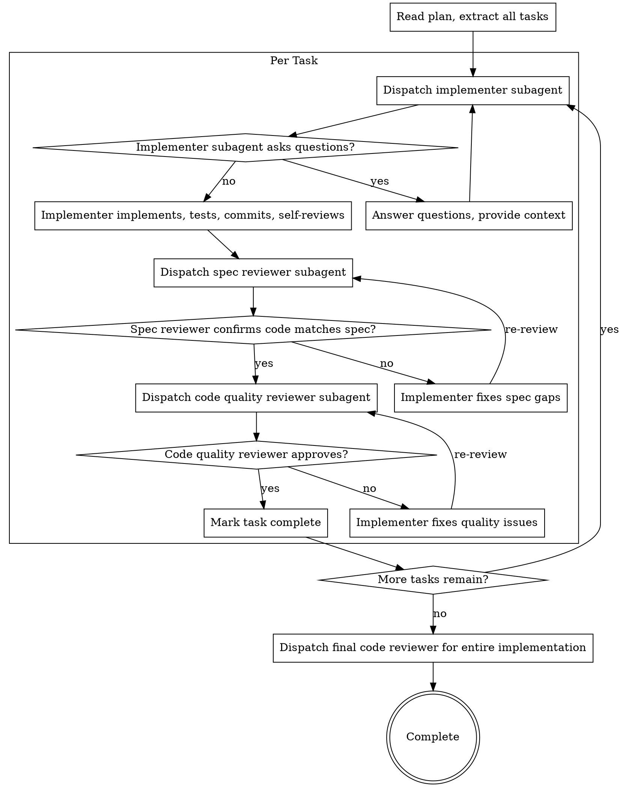

# Subagent-Driven Development

Execute plan by dispatching fresh subagent per task, with two-stage review after each: spec compliance review first, then code quality review.

**Core principle:** Fresh subagent per task + two-stage review (spec then quality) = high quality, fast iteration

## The Process

## Model Selection

Use the least powerful model that can handle each role to conserve cost and increase speed.

**Mechanical implementation tasks** (isolated functions, clear specs, 1-2 files): use a fast, cheap model.

**Integration and judgment tasks** (multi-file coordination, pattern matching, debugging): use a standard model.

**Architecture, design, and review tasks**: use the most capable available model.

## Handling Implementer Status

Implementer subagents report one of four statuses:

**DONE:** Proceed to spec compliance review.

**DONE_WITH_CONCERNS:** Read concerns before proceeding. If about correctness/scope, address first. If observations, note and proceed.

**NEEDS_CONTEXT:** Provide missing context and re-dispatch.

**BLOCKED:** Assess blocker:
1. Context problem → provide more context, re-dispatch
2. Needs more reasoning → re-dispatch with more capable model
3. Task too large → break into smaller pieces
4. Plan wrong → escalate to human

**Never** ignore an escalation or force retry without changes.

## Prompt Templates

- `skills/implementing/implementer-prompt.md` - Dispatch implementer subagent
- `skills/implementing/spec-reviewer-prompt.md` - Dispatch spec compliance reviewer subagent
- `skills/implementing/code-quality-reviewer-prompt.md` - Dispatch code quality reviewer subagent

## Red Flags

**Never:**
- Start implementation on main/master branch without explicit user consent
- Skip reviews (spec compliance OR code quality)
- Proceed with unfixed issues
- Dispatch multiple implementation subagents in parallel (conflicts)
- Make subagent read plan file (provide full text instead)
- Skip scene-setting context
- Ignore subagent questions
- Accept "close enough" on spec compliance
- Skip review loops
- Let implementer self-review replace actual review
- **Start code quality review before spec compliance passes** (wrong order)
- Move to next task while either review has open issues

**If subagent asks questions:**
- Answer clearly and completely
- Provide additional context if needed
- Don't rush them into implementation

**If reviewer finds issues:**
- Implementer (same subagent) fixes them
- Reviewer reviews again
- Repeat until approved
- Don't skip the re-review

**If subagent fails task:**
- Dispatch fix subagent with specific instructions
- Don't try to fix manually (context pollution)

## Integration

**Invoked by:**
- **implementing** (REQUIRED SUB-SKILL) — implementing loads the plan and design, then invokes SDD to execute all tasks

**Subagent prompts:**
- `skills/implementing/implementer-prompt.md` — TDD rules are embedded directly in this prompt
- `skills/implementing/spec-reviewer-prompt.md` — spec compliance review
- `skills/implementing/code-quality-reviewer-prompt.md` — code quality review

**Context:** When invoked by implementing, the plan and design are already in the conversation context. Use them directly. If the plan is not in context (e.g., invoked standalone), read it from `.afyapowers/features/<feature>/artifacts/plan.md`.
